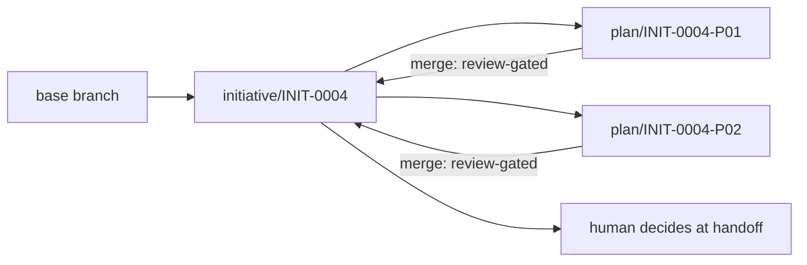
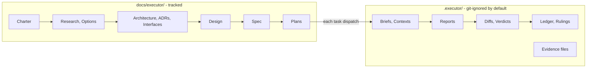

# The Executor

An initiative-scoped workflow system for coding agents: it takes a major
idea from intake through architecture, spec, plan, execution, review, and
verification — with a strict per-initiative ID namespace, separated thinking
and execution stores, a script-enforced contract at every state transition,
and evidence-backed completion.

**Nothing floats.** Every document, task, review, verdict, and ruling
carries an ID that names the initiative it belongs to. A body of work gets
one **Initiative**; the initiative owns a folder, an ID namespace, and every
document produced about it.

**Nothing is enforced by hope.** Where a workflow could silently drift — a
run row lying about the ledger, a task completed without review, a plan
naming paths only scripts may resolve — a script checks it and exits
non-zero. Contracts enforced by prose are hopes; contracts enforced by
scripts are contracts.

Works with any agent that can read skill files from a directory —
Claude Code, Codex, [omp](https://github.com/Atri10/.omp), or anything
similar. The skills are markdown; the scripts are POSIX bash.

## Install

Clone the repo and copy the `skills/` directories into whatever directory
your agent loads skills from:

```bash
git clone git@github.com:Atri10/executor.git
cp -R executor/skills/* <your-agents-skills-dir>/
```

Then invoke the root router:

```text
/skill:executor
```

or just say *"start an initiative"* — normal requests route by each skill's
frontmatter description.

## The phase pipeline

| Skill | Phase | Output |
|---|---|---|
| `executor` | Router + contract | Loads the right phase skill, defines the ID namespace |
| `executor-initiative` | Intake | Initiative folder, charter, registry entry, initiative branch |
| `executor-discovery` | Discovery | Research notes, options comparison |
| `executor-architecture` | Architecture, Design | Architecture, ADRs, interfaces, component designs |
| `executor-spec` | Specification | Spec, risks, verification strategy (one row per requirement) |
| `executor-planning` | Planning | Plans with tasks, linted before the gate |
| `executor-execution` | Execution | Task dispatch, ledger, reports, run registry |
| `executor-review` | Review | Per-task and whole-branch verdicts, findings, fix loops |
| `executor-verification` | Verification | Evidence-backed proof each requirement holds |
| `executor-handoff` | Handoff | Human decision menu: merge, PR, or keep the branch |

**Phases compress, they never vanish.** A small initiative can produce a
charter and a spec in one exchange and skip discovery — but skipping is a
stated decision recorded in the charter, not an omission.

## Feature highlights

### Every task gets a brief, a context file, and a fresh reviewer

- `exec-brief` extracts one task's text into a self-contained brief — the
  implementer reads requirements in one call, and task text never passes
  through the controller's context.
- `exec-context` assembles everything the brief cannot know: the exact
  signatures earlier tasks provide, the current surface of the files being
  modified, the binding global constraints, and the rulings that touch the
  task's files. Implementers start working without exploring.
- **Two-verdict reviews** (spec compliance + code quality) from a reviewer
  who never trusted the implementer's report, writing a verdict *file* —
  not a chat message that vanishes on the next summarization.
- **Non-code tasks still get reviewed**: a docs-only or evidence-capture
  task is judged on its report vs its brief, with the same mandatory
  verdict file.

### A fix loop with a breaker

Findings are severity-graded with worked calibration examples, fixed in
rounds (1–3 resume the original implementer; 4–5 escalate to a fresh,
more-capable model), re-reviewed scoped to the fix diff, and at the cap
adjudicated by recorded ruling — never silently dropped. Re-reviews check
the fix addressed the *root cause*, and whether any test was weakened.

### TDD is mechanical, not aspirational

The implementer contract requires a watched failing test before any
production code, with RED/GREEN evidence in the report. The reviewer runs
a **mechanical TDD evidence check** on every task and a test-quality
doctrine gates the tests themselves: no change detectors, no mirror
assertions, no mock-only coverage.

### Script-enforced state, everywhere

| Script | Owns |
|---|---|
| `exec-initiative` | Allocate initiative IDs, scaffold folders, phase log, initiative branch (`branch INIT-0004`) |
| `exec-id` | Next free ID of any type — allocation never guesses |
| `exec-plan-lint` | **Planning gate**: rejects literal store paths in plans, task headings without IDs, missing frontmatter |
| `exec-workspace` | Resolve and seed a plan's execution workspace: ledger, rulings, preflight scan, dispatch log |
| `exec-brief` / `exec-context` | Task brief and context files, generated, never hand-built |
| `exec-review-package` | Review diffs with commit list + stat + `-U10` diff in one file, per round |
| `exec-run` | Run lifecycle in the registry: `start`/`task`/`complete`/`pause`/`blocked`/`check` |
| `exec-run check` | **Drift + verdict audit**: registry row vs ledger, a verdict file per completed task, final verdict present — exit 1 names the failure |
| `exec-branch` | Plan-branch lifecycle: fork from the initiative branch, `merge` **refused** unless the review audit passes |
| `exec-evidence` | Per-criterion evidence files with a per-round state stamp (branch, commit, dirtiness) |
| `exec-ruling` | Record a decision taken on the human's behalf — to the rulings log *and* the local decisions store |
| `exec-scan-secrets` | Credential-shaped content scan across both stores; reports file:line, never the value |

### A branch model with review-gated merges

One branch per initiative (`initiative/INIT-NNNN`, forked from wherever the
human currently is, fork point recorded), one branch per plan
(`plan/INIT-NNNN-Pnn`, forked from the initiative branch). Task commits land
with detailed messages on the plan branch; the plan branch merges back with
`--no-ff` — **only after** its final review verdict exists and the audit
passes. Merging the initiative branch onward is always the human's
explicit decision at handoff.



### Reviews that survive the session

Every review is a **round** with an ID (`INIT-0004-P01-T03-R02`), a diff
file, and a verdict file carrying YAML frontmatter. Findings are labelled
(`C1`, `I2`, `M1`), cited to the spec requirement they violate
(`INIT-0004-SPEC-01-R07`), and live in files a fixer reads directly — the
controller transcribes nothing. The final whole-branch review walks every
declared cross-task seam and triages every deferred or parked finding.

### Every generated artifact carries frontmatter

Briefs, contexts, ledger, rulings, preflight scan, dispatch log, reports,
verdicts, evidence files — all carry the same YAML identity block
(`kind`, `id`, `initiative`, `plan`, `created_at`, …), defined in the
[frontmatter contract](skills/executor/references/frontmatter.md). An agent
reading any file cold knows exactly what it is holding.

### Verification converts claims into evidence

The spec's verification strategy names one criterion per requirement with
its exact command. The verification phase runs each row fresh against the
current commit and reports four honest statuses: `PROVEN`, `FAILED`,
`NOT-RUN`, `UNAVAILABLE`. A single `NOT-RUN` blocks the word "complete" —
and nothing upgrades it by inference. Raw observed output lands in
per-criterion evidence files the outcomes table cites.

### Context-resilient by design

After a context loss or model switch, the controller reads the ledger —
not its recollection. Completed tasks are not re-dispatched; the ledger's
identity block refuses a ledger that belongs to another plan; live subagent
identities are recorded so a fix round can *resume* rather than replace.
Nothing in either store is ever deleted by a skill — pruning is a human
decision.

## The Two Stores



- **`docs/executor/`** — the thinking record. Git-tracked: charter, research,
  architecture, decisions, interfaces, design, spec, risks, plans, and the
  verification strategy + outcomes ledger. A reader who clones the repo gets
  the complete reasoning.
- **`.executor/`** — the execution record. Git-ignored by default, safe to
  commit if you choose: task briefs and contexts, implementer reports,
  review diffs and verdicts, evidence files, the progress ledger, rulings.
  Never deleted — the reasoning is the point.

The split is durability-of-audience, not durability-of-value. `.executor/`
resolves from the main repository root, so **removing a worktree cannot
destroy the execution record.**

## The ID Namespace

```text
INIT-0004                      the initiative
INIT-0004-CHTR-01              its charter
INIT-0004-RSCH-02              a research note
INIT-0004-SPEC-01-R07          requirement 7 inside that spec
INIT-0004-P01                  a plan
INIT-0004-P01-T03              task 3 of that plan
INIT-0001-P01-T03-R02          review round 2 of that task
```

Addressable requirements are what let a review finding name the exact
contract it violates, and what lets a plan task declare precisely which
requirements it discharges.

## Safety

`.executor/` may be committed, so everything in both stores is written as
though it will be public. Credentials, tokens, and personal data never go
into any Executor artifact — a redacted existence statement and a safe path
instead. `skills/executor/references/safety.md` defines the required scan
before any handoff, and reviewers treat credential-shaped content in any
diff as a Critical, stop-and-tell-the-human finding.

## Project docs

| Doc | Purpose |
|---|---|
| [CONTRIBUTING.md](CONTRIBUTING.md) | How to change skills, references, and scripts |
| [CODE_OF_CONDUCT.md](CODE_OF_CONDUCT.md) | Participation standards and enforcement |
| [SECURITY.md](SECURITY.md) | Reporting vulnerabilities and how artifact secret-hygiene works |
| [CHANGELOG.md](CHANGELOG.md) | Notable changes, newest first |

## License

[MIT](LICENSE)
