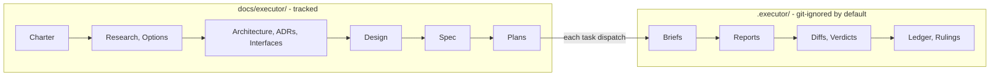

# The Executor

An initiative-scoped workflow system for coding agents: it takes a major idea
from intake through architecture, spec, plan, execution, and review, with a
strict per-initiative ID namespace, separated thinking and execution stores,
and evidence-backed completion.

Nothing floats. Every document, task, review, and ruling carries an ID that
names the initiative it belongs to. A body of work gets one **Initiative**;
the initiative owns a folder, an ID namespace, and every document produced
about it.

Works with any agent that can read skill files from a directory.

## Install

Clone the repo and copy the `skills/` directories into whatever directory
your agent loads skills from:

```bash
git clone git@github.com:Atri10/executor.git
cp -R executor/skills/* <your-agents-skills-dir>/
```

Then invoke the root router:

```text
/skill:executor
```

or just say *"start an initiative"* — normal requests route by the skill's
frontmatter description.

## Skills

| Skill | Phase | Output |
|---|---|---|
| `executor` | Router + contract | Loads the right phase skill, defines the ID namespace |
| `executor-initiative` | Intake | Initiative folder, charter |
| `executor-discovery` | Discovery | Research, options comparison |
| `executor-architecture` | Architecture, Design | Architecture, ADRs, interfaces, component designs |
| `executor-spec` | Specification | Spec, risks, verification strategy |
| `executor-planning` | Planning | Plans with tasks |
| `executor-execution` | Execution | Commits, reports, ledger |
| `executor-review` | Review | Verdicts, findings, rulings |
| `executor-verification` | Verification | Evidence of working software |
| `executor-handoff` | Handoff | Merged branch, updated indexes |

**Phases compress, they never vanish.** A small initiative can produce a
charter and a spec in one exchange and skip discovery — but skipping is a
stated decision recorded in the charter, not an omission.

## The Two Stores



- **`docs/executor/`** — the thinking record. Git-tracked: charter, research,
  architecture, decisions, interfaces, design, spec, risks, plans. A reader
  who clones the repo gets the complete reasoning.
- **`.executor/`** — the execution record. Git-ignored by default, safe to
  commit if you choose: task briefs, implementer reports, review diffs and
  verdicts, the progress ledger, rulings. Never deleted — the reasoning is
  the point.

The split is durability-of-audience, not durability-of-value.

## The ID Namespace

```text
INIT-0004                      the initiative
INIT-0004-CHTR-01              its charter
INIT-0004-RSCH-02              a research note
INIT-0004-SPEC-01-R07          requirement 7 inside that spec
INIT-0004-P01                  a plan
INIT-0004-P01-T03              task 3 of that plan
INIT-0004-P01-T03-R02          review round 2 of that task
```

Addressable requirements are what let a review finding name the exact
contract it violates, and what lets a plan task declare precisely which
requirements it discharges.

## Safety

`.executor/` may be committed, so everything in both stores is written as
though it will be public. Credentials, tokens, and personal data never go
into any Executor artifact — a redacted existence statement and a safe path
instead. `skills/executor/references/safety.md` defines the required scan
before any handoff.

## Project docs

| Doc | Purpose |
|---|---|
| [CONTRIBUTING.md](CONTRIBUTING.md) | How to change skills, references, and scripts |
| [CODE_OF_CONDUCT.md](CODE_OF_CONDUCT.md) | Participation standards and enforcement |
| [SECURITY.md](SECURITY.md) | Reporting vulnerabilities and how artifact secret-hygiene works |
| [CHANGELOG.md](CHANGELOG.md) | Notable changes, newest first |

## License

[MIT](LICENSE)
