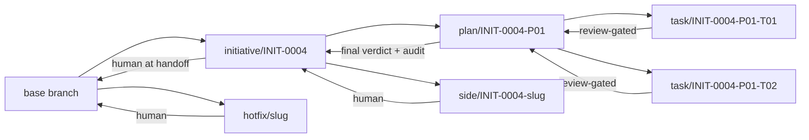
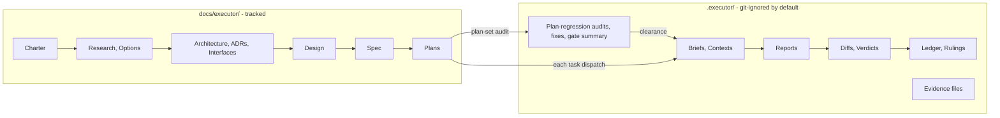

# The Executor

An initiative-scoped workflow system for coding agents: it takes a major
idea from intake through architecture, spec, plan, plan regression,
execution, review, and verification — with a strict per-initiative ID
namespace, separated thinking and execution stores, a script-enforced
contract at every state transition, and evidence-backed completion.

**Nothing floats.** Every document, task, review, verdict, and ruling
carries an ID that names the initiative it belongs to. A body of work gets
one **Initiative**; the initiative owns a folder, an ID namespace, and every
document produced about it.

**Nothing is enforced by hope.** Where a workflow could silently drift — a
run row lying about the ledger, a task completed without review, a plan
naming paths only scripts may resolve — a script checks it and exits
non-zero. Contracts enforced by prose are hopes; contracts enforced by
scripts are contracts.

Works with any agent that can read skill files from a directory —
Claude Code, Codex, [omp](https://github.com/Atri10/.omp), or anything
similar. The skills are markdown; the scripts are POSIX bash.

## Install

Clone the repo and copy the `skills/` directories into whatever directory
your agent loads skills from:

```bash
git clone git@github.com:Atri10/executor.git
cp -R executor/skills/* <your-agents-skills-dir>/
```

Pin to a release tag instead of `main` for stability:

```bash
git clone --branch v0.5.0 git@github.com:Atri10/executor.git
```

### One-paste install for any LLM agent

Paste this into your agent — Claude Code, Cursor, Aider, Codex, omp, or any
other harness. It discovers the right skills directory itself and verifies
the install:

```text
Install The Executor skill library for me:

1. Clone https://github.com/Atri10/executor.git into a temp directory
   (use --branch v0.5.0 for the latest release, or default branch for main).
2. Find my agent's skills directory. Candidates, in order — use the first
   that exists, or ask me if none do:
   - ~/.omp/agent/skills/            (omp)
   - ~/.claude/skills/               (Claude Code)
   - ~/.cursor/skills/               (Cursor)
   - .claude/skills/                 (repo-local Claude Code)
   - ~/.aider/skills/ or as my harness documents
3. Copy every directory from the clone's skills/ folder into that skills
   directory (each is one skill: skills/executor, skills/executor-spec, ...).
4. Verify: run bash <skills-dir>/executor/scripts/exec-run with no arguments
   — it must print a usage line and exit non-zero. Then confirm the twelve
   SKILL.md files exist under the skills directory.
5. Tell me which directory you installed into, and how to invoke the
   router in my harness (usually /skill:executor or just asking for
   "the executor").

Do not modify any file inside the clone or the skills directory other
than the copy operation itself.
```

Then invoke the root router:

```text
/skill:executor
```

or just say *"start an initiative"* — normal requests route by each skill's
frontmatter description.

## The phase pipeline

| Skill | Phase | Output |
|---|---|---|
| `executor` | Router + contract | Loads the right phase skill, defines the ID namespace |
| `executor-initiative` | Intake | Initiative folder, charter, registry entry, initiative branch |
| `executor-discovery` | Discovery | Research notes, options comparison |
| `executor-architecture` | Architecture, Design | Architecture, ADRs, interfaces, component designs |
| `executor-spec` | Specification | Spec, risks, verification strategy (one row per requirement) |
| `executor-planning` | Planning | Plans with tasks, linted before the gate |
| `executor-plan-regression` | Plan regression | Plan-set audit, repairs, clearance summary — gates execution |
| `executor-execution` | Execution | Task dispatch, ledger, reports, run registry |
| `executor-review` | Review | Per-task and whole-branch verdicts, findings, fix loops |
| `executor-verification` | Verification | Evidence-backed proof each requirement holds |
| `executor-handoff` | Handoff | Human decision menu: merge, PR, or keep the branch |
| `executor-brainstorm` | Cross-phase | Recorded divergent ideation sessions; visual companion optional |

**Phases compress, they never vanish.** A small initiative can produce a
charter and a spec in one exchange and skip discovery — but skipping is a
stated decision recorded in the charter, not an omission.

## Feature highlights

### Every task gets a brief, a context file, and a fresh reviewer

- `exec-brief` extracts one task's text into a self-contained brief — the
  implementer reads requirements in one call, and task text never passes
  through the controller's context.
- `exec-context` assembles everything the brief cannot know: the exact
  signatures earlier tasks provide, the current surface of the files being
  modified, the binding global constraints, and the rulings that touch the
  task's files. Implementers start working without exploring.
- **Two-verdict reviews** (spec compliance + code quality) from a reviewer
  who never trusted the implementer's report, writing a verdict *file* —
  not a chat message that vanishes on the next summarization.
- **Non-code tasks still get reviewed**: a docs-only or evidence-capture
  task is judged on its report vs its brief, with the same mandatory
  verdict file.

### A fix loop with a breaker

Findings are severity-graded with worked calibration examples, fixed in
rounds (1–3 resume the original implementer; 4–5 escalate to a fresh,
more-capable model), re-reviewed scoped to the fix diff, and at the cap
adjudicated by recorded ruling — never silently dropped. Re-reviews check
the fix addressed the *root cause*, and whether any test was weakened.

### Evidence is capability-aware, not ceremony

The implementer contract asks for the **strongest feasible evidence**
for every behavior change: a watched failing test where a test harness
exists, a named alternative instrument where it does not (CLI fixture
run, parse/render check, exercised UI), and an explicit NOT-RUN/UNAVAILABLE
record where nothing feasible exists. Reviewers verify evidence, and a
reviewer who cannot name the failure a demanded test would catch does
not get to demand it.

### Plans are audited as a set, not one at a time

Per-plan review reads one file. The defects that actually ship live
*between* files: an `Assumes` section promising a signature the
predecessor plan never produces, a spec requirement no plan's `Covers:`
claims, two plans provisioning the same queue with different shapes.

`executor-plan-regression` runs between planning and execution and reads
the whole set against the spec, the interface contracts, and each other —
coverage, Assumes/Produces closure, ordering, constraint propagation,
file-map collisions, vocabulary. Findings are repaired in the plan files
themselves, then re-audited; the clearance summary lives at
`.executor/<INIT>/plan-regression/summary.md`. Execution cannot start
until every plan is `clean` or the human has explicitly `waived` a
finding — enforced by the phase-order machine, by `exec-run start`, and
by `exec-store-check`.

### Decisions: rule, ask, or stop

Inside a phase the workflow does not wait on a human — but it does not
silently decide everything either. Mechanical or reversible calls are
ruled and logged (`exec-ruling`, mirrored into `.local/decisions/`).
Decision-class calls — contract conflicts, scope cuts, irreversible
choices, product judgment — are asked on the spot through the harness's
question affordance, blocking only the affected lane, with the question
recorded beside the ruling (`--answered`). Only four things stop a run:
an irreversible operation, a security-sensitive action, a side effect
outside the worktree, or a defect where every path forward is a guess.

### Script-enforced state, everywhere

| Script | Owns |
|---|---|
| `exec-initiative` | Allocate initiative IDs, scaffold folders, phase log, initiative branch (`branch INIT-0004`) |
| `exec-id` | Next free ID of any type — allocation never guesses |
| `exec-plan-lint` | **Planning gate**: rejects literal store paths in plans, task headings without IDs, missing or empty `spec`/`interfaces`/`tasks`/`execution_mode`, task-count mismatch, and over-specified task bodies (impl-language fences >40 lines or >60% of a body) |
| `exec-workspace` | Resolve and seed a plan's execution workspace: ledger, rulings, preflight scan, dispatch log |
| `exec-brief` / `exec-context` | Task brief and context files, generated, never hand-built — briefs carry contract verbatim and mark embedded code as advisory |
| `exec-review-package` | Review diffs with commit list + stat + `-U10` diff in one file, per round |
| `exec-fix-package` | Fix-round dispatch package: verdict findings + implementer report + brief + context verbatim, so fix agents see the contract, not a paraphrase |
| `exec-run` | Run lifecycle in the registry: `start`/`task`/`complete`/`pause`/`blocked`/`check` |
| `exec-plan-regression` | **Plan-set gate**: resolves the initiative-level `plan-regression/` dir, seeds the clearance summary, and `check` refuses a run while any plan is unaudited or unrepaired |
| `exec-run check` | **Drift + semantic audit**: registry row vs ledger, verdict CONTENT (a FAIL verdict blocks), exact task set with latest-state reduction, final verdict lineage (a failing final re-review supersedes an earlier clean one), completed tasks present in the Task status table, branch topology (branch/task agreement, recorded merges present on the plan branch, unmerged task branches under a clean final verdict, orphan worktrees) — exit 1 names the failure |
| `exec-branch` | **Branch lifecycle**: `start`/`merge`/`abandon` for the plan branch (merge refused unless the review audit passes), `task start\|merge\|abandon` for task branches (merge refused unless the task's own verdict is clean; `--worktree` for parallel waves), `side`/`spike` for work that is neither, and `status` for the branch stack + orphan worktrees |
| `exec-evidence` | Per-criterion evidence files in the initiative's tracked `verification/evidence/PNN/`, immutable per round (`-attempt2` on same-round reruns), atomic publish, per-round state stamp (branch, commit, dirtiness) |
| `exec-store-check` | **Thinking-store integrity gate**: registry ↔ folders ↔ Documents table ↔ frontmatter statuses ↔ cross-links ↔ evidence citations ↔ phase-log chronology, plus per-kind document contracts (architecture must carry a Mermaid diagram, specs need requirement headings + a resolving verification link, active options need a decision, `criteria_count` must match `V<nn>` rows), the doc-code boundary, the brainstorm record, branch provenance, and plan-regression clearance (execution entered without a passed/skipped plan-regression phase fails) |
| `exec-ruling` | Record a decision taken on the human's behalf — to the rulings log *and* the local decisions store |
| `exec-scan-secrets` | Credential-shaped content scan across both stores; reports file:line, never the value |

### A branch model with review-gated merges

One branch per artifact level, named after the artifact's ID
([full spec](skills/executor/references/branches.md)): `initiative/INIT-NNNN` forks from
wherever the human currently is (fork point recorded), `plan/INIT-NNNN-Pnn`
forks from the initiative branch, and `task/INIT-NNNN-Pnn-Tnn` forks from
the **plan branch tip at dispatch** — so task N+1 already contains task N's
merged work.

Each level merges only through the gate its level requires: a task merges
when its own review verdict is clean, a plan merges when its final verdict
exists and the audit passes, and merging the initiative onward is always
the human's explicit decision at handoff. The plan branch's history is
therefore only reviewed merges — clean to bisect, one `git revert -m 1`
from undoing a single task.

Parallel tasks get a worktree each (`task start --worktree`), because two
agents cannot share one working tree. A plan that is a single chain may
declare `sequential: true` to commit direct to the plan branch — the lint
requires the dependency chain to justify it. Work that is neither plan nor
task goes on `side/` (merged on a recorded ruling) or `spike/` (never
merged); an urgent out-of-scope fix goes on `hotfix/` from the base branch.



### Reviews that survive the session

Every review is a **round** with an ID (`INIT-0004-P01-T03-R02`), a diff
file, and a verdict file carrying YAML frontmatter. Findings are labelled
(`C1`, `I2`, `M1`), cited to the spec requirement they violate
(`INIT-0004-SPEC-01-R07`), and live in files a fixer reads directly — the
controller transcribes nothing. The final whole-branch review walks every
declared cross-task seam and triages every deferred or parked finding.

**Re-reviews do two jobs:** impact review of the fix (following what it
actually affects — including unchanged callers) before finding closure,
so a regression the fix introduced in untouched code is still caught,
and a fix-only lens never hides it.

### Every generated artifact carries frontmatter

Briefs, contexts, ledger, rulings, preflight scan, dispatch log, reports,
verdicts, evidence files — all carry the same YAML identity block
(`kind`, `id`, `initiative`, `plan`, `created_at`, …), defined in the
[frontmatter contract](skills/executor/references/frontmatter.md). An agent
reading any file cold knows exactly what it is holding.

### Verification converts claims into evidence

The spec's verification strategy names one criterion per requirement with
its exact command. The verification phase runs each row fresh against the
current commit and reports four honest statuses: `PROVEN`, `FAILED`,
`NOT-RUN`, `UNAVAILABLE`. A single `NOT-RUN` blocks the word "complete" —
and nothing upgrades it by inference. Raw observed output lands in
per-criterion evidence files the outcomes table cites.

### Context-resilient by design

After a context loss or model switch, the controller reads the ledger —
not its recollection. Completed tasks are not re-dispatched; the ledger's
identity block refuses a ledger that belongs to another plan; live subagent
identities are recorded so a fix round can *resume* rather than replace.
Nothing in either store is ever deleted by a skill — pruning is a human
decision.

## The Two Stores



- **`docs/executor/`** — the thinking record. Git-tracked: charter, research,
  architecture, decisions, interfaces, design, spec, risks, plans, and the
  verification strategy + outcomes ledger. A reader who clones the repo gets
  the complete reasoning.
- **`.executor/`** — the execution record. Git-ignored by default, safe to
  commit if you choose: task briefs and contexts, implementer reports,
  review diffs and verdicts, evidence files, the progress ledger, rulings.
  Never deleted — the reasoning is the point.

The split is durability-of-audience, not durability-of-value. `.executor/`
resolves from the main repository root, so **removing a worktree cannot
destroy the execution record.**

## The ID Namespace

```text
INIT-0004                      the initiative
INIT-0004-CHTR-01              its charter
INIT-0004-RSCH-02              a research note
INIT-0004-SPEC-01-R07          requirement 7 inside that spec
INIT-0004-P01                  a plan
INIT-0004-P01-T03              task 3 of that plan
INIT-0001-P01-T03-R02          review round 2 of that task
```

Addressable requirements are what let a review finding name the exact
contract it violates, and what lets a plan task declare precisely which
requirements it discharges.

## Safety

`.executor/` may be committed, so everything in both stores is written as
though it will be public. Credentials, tokens, and personal data never go
into any Executor artifact — a redacted existence statement and a safe path
instead. `skills/executor/references/safety.md` defines the required scan
before any handoff, and reviewers treat credential-shaped content in any
diff as a Critical, stop-and-tell-the-human finding.

## Project docs

| Doc | Purpose |
|---|---|
| [CONTRIBUTING.md](CONTRIBUTING.md) | How to change skills, references, and scripts |
| [CODE_OF_CONDUCT.md](CODE_OF_CONDUCT.md) | Participation standards and enforcement |
| [SECURITY.md](SECURITY.md) | Reporting vulnerabilities and how artifact secret-hygiene works |
| [CHANGELOG.md](CHANGELOG.md) | Notable changes, newest first |

## License

[MIT](LICENSE)
