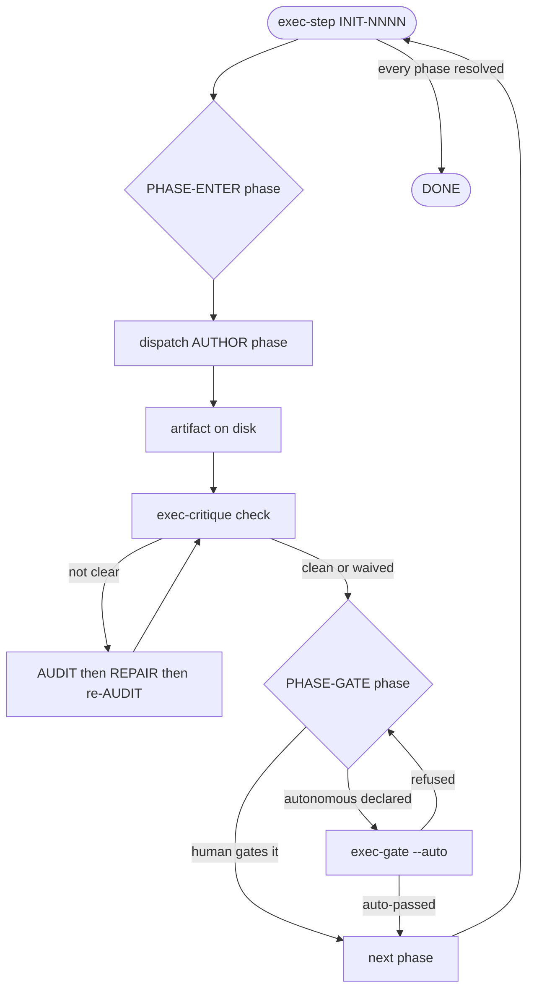
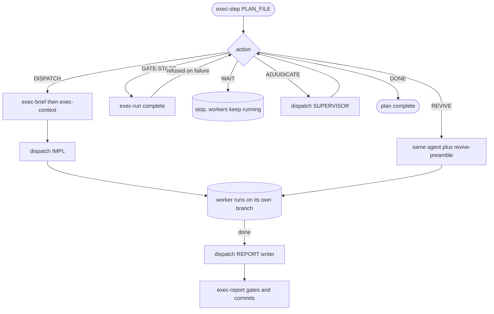
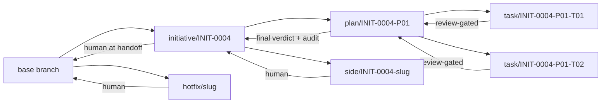
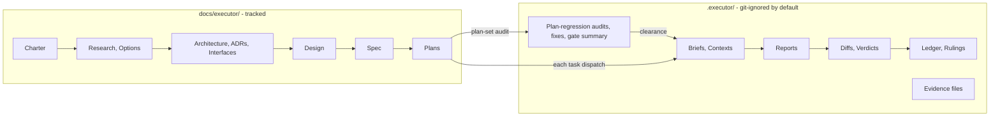

# The Executor

An initiative-scoped workflow system for coding agents: it takes a major
idea from intake through architecture, spec, plan, plan regression,
execution, review, and verification — with a strict per-initiative ID
namespace, separated thinking and execution stores, a script-enforced
contract at every state transition, and evidence-backed completion.

**Nothing floats.** Every document, task, review, verdict, and ruling
carries an ID that names the initiative it belongs to. A body of work gets
one **Initiative**; the initiative owns a folder, an ID namespace, and every
document produced about it.

**Nothing is enforced by hope.** Where a workflow could silently drift — a
run row lying about the ledger, a task completed without review, a plan
naming paths only scripts may resolve — a script checks it and exits
non-zero. Contracts enforced by prose are hopes; contracts enforced by
scripts are contracts.

Works with any agent that can read skill files from a directory —
Claude Code, Codex, [omp](https://github.com/Atri10/.omp), or anything
similar. The skills are markdown; the scripts are POSIX bash.

## Install

Clone the repo and copy the `skills/` directories into whatever directory
your agent loads skills from:

```bash
git clone git@github.com:Atri10/executor.git
cp -R executor/skills/* <your-agents-skills-dir>/
```

Pin to a release tag instead of `main` for stability:

```bash
git clone --branch v0.7.0 git@github.com:Atri10/executor.git
```

### One-paste install for any LLM agent

Paste this into your agent — Claude Code, Cursor, Aider, Codex, omp, or any
other harness. It discovers the right skills directory itself and verifies
the install:

```text
Install The Executor skill library for me:

1. Clone https://github.com/Atri10/executor.git into a temp directory
   (use --branch v0.7.0 for the latest release, or default branch for main).
2. Find my agent's skills directory. Candidates, in order — use the first
   that exists, or ask me if none do:
   - ~/.omp/agent/skills/            (omp)
   - ~/.claude/skills/               (Claude Code)
   - ~/.cursor/skills/               (Cursor)
   - .claude/skills/                 (repo-local Claude Code)
   - ~/.aider/skills/ or as my harness documents
3. Copy every directory from the clone's skills/ folder into that skills
   directory (each is one skill: skills/executor, skills/executor-spec, ...).
4. Verify: run bash <skills-dir>/executor/scripts/exec-run with no arguments
   — it must print a usage line and exit non-zero. Then confirm every copied
   skills/<name>/ directory contains a SKILL.md (count the directories, not a
   remembered number — the skill set grows, and a stale count here fails an
   install that is actually fine).
5. Tell me which directory you installed into, and how to invoke the
   router in my harness (usually /skill:executor or just asking for
   "the executor").

Do not modify any file inside the clone or the skills directory other
than the copy operation itself.
```

Then invoke the root router:

```text
/skill:executor
```

or just say *"start an initiative"* — normal requests route by each skill's
frontmatter description.

## The phase pipeline

| Skill | Phase | Output |
|---|---|---|
| `executor` | Router + contract | Loads the right phase skill, defines the ID namespace |
| `executor-initiative` | Intake | Initiative folder, charter, registry entry, initiative branch |
| `executor-discovery` | Discovery | Research notes, options comparison |
| `executor-architecture` | Architecture, Design | Architecture, ADRs, interfaces, component designs |
| `executor-spec` | Specification | Spec, risks, verification strategy (one row per requirement) |
| `executor-planning` | Planning | Plans with tasks, linted before the gate |
| `executor-plan-regression` | Plan regression | Plan-set audit, repairs, clearance summary — gates execution |
| `executor-execution` | Execution | Task dispatch, ledger, reports, run registry |
| `executor-review` | Review | Per-task and whole-branch verdicts, findings, fix loops |
| `executor-verification` | Verification | Evidence-backed proof each requirement holds |
| `executor-handoff` | Handoff | Human decision menu: merge, PR, or keep the branch |
| `executor-brainstorm` | Cross-phase | Recorded divergent ideation sessions; visual companion optional |
| `executor-critique` | Every phase (gate) | Per-component audit, repair, re-audit; gates the phase that produced the artifacts |

**Phases compress, they never vanish.** A small initiative can produce a
charter and a spec in one exchange and skip discovery — but skipping is a
stated decision recorded in the charter, not an omission.

### The shape of a run

The controller runs one loop and holds no judgment: it runs `exec-step`,
reads the single action word it prints, does that, and goes back. Every
arrow below is either a script decision or a dispatched subagent. There is
no step where the controller does the work.


```mermaid
flowchart TD
    start(["exec-step INIT-NNNN"]) --> enter{"PHASE-ENTER phase"}
    enter --> author["dispatch AUTHOR phase"]
    author --> artifact["artifact on disk"]
    artifact --> check["exec-critique check"]
    check -->|"not clear"| loop["AUDIT then REPAIR then re-AUDIT"]
    loop --> check
    check -->|"clean or waived"| gate{"PHASE-GATE phase"}
    gate -->|"human gates it"| next["next phase"]
    gate -->|"autonomous declared"| auto["exec-gate --auto"]
    auto -->|"refused"| gate
    auto -->|"auto-passed"| next
    next --> start
    start -->|"every phase resolved"| done(["DONE"])
```

The phase order, and which of them carry a critique gate. Every authoring
phase does; the two critique phases audit the others.


```mermaid
flowchart LR
    I["intake"] --> D["discovery"]
    D --> A["architecture"]
    A --> G["design"]
    G --> S["specification"]
    S --> P["planning"]
    P --> PR["plan-regression"]
    PR --> E["execution"]
    E --> R["review"]
    R --> V["verification"]
    V --> H["handoff"]

    classDef gated fill:#1f3a5f,stroke:#4a90d9,color:#fff
    classDef critic fill:#3d2f1f,stroke:#d9a04a,color:#fff
    class I,D,A,G,S,P,E,V,H gated
    class PR,R critic
```

### The task loop inside execution

Each plan's tasks run as a loop, and a task result reaches run state only
through a gate. A worker that stops is escalated through a fixed ladder
before anyone is replaced.


```mermaid
flowchart TD
    step(["exec-step PLAN_FILE"]) --> act{"action"}
    act -->|"DISPATCH"| brief["exec-brief then exec-context"]
    brief --> impl["dispatch IMPL"]
    impl --> worker[("worker runs on its own branch")]
    worker -->|"done"| rep["dispatch REPORT writer"]
    rep --> commit["exec-report gates and commits"]
    act -->|"GATE-STAGE"| audit["exec-run complete"]
    audit -->|"refused on failure"| act
    act -->|"WAIT"| idle[("stop, workers keep running")]
    act -->|"REVIVE"| revive["same agent plus revive-preamble"]
    revive --> worker
    act -->|"ADJUDICATE"| sup["dispatch SUPERVISOR"]
    sup --> act
    act -->|"DONE"| fin(["plan complete"])
```

## Feature highlights

### Every task gets a brief, a context file, and a fresh reviewer

- `exec-brief` extracts one task's text into a self-contained brief — the
  implementer reads requirements in one call, and task text never passes
  through the controller's context.
- `exec-context` assembles everything the brief cannot know: the exact
  signatures earlier tasks provide, the current surface of the files being
  modified, the binding global constraints, and the rulings that touch the
  task's files. Implementers start working without exploring.
- **Two-verdict reviews** (spec compliance + code quality) from a reviewer
  who never trusted the implementer's report, writing a verdict *file* —
  not a chat message that vanishes on the next summarization.
- **Non-code tasks still get reviewed**: a docs-only or evidence-capture
  task is judged on its report vs its brief, with the same mandatory
  verdict file.

### A fix loop with a breaker

Findings are severity-graded with worked calibration examples, fixed in
rounds (1–3 resume the original implementer; 4–5 escalate to a fresh,
more-capable model), re-reviewed scoped to the fix diff, and at the cap
adjudicated by recorded ruling — never silently dropped. Re-reviews check
the fix addressed the *root cause*, and whether any test was weakened.

### Evidence is capability-aware, not ceremony

The implementer contract asks for the **strongest feasible evidence**
for every behavior change: a watched failing test where a test harness
exists, a named alternative instrument where it does not (CLI fixture
run, parse/render check, exercised UI), and an explicit NOT-RUN/UNAVAILABLE
record where nothing feasible exists. Reviewers verify evidence, and a
reviewer who cannot name the failure a demanded test would catch does
not get to demand it.

### Plans are audited as a set, not one at a time

Per-plan review reads one file. The defects that actually ship live
*between* files: an `Assumes` section promising a signature the
predecessor plan never produces, a spec requirement no plan's `Covers:`
claims, two plans provisioning the same queue with different shapes.

`executor-plan-regression` runs between planning and execution and reads
the whole set against the spec, the interface contracts, and each other —
coverage, Assumes/Produces closure, ordering, constraint propagation,
file-map collisions, vocabulary. Findings are repaired in the plan files
themselves, then re-audited; the clearance summary lives at
`.executor/<INIT>/plan-regression/summary.md`. Execution cannot start
until every plan is `clean` or the human has explicitly `waived` a
finding — enforced by the phase-order machine, by `exec-run start`, and
by `exec-store-check`.

### Dispatched agents are briefed from a template, not memory

Every role that dispatches a subagent — implementer, task reviewer,
re-reviewer, final reviewer, plan auditor, plan repairer, plan
re-auditor, evidence runner, prior-art scout, concept explorer, design
critic — has a registered prompt template with its identity grammar, a
required `model:` line, and a filled `[PLACEHOLDER]` contract. An agent
briefed from the dispatcher's memory is a dispatch defect:
`validate-skills.sh` fails on a dispatch role with no registered template,
a template missing its `## Self-Critique Before You Return` /
`## Verification` / `## What You Return` sections, or a prompt file nobody
registered. The dispatch registry lives in
[references/layout.md](skills/executor/references/layout.md).

### Every artifact critiques and verifies itself before its gate

Each phase skill carries a `## Self-Critique` section — an adversarial
pass over the artifact it just wrote — and a `## Verification` section —
the commands that prove it, run in-session with output cited at the gate.
A gate claimed before both ran is not claimed. The same two sections are
required inside every dispatch template, so a subagent checks its own
output before returning a status line the controller will trust.

### Every authoring phase passes an independent critique gate

The pipeline has eleven phases. Before this, only **two** of them could
reject a bad deliverable — `plan-regression` and `review`. `design` and
`verification` had no artifact gate at all, and architecture and spec ran
adversarial *self*-critiques whose own skills refused the word critic,
correctly: one agent grading its own work is not review.

`executor-critique` generalises the plan-regression contract to all nine
authoring components. Each phase's artifacts are audited as a **set** — the
defects worth finding live between documents — and the phase cannot be marked
`passed` until that audit is clean or the human has waived it in writing.

The gate is a script, and it is harder than the stage it generalises from:

- **`verdict: PASS` beside a non-zero `high`/`medium` is refused**, not
  believed. PASS means zero HIGH and zero MEDIUM, and the check recomputes
  that from the auditor's own counts.
- **The three-round cap is enforced by the script.** `audit 04` exits 2
  with a message. A cap nobody counts is a suggestion, and a suggestion is
  how a fourth round appears with nobody able to say when the loop started.
- **A waiver needs both a note in the row and an initiative ruling naming
  the artifact.** A bare `waived` cell is indistinguishable from a controller
  self-granting one.
- **An empty clearance is not a cleared one** — for document components and
  run-axis components alike.

The controller never clears its own work. `exec-initiative` runs the check on
the controller's behalf and refuses the phase, and the refusal names what to
do about it rather than leaving a way around it.

### Upstream drift has a seat

No reviewer prompt in the system ever opened the architecture store. Its
inputs were the spec, the plan, the ledger, reports, verdicts and the diff —
so an implementation satisfying every `R-nn` and every `C-nn` while violating
the ARCH passed **every gate in the system**. Adapters importing each other, an
ORM row crossing into policy, a seam renamed from its IFCE: there was no point
at which anything could see it.

Two seats now catch it. The `code` component's check catalog makes the
architecture, IFCE and design stores *required inputs* of the implementation
critique, and the final reviewer's prompt takes them as required inputs with an
architecture-conformance check — where the spec and the architecture disagree,
that is a finding, and the diff alone cannot say which side is wrong.

### Unattended runs, fail-closed

An initiative can declare which phase gates a human agreed to let go
unattended:

```markdown
| Phase | Mode | Why |
|---|---|---|
| intake | deny | the charter is the human's to approve |
| execution | allow | every stage is gated; workers are dispatched, not self-approved |
```

`exec-gate INIT PHASE --auto` clears a gate only when the policy permits it,
and **every ambiguity resolves to deny**: no policy file, `enabled: false`, an
unlisted phase, or a mode spelled wrong. A typo in a table cell must not become
an unattended phase gate. A pick-class phase (`design`, `specification`) in
`allow` mode still requires a scored verdict already on disk — a script can
count files, it cannot choose between designs, so it declines rather than
guesses.

An auto-pass is recorded as `**auto-passed** <date>`, visibly distinct from a
human `passed`, and it must clear the same artifact gate a human pass does. A
human who disagrees overturns it with one command, which reopens the phase:

```bash
exec-initiative phase INIT-0004 superseded specification "the design was wrong"
```

### Decisions: rule, ask, or stop

Inside a phase the workflow does not wait on a human — but it does not
silently decide everything either. Mechanical or reversible calls are
ruled and logged (`exec-ruling`, mirrored into `.local/decisions/`).
Decision-class calls — contract conflicts, scope cuts, irreversible
choices, product judgment — are asked on the spot through the harness's
question affordance, blocking only the affected lane, with the question
recorded beside the ruling (`--answered`). Only four things stop a run:
an irreversible operation, a security-sensitive action, a side effect
outside the worktree, or a defect where every path forward is a guess.

### Script-enforced state, everywhere

| Script | Owns |
|---|---|
| `exec-initiative` | Allocate initiative IDs, scaffold folders, phase log, initiative branch (`branch INIT-0004`) |
| `exec-id` | Next free ID of any type — allocation never guesses |
| `exec-plan-lint` | **Planning gate**: rejects literal store paths in plans, task headings without IDs, missing or empty `spec`/`interfaces`/`tasks`/`execution_mode`, task-count mismatch, and over-specified task bodies (impl-language fences >40 lines or >60% of a body) |
| `exec-workspace` | Resolve and seed a plan's execution workspace: ledger, rulings, preflight scan, dispatch log |
| `exec-brief` / `exec-context` | Task brief and context files, generated, never hand-built — briefs carry contract verbatim and mark embedded code as advisory |
| `exec-review-package` | Review diffs with commit list + stat + `-U10` diff in one file, per round |
| `exec-fix-package` | Fix-round dispatch package: verdict findings + implementer report + brief + context verbatim, so fix agents see the contract, not a paraphrase |
| `exec-run` | Run lifecycle in the registry: `start`/`task`/`complete`/`pause`/`blocked`/`check` |
| `exec-step` | **The pump kernel**: folds a plan run (or an initiative's phase log, or every in-flight run) and emits exactly one typed action — `DISPATCH`/`REPORT`/`REVIVE`/`REDISPATCH`/`ADJUDICATE`/`GATE-STAGE`/`REPAIR-STATE`/`PHASE-ENTER`/`PHASE-GATE`/`ASK`/`WAIT`/`DONE`. Read-only and non-improvising: "what is legal next" is a script question, not a controller judgment. Repeated emits with no state change escalate to `ADJUDICATE` instead of looping |
| `exec-supervise` | **Worker liveness and the revive ladder**: output presence > worker heartbeat > row age, then `REVIVE` → `REDISPATCH` → `ADJUDICATE`, counted from the dispatch log rather than a counter file a worker could delete |
| `exec-report` | **Gate-on-commit**: the only path a worker's result takes into run state. Refuses (writing nothing) unless the task's latest-round verdict is clean; on success appends the canonical ledger line, writes the Task status row, and closes the dispatch rows in one locked act |
| `exec-gate` | **Autonomy policy**: decides whether a phase gate may clear without a human. Fail-closed — a missing, disabled, or unlisted policy reads as `deny`. `--auto` records `**auto-passed**` in the phase log (visibly distinct from a human `passed`); a pick-class phase additionally requires a scored verdict on disk, because a script can count files but cannot choose between designs |
| `exec-plan-regression` | **Plan-set gate**: resolves the initiative-level `plan-regression/` dir, seeds the clearance summary, and `check` refuses a run while any plan is unaudited or unrepaired |
| `exec-critique` | **The gate every authoring phase passes through**: audits one component's document set against itself and its upstream contracts, then decides whether that phase may be marked `passed`. One script, every component — the mapping from phase to component to check catalog is a registry row, so adding a component is data, not a fork. Hardened where `plan-regression` was soft: `verdict: PASS` beside a non-zero `high`/`medium` is refused rather than believed, the three-round cap is enforced by the script, and a waiver needs both a note and an initiative ruling behind it |
| `exec-run check` | **Drift + semantic audit**: registry row vs ledger, verdict CONTENT (a FAIL verdict blocks), exact task set with latest-state reduction, final verdict lineage (a failing final re-review supersedes an earlier clean one), completed tasks present in the Task status table, branch topology (branch/task agreement, recorded merges present on the plan branch, unmerged task branches under a clean final verdict, orphan worktrees) — exit 1 names the failure |
| `exec-branch` | **Branch lifecycle**: `start`/`merge`/`abandon` for the plan branch (merge refused unless the review audit passes), `task start\|merge\|abandon` for task branches (merge refused unless the task's own verdict is clean; `--worktree` for parallel waves), `side`/`spike` for work that is neither, and `status` for the branch stack + orphan worktrees |
| `exec-evidence` | Per-criterion evidence files in the initiative's tracked `verification/evidence/PNN/`, immutable per round (`-attempt2` on same-round reruns), atomic publish, per-round state stamp (branch, commit, dirtiness) |
| `exec-store-check` | **Thinking-store integrity gate**: registry ↔ folders ↔ Documents table ↔ frontmatter statuses ↔ cross-links ↔ evidence citations ↔ phase-log chronology, plus per-kind document contracts (architecture must carry a Mermaid diagram, specs need requirement headings + a resolving verification link, active options need a decision, `criteria_count` must match `V<nn>` rows), the doc-code boundary, the brainstorm record, branch provenance, and plan-regression clearance (execution entered without a passed/skipped plan-regression phase fails) |
| `exec-ruling` | Record a decision taken on the human's behalf — to the rulings log *and* the local decisions store. `--answered` marks it as a reply to a question you asked; `--unsolicited "<verbatim>"` records input the human offered unasked, and `--stop` halts the run mechanically instead of leaving the controller to decide whether to comply |
| `exec-scan-secrets` | Credential-shaped content scan across both stores; reports file:line, never the value |

### A branch model with review-gated merges

One branch per artifact level, named after the artifact's ID
([full spec](skills/executor/references/branches.md)): `initiative/INIT-NNNN` forks from
wherever the human currently is (fork point recorded), `plan/INIT-NNNN-Pnn`
forks from the initiative branch, and `task/INIT-NNNN-Pnn-Tnn` forks from
the **plan branch tip at dispatch** — so task N+1 already contains task N's
merged work.

Each level merges only through the gate its level requires: a task merges
when its own review verdict is clean, a plan merges when its final verdict
exists and the audit passes, and merging the initiative onward is always
the human's explicit decision at handoff. The plan branch's history is
therefore only reviewed merges — clean to bisect, one `git revert -m 1`
from undoing a single task.

Parallel tasks get a worktree each (`task start --worktree`), because two
agents cannot share one working tree. A plan that is a single chain may
declare `sequential: true` to commit direct to the plan branch — the lint
requires the dependency chain to justify it. Work that is neither plan nor
task goes on `side/` (merged on a recorded ruling) or `spike/` (never
merged); an urgent out-of-scope fix goes on `hotfix/` from the base branch.


```mermaid
flowchart LR
    BASE["base branch"] --> INIT["initiative/INIT-0004"]
    INIT --> P1["plan/INIT-0004-P01"]
    INIT --> SIDE["side/INIT-0004-slug"]
    P1 --> T1["task/INIT-0004-P01-T01"]
    P1 --> T2["task/INIT-0004-P01-T02"]
    T1 -->|"review-gated"| P1
    T2 -->|"review-gated"| P1
    SIDE -->|"human"| INIT
    P1 -->|"final verdict + audit"| INIT
    INIT -->|"human at handoff"| BASE
    BASE --> HOT["hotfix/slug"]
    HOT -->|"human"| BASE
```

### Reviews that survive the session

Every review is a **round** with an ID (`INIT-0004-P01-T03-R02`), a diff
file, and a verdict file carrying YAML frontmatter. Findings are labelled
(`C1`, `I2`, `M1`), cited to the spec requirement they violate
(`INIT-0004-SPEC-01-R07`), and live in files a fixer reads directly — the
controller transcribes nothing. The final whole-branch review walks every
declared cross-task seam and triages every deferred or parked finding.

**Re-reviews do two jobs:** impact review of the fix (following what it
actually affects — including unchanged callers) before finding closure,
so a regression the fix introduced in untouched code is still caught,
and a fix-only lens never hides it.

### Every generated artifact carries frontmatter

Briefs, contexts, ledger, rulings, preflight scan, dispatch log, reports,
verdicts, evidence files — all carry the same YAML identity block
(`kind`, `id`, `initiative`, `plan`, `created_at`, …), defined in the
[frontmatter contract](skills/executor/references/frontmatter.md). An agent
reading any file cold knows exactly what it is holding.

### Verification converts claims into evidence

The spec's verification strategy names one criterion per requirement with
its exact command. The verification phase runs each row fresh against the
current commit and reports four honest statuses: `PROVEN`, `FAILED`,
`NOT-RUN`, `UNAVAILABLE`. A single `NOT-RUN` blocks the word "complete" —
and nothing upgrades it by inference. Raw observed output lands in
per-criterion evidence files the outcomes table cites.

### Context-resilient by design

After a context loss or model switch, the controller reads the ledger —
not its recollection. Completed tasks are not re-dispatched; the ledger's
identity block refuses a ledger that belongs to another plan; live subagent
identities are recorded so a fix round can *resume* rather than replace.
Nothing in either store is ever deleted by a skill — pruning is a human
decision.

## How the engine is put together

### Two axes, one loop

The engine runs two axes over the same machinery, and confusing them is the
main thing to get right when reading a transcript.

**The phase axis** is the initiative's own lifecycle: intake → discovery →
architecture → design → specification → planning → plan-regression →
execution → review → verification → handoff. Its atomic step is
`exec-step INIT-NNNN`, which prints `PHASE-ENTER` or `PHASE-GATE`. Between
those two, the phase's `AUTHOR` writes the artifact and the phase's critique
audits it.

**The plan axis** is what happens inside execution: `exec-step PLAN_FILE`
prints `DISPATCH`, `REPORT`, `GATE-STAGE`, `REVIVE`, `ADJUDICATE`, `WAIT` or
`DONE`. Workers run on their own branches; a worker's result reaches run state
only through `exec-report`, which refuses unless the latest verdict is clean.

The canonical phase order lives in exactly one place — `exec_phases()` in
`_exec-lib.sh` — and both the validator and the pump fold against it. Two
hand-maintained copies would let a run advance and refuse in the same turn.

### The controller carries no weight

The controller runs one loop: run `exec-step`, read the single action word it
prints, do that, go back. It never authors, never judges, never passes a gate.
The reason is not stylistic — the controller is the least reliable worker in
the system. It dies, compacts, drifts, and is under pressure at exactly the
moment a judgment call matters, so the design assumes it will get clever and
takes away the opportunity.

Every step is therefore one of two things, and the distinction is load-bearing:

- A **dispatch** is intellectual work — authoring, auditing, implementing,
  reviewing, adjudicating. It goes to a named role with a registered prompt
  template, and its output is an artifact someone else will read.
- A **script call** is a transition — `exec-initiative phase … entered`,
  `exec-workspace`, `exec-branch merge`. It writes state, and no judgment
  exists anywhere in the path.

The test: *would a subagent reading only its prompt know more than you do right
now?* If yes, dispatch. If the prompt would be a transcript of the command
you are about to type, run the command.

### Every dispatch is a registered role with a prompt

There is no ad-hoc dispatch. `references/layout.md` carries a registry of
roles, and every row names the prompt template that implements it — the
auditor, the repairer, the re-auditor, the implementer, the reviewers, the
supervisor, the scouts. The suite checks that every action `exec-step` can
emit has a decision-table row, and that every registered role's prompt exists
on disk. Adding an action or a role without wiring it fails the build rather
than a run.

The prompts themselves carry the dispatch contract: an identity block, a
self-critique pass, a verification section, and a machine-readable return
block. They also carry the states a naive agent invents behaviour for — a
missing upstream artifact, two inputs that contradict, an output file left
behind by an aborted prior run, a test that fails for a reason outside the
task's remit. A prompt is the only definition of what a subagent does, so an
undefined state is an unreviewed behaviour, not a style gap.

### Adding a component is a row, not a fork

The critique engine is the extension point worth knowing about. Which
artifacts a component owns, where its clearance record lives, and which check
catalog applies are **one row of data** in `exec_critique_components()`:

```
component | phase | set_spec | summary_dir | catalog
```

Adding a twelfth component means adding a row and a catalog section in
`executor-critique/SKILL.md`. It does not mean writing a script, forking
`exec-plan-regression`, or teaching the pump a new case. `plans` is the proof:
it resolves to the pre-existing `plan-regression/` home and reads the same
`summary.md` the shipped skill writes — one gate with two front doors, not two
gates that can disagree.

The registry is positional data, so its shape is enforced where it is read:
`exec-critique` counts each row's fields and refuses a miscount. A row with one
field too many reads as plausible-but-wrong, and that class of bug once put two
components' clearance records in a directory literally named `-`.

## The Two Stores


```mermaid
flowchart LR
    subgraph THINK["docs/executor/ - tracked"]
        C["Charter"] --> R["Research, Options"]
        R --> A["Architecture, ADRs, Interfaces"]
        A --> D["Design"]
        D --> S["Spec"]
        S --> P["Plans"]
    end
    subgraph EXEC[".executor/ - git-ignored by default"]
        L["Ledger, Rulings"]
        B["Briefs, Contexts"]
        RP["Reports"]
        V["Diffs, Verdicts"]
        EV["Evidence files"]
        PR["Plan-regression audits, fixes, gate summary"]
    end
    P -->|"plan-set audit"| PR
    PR -->|"clearance"| B
    P -->|"each task dispatch"| B
    B --> RP
    RP --> V
    V --> L
```

- **`docs/executor/`** — the thinking record. Git-tracked: charter, research,
  architecture, decisions, interfaces, design, spec, risks, plans, and the
  verification strategy + outcomes ledger. A reader who clones the repo gets
  the complete reasoning.
- **`.executor/`** — the execution record. Git-ignored by default, safe to
  commit if you choose: task briefs and contexts, implementer reports,
  review diffs and verdicts, evidence files, the progress ledger, rulings.
  Never deleted — the reasoning is the point.

The split is durability-of-audience, not durability-of-value. `.executor/`
resolves from the main repository root, so **removing a worktree cannot
destroy the execution record.**

## The ID Namespace

```text
INIT-0004                      the initiative
INIT-0004-CHTR-01              its charter
INIT-0004-RSCH-02              a research note
INIT-0004-SPEC-01-R07          requirement 7 inside that spec
INIT-0004-P01                  a plan
INIT-0004-P01-T03              task 3 of that plan
INIT-0001-P01-T03-R02          review round 2 of that task
```

Addressable requirements are what let a review finding name the exact
contract it violates, and what lets a plan task declare precisely which
requirements it discharges.

## Safety

`.executor/` may be committed, so everything in both stores is written as
though it will be public. Credentials, tokens, and personal data never go
into any Executor artifact — a redacted existence statement and a safe path
instead. `skills/executor/references/safety.md` defines the required scan
before any handoff, and reviewers treat credential-shaped content in any
diff as a Critical, stop-and-tell-the-human finding.

## Project docs

| Doc | Purpose |
|---|---|
| [CONTRIBUTING.md](CONTRIBUTING.md) | How to change skills, references, and scripts |
| [CODE_OF_CONDUCT.md](CODE_OF_CONDUCT.md) | Participation standards and enforcement |
| [SECURITY.md](SECURITY.md) | Reporting vulnerabilities and how artifact secret-hygiene works |
| [CHANGELOG.md](CHANGELOG.md) | Notable changes, newest first |

## License

[MIT](LICENSE)
