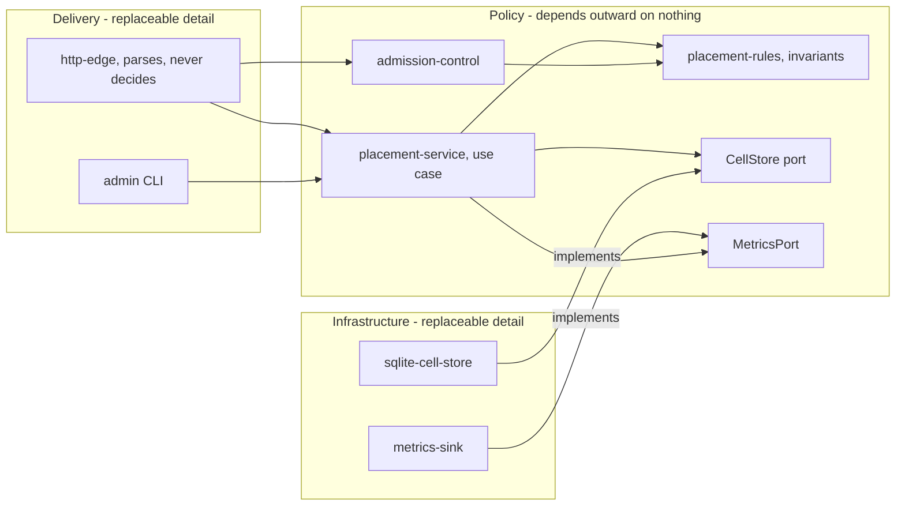

# ARCH Template — System Structure

One per initiative. Path:
`docs/executor/INIT-NNNN-<slug>/architecture/INIT-NNNN-ARCH-nn-<slug>.md`

Allocate the ID immediately before writing:
`scripts/exec-id INIT-NNNN ARCH`

Copy the structure below. Guidance sits in HTML comments — delete them. Every
section is required; a section with nothing to say says so in one line
("Single process, no deployment shape to describe") rather than being cut.

## Frontmatter

```yaml
---
id: INIT-0004-ARCH-01
initiative: INIT-0004
kind: architecture
title: System structure
status: draft                      # draft while writing, active when the gate passes
created_at: 2026-09-01T14:55:52Z   # date -u +%Y-%m-%dT%H:%M:%SZ
updated_at: 2026-09-01T14:55:52Z
supersedes: null
superseded_by: null
components: [router, placement-service, admission-control, cell-store]
interfaces: [INIT-0004-IFCE-01]
decisions: [INIT-0004-ADR-01, INIT-0004-ADR-02]
---
```

`components` is the inventory below, verbatim. `interfaces` and `decisions`
are filled as those documents are written — every ID begins with this
initiative's ID, no exceptions.

## Body

---

# System structure

## 1. Context and forces

<!-- What this structure exists to satisfy, traced to the charter. Not a
     restatement of the problem — the forces that constrain the shape.
     Name each force and where it comes from. -->

| Force | Source | Consequence for structure |
|---|---|---|
| p99 placement under 200 ms at 10k tenants | charter success criteria | Placement decision cannot make a network call per request |
| Tenant data must not co-mingle | charter constraint | Isolation is a boundary, not a query filter |
| Team of two, one quarter | charter constraint | No component gets its own deployment |

<!-- Also state the forces you are deliberately NOT optimising for. An
     architecture that claims to satisfy everything has been checked against
     nothing. -->

**Not optimised for:** multi-region writes; more than 50k tenants; hot-swap
of the storage engine at runtime.

## 2. Component inventory

<!-- One line per component. If a responsibility needs "and", it is two
     components or the line is imprecise. -->

| Component | Responsibility (one line) | Layer |
|---|---|---|
| `placement-service` | Chooses the cell a tenant belongs to | policy |
| `placement-rules` | Holds the invariants a placement must satisfy | policy |
| `CellStore` (port) | The persistence surface placement needs | policy-owned port |
| `sqlite-cell-store` | Implements `CellStore` on per-cell SQLite | adapter |
| `http-edge` | Parses requests, calls a use case, formats responses | adapter |
| `admission-control` | Rejects requests a cell cannot currently serve | policy |
| `metrics-sink` | Emits placement counters and latencies | adapter |

## 3. Boundaries

<!-- The load-bearing section. Dependencies point inward toward policy;
     frameworks, databases, transports, and vendors stay replaceable details
     at the edge. -->

| Component | May depend on | Must not depend on | Enforced by |
|---|---|---|---|
| `placement-service` | `placement-rules`, `CellStore` port | Any adapter, any SQL, any HTTP type | No imports outside `core/` — import lint rule |
| `sqlite-cell-store` | `CellStore` port, policy value types | `http-edge`, `metrics-sink` | Package visibility |
| `http-edge` | Use cases, request/response models | `sqlite-cell-store`, SQL, `placement-rules` internals | Package visibility |
| composition root | Everything | — nothing depends on it | Single `main` file |

**What crosses a boundary:** plain request and response models only. No ORM
rows, framework request objects, or vendor response types enter or leave
policy — otherwise a vendor upgrade becomes a policy change.

**Named exceptions:** `admission-control` reads the clock directly rather
than through a port. Cost to undo: one injected parameter and three test
updates. Accepted because no test needs to control time yet.

<!-- One worked diagram. Boundary subgraphs, and every arrow crossing into
     policy is an implements-arrow. If your system cannot be drawn this way,
     name the exception above and its cost. -->



Reading the diagram: nothing inside `POLICY` has an arrow pointing out of it.
Both infrastructure components reach policy only by implementing a port that
policy owns, which is what makes either one replaceable without touching a
rule.

## 4. Data flow

<!-- The main path first, then each significant variant. Say what data is at
     each hop and where it changes shape, because shape changes are where
     seams live. -->

1. `http-edge` receives `POST /tenants/:id/cell`, validates syntax only, and
   builds a `PlacementRequest` (tenant id, region, size class).
2. `admission-control` checks current cell load against
   `placement-rules.admissible()`; a rejection returns before any storage
   read.
3. `placement-service` loads candidate cells via `CellStore.candidates()`,
   scores them against `placement-rules`, and writes the binding via
   `CellStore.bind()`.
4. `http-edge` maps the returned `Placement` to a response body. Errors map
   per the table in `INIT-0004-IFCE-01`.

**Shape changes:** HTTP body → `PlacementRequest` (edge); `CellRow` →
`Cell` (adapter). Both are the only translation points, and both live outside
policy.

## 5. Failure modes

<!-- What breaks, how it is noticed, how far it spreads, and whether the
     response is designed or merely accepted. An accepted failure is fine;
     an unnoticed one is not. -->

| Failure | Detected by | Blast radius | Response | Designed or accepted |
|---|---|---|---|---|
| Cell store unreachable | `CellStore` call raises `StoreUnavailable` | All placements for that cell | Fail the request, retry-after header, no partial bind | designed |
| Two concurrent placements pick the same cell | Unique constraint on `(tenant, cell)` | One request | Loser retries once, then fails | designed |
| Metrics sink down | Emit returns error, ignored | None — placement unaffected | Drop the metric | accepted |
| Clock skew across nodes | Not detected | Placement fairness drifts | None | accepted — recorded in `INIT-0004-ADR-02` |

## 6. Deployment shape

<!-- Processes, what runs where, what crosses a process or network boundary
     and at what cost, and how configuration and secrets arrive. Secrets by
     reference only. -->

- One process per region. All components in-process; no internal network
  hops on the placement path — that is what buys the p99 budget.
- Cell stores are local files on the same node, one per cell.
- Configuration arrives as environment variables read once at startup in the
  composition root. The store credential is read from `CELL_DB_KEY`; the
  value lives in the deployment's secret store and is not recorded here.

## 7. What this document does not decide

<!-- Explicit non-decisions, so the spec does not assume they were settled
     and the next reader does not go looking for a rationale that was never
     written. -->

- Cell sizing policy — deferred to `INIT-0004-SPEC-01`.
- Eviction ordering — no decision yet; the `CellStore` port leaves room for
  it.

## 8. Decisions and interfaces produced

| ID | Kind | Covers |
|---|---|---|
| INIT-0004-ADR-01 | adr | Per-cell SQLite over a shared cluster |
| INIT-0004-ADR-02 | adr | Isolation boundary at the cell, not the row |
| INIT-0004-IFCE-01 | interface | `CellStore`, `MetricsPort`, placement error contract |

---

## Quality bar

- Every component's responsibility fits one line with no "and".
- Every arrow in section 4 is permitted by section 3, or named as an exception
  with its undo cost.
- Every boundary names its enforcement mechanism. A boundary enforced only by
  intention is a diagram.
- Every force in section 1 traces to the charter, and the not-optimised-for
  list is non-empty.
- Every failure in section 5 has a detection mechanism, including the accepted
  ones.
- No credentials, tokens, or connection strings — redacted existence
  statement plus a safe pointer instead.
