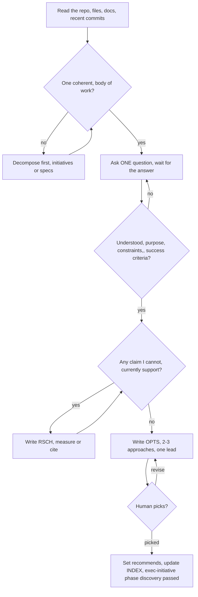

# Executor — Discovery

Discovery answers exactly two questions: **what is actually being asked for**,
and **which approach wins**. Its outputs are research documents (`RSCH`), an
options comparison (`OPTS`), and one human decision recorded in the phase log.

Discovery writes no production code, scaffolds nothing, and installs nothing.
A probe you run to measure something is evidence — it is labelled throwaway in
the research document that cites it and it is not kept.

| | |
|---|---|
| **Entry** | Charter exists and its intake gate passed (`executor-initiative`) |
| **Owns** | `docs/executor/INIT-NNNN-<slug>/discovery/`, `.../brainstorm/sessions/` |
| **Produces** | `INIT-NNNN-RSCH-nn`, `INIT-NNNN-OPTS-nn` |
| **Exit gate** | The human picks an approach |
| **Next** | `executor-architecture` |

Read the contract before writing anything:
[layout](../executor/references/layout.md) ·
[frontmatter](../executor/references/frontmatter.md) ·
[indexes](../executor/references/indexes.md) ·
[safety](../executor/references/safety.md).

Scripts live in `agent/skills/executor/scripts/`; paths below are written
`scripts/...` as the contract writes them.

<HARD-GATE>
Do NOT write code, scaffold a project, install a dependency, create a
branch for implementation, or invoke any implementation skill until the
human has approved an approach. This applies to EVERY initiative, however
small. The artifact scales with the task — a tiny initiative's options
document is three paragraphs. The approval gate never scales.
</HARD-GATE>

## Procedure



1. **Read the repo.** Files, docs, recent commits, the charter. Never ask a
   question the repository already answers — it burns the human's patience on
   work you could have done.
2. **Check scope.** Decompose before detailed questions (below).
3. **Ask one question per message** until purpose, constraints, and success
   criteria are clear.
4. **Gather evidence** into `RSCH` documents when a claim needs support.
5. **Write the `OPTS` document** — 2-3 approaches, identical axes, one lead
   recommendation, and what would change it.
6. **Present and stop.** The human picks.
7. **Record the pick** and pass the gate.

## Dialogue Discipline

This is the highest-value part of discovery. A wrong approach chosen from a
well-run dialogue costs one initiative; a right-looking approach chosen from
assumptions costs the whole build and is not discovered until execution.

| Rule | Why |
|---|---|
| **One question per message. Never batch.** | Batched questions get one answer covering the easiest of them, and the hard one is silently dropped. |
| **If a topic needs more exploration, split it into more messages** — not more questions in one message. | Depth comes from follow-ups that react to the last answer, which a batch cannot do. |
| **Prefer multiple choice.** Offer 2-4 concrete labelled options plus "something else". | Choosing is faster and more accurate than composing, and your option list exposes your assumptions where the human can correct them. |
| Open-ended is fine when you genuinely have no candidate answers. | A fake multiple choice with a foregone winner is a leading question. |
| **Focus on purpose, constraints, success criteria.** | These are what you cannot derive from the repo. Implementation detail you can derive — do not spend a question on it. |
| Ask what is explicitly **out of scope**. | Non-goals prevent more rework than goals do, and the human rarely volunteers them. |
| **Be ready to go back.** When a later answer contradicts an earlier one, say so and re-ask. | Silently reconciling a contradiction means you invented the resolution and nobody reviewed it. |
| Say what you already concluded from the repo before asking around it. | The human corrects a stated wrong premise instantly and an unstated one never. |
| Stop asking when the next question would not change any option. | Interrogation is not rigour. Discovery ends when the choice is decidable. |

**Question budget check.** Before sending a question, name which of the
options it might eliminate or add. If it eliminates nothing, delete it.

## Decompose Before Detailed Questions

A request spanning multiple independent subsystems is decomposed first.
Refining details of the first subsystem you happened to hear about wastes the
questions and produces a spec for a fragment.

Flag it the moment you see it, then decide the shape:

| Test | Shape |
|---|---|
| The pieces ship, fail, and are reviewed **independently**, and each produces a deliverable that outlives the others | **Several initiatives**, ordered — declare order with `depends_on` in each charter |
| The pieces share one architecture, one set of interfaces, and one success definition, but are too much for one requirements contract | **One initiative, several specs** — `INIT-NNNN-SPEC-01`, `-SPEC-02`, each with its own plans |
| The pieces are one deliverable seen from two angles | **One initiative, one spec** — you are decomposing prose, not work |

**Prefer one initiative with several specs when in doubt.** The citation rule
is hard: a document inside `INIT-0004` may never cite an ID from another
initiative, so a dependency across initiatives cannot be expressed as a
reference — only as `depends_on` at the charter level, with each side
restating the other's requirement in its own words. That restatement is real
cost, and it drifts. Splitting into initiatives buys independent archival;
pay for it only when the pieces are genuinely independent.

Decomposition into initiatives is `executor-initiative`'s work — hand it the
split, do not scaffold folders yourself. Then run discovery on the first
initiative only.

## Research Documents (`RSCH`)

Write one when a claim the options rest on is not currently supported: a
performance number, an API's real behaviour, prior art, a vendor limit, the
actual shape of the code you are about to change.

**Do not write one to restate what you already know.** A research document
that carries no new evidence is noise in the registry.

### Provenance is the point

| Value of `confidence` | Means |
|---|---|
| `measured` | **You ran it.** The command is in `sources` and its output is in the body. |
| `cited` | You read it in a named source. The URL or path is in `sources`. |
| `inferred` | You reasoned from measured or cited facts. The reasoning is in the body. |
| `unverified` | You believe it and have not checked. Named as such, or not written at all. |

**A research document that presents a citation as a measurement is a defect.**
Not a style problem — a defect, on the same footing as a wrong number. Every
downstream decision weights "we measured 40ms" differently from "the docs say
40ms", and once the distinction is lost it cannot be recovered from the text.

- Mixed document → `confidence` takes the **weakest** value present, and each
  claim in the body carries its own marker.
- Separate what you ran from what you read into distinct sections. Never
  interleave them in one paragraph.
- Paste the actual command and its actual output for anything `measured`. A
  measurement with no reproducible command is `unverified`.
- Contradicting evidence is written down, not dropped. A source you rejected
  and why is worth more than a source you agreed with.

### Writing it

```bash
scripts/exec-id INIT-0004 RSCH          # → INIT-0004-RSCH-02
date -u +%Y-%m-%dT%H:%M:%SZ             # real timestamp, never invented
```

Path: `docs/executor/INIT-0004-<slug>/discovery/INIT-0004-RSCH-02-<topic-slug>.md`

```yaml
---
id: INIT-0004-RSCH-02
initiative: INIT-0004
kind: research
title: Cell placement cost at 10k tenants
status: active
created_at: 2026-09-01T14:55:52Z
updated_at: 2026-09-01T14:55:52Z
supersedes: null
superseded_by: null
question: What does cell placement cost at 10k tenants?
sources: ["bench/place.sh --tenants 10000", "https://…/sharding-guide"]
confidence: measured
---
```

Body: the question · what was measured (command, output) · what was cited
(source, claim) · what was inferred · what remains unknown · what this rules
in or out.

**"What remains unknown" is required.** An options document built on research
with no stated gaps is built on a document that pretended to be complete.

## Options Documents (`OPTS`)

One per decision that has real alternatives. This is discovery's deliverable —
the human's pick happens against this document.

**Rules:**

1. **2-3 approaches.** One is not a comparison; four means two of them are the
   same approach wearing different names, or you have not thought hard enough
   to eliminate the weak ones.
2. **Straw men are forbidden.** Every approach listed must be one a competent
   engineer would defend. If you cannot defend it, it is not an option — it is
   a paragraph in the rejected section.
3. **Identical evaluation axes across all approaches.** Pick the axes that
   matter for *this* decision (typical: effort, risk, reversibility, blast
   radius, operational cost, migration cost, testability, what it forecloses),
   state them once, and answer every one for every approach. An axis answered
   for the lead and skipped for the alternatives is how a recommendation gets
   rigged without anyone deciding to rig it.
4. **YAGNI ruthlessly, per approach.** Strip every feature not required by the
   charter's success criteria out of *each* approach before comparing. Options
   inflated with speculative features compare their inflation, not their
   substance. Note what you stripped — the human may want one back.
5. **Lead with the recommendation and its reasoning.** A comparison with no
   recommendation pushes your job onto the human.
6. **State what would change the recommendation.** One or two concrete,
   checkable conditions: "if the tenant count is above 50k, B wins"; "if we
   must support on-prem, A is out". A recommendation with no falsifier is a
   preference. This is also what makes the document useful when someone
   reopens the decision in six months.
7. **Cost the reversal.** For each approach, one line on what it costs to
   undo. `two-way` doors deserve less agonising than `one-way` doors, and
   saying which is which shortens the human's decision.

### Writing it

```bash
scripts/exec-id INIT-0004 OPTS          # → INIT-0004-OPTS-01
```

Path: `docs/executor/INIT-0004-<slug>/discovery/INIT-0004-OPTS-01-<topic-slug>.md`

```yaml
---
id: INIT-0004-OPTS-01
initiative: INIT-0004
kind: options
title: Placement approaches
status: draft
created_at: 2026-09-01T15:10:04Z
updated_at: 2026-09-01T15:10:04Z
supersedes: null
superseded_by: null
question: How are tenants placed onto cells?
sources: [INIT-0004-RSCH-01, INIT-0004-RSCH-02]
confidence: inferred
recommends: null
---
```

`status: draft` while the human has not picked; `active` once they have.
`recommends: null` until then.

Body skeleton:

```markdown
## Recommendation
<lead approach, in one paragraph, with the reason it wins>

## What would change this
<1-2 concrete, checkable conditions>

## Evaluation axes
<the axes, stated once, with why these and not others>

## Approach A — <name>
How it works · axis-by-axis · reversal cost · what it forecloses · stripped by YAGNI

## Approach B — <name>
<same headings, same order>

## Rejected without full comparison
<approach, one line why it is not defensible here>

## Decision
<filled in when the human picks: which approach, their words, date>
```

Every ID in `sources` begins with this initiative's ID. If a fact came from
another initiative's work, **restate the fact in your own words with its
original evidence** — never cite the foreign ID.

## Decisions Made During Discovery Are Not Rulings

`exec-ruling` is an execution-time tool: it appends to a *plan's*
`rulings.md`, so calling it before a plan exists is an error, not a shortcut.

| Decision made during… | Recorded as |
|---|---|
| Discovery, architecture, specification | An **ADR** (`INIT-NNNN-ADR-nn`), written by `executor-architecture`, human in the loop |
| A plan already running | A **ruling** via `scripts/exec-ruling`, controller decides alone |

Inside discovery, a decision small enough not to need an ADR is recorded in
the `OPTS` or `RSCH` body where it applies. A decision big enough to need one
waits for the architecture phase — note it in the options document as an open
decision so it is not lost.

## Brainstorm Sessions

Visual sessions live inside the **tracked** thinking store:

```text
docs/executor/INIT-0004-<slug>/brainstorm/sessions/<UTC-timestamp>-<topic>/
```

This is deliberate: the Executor keeps visual evidence in the tracked
thinking store instead of a disposable scratch directory. **The mockups and
the options shown are part of the reasoning record.** A year later, "why is
the wizard three steps" is answered by the three-step and five-step mockups
the human chose between — that evidence is worth more than the sentence in
the options document.

Offer the companion **just-in-time**, never upfront, and only when a question
is genuinely clearer shown than told. Read
[visual-companion.md](visual-companion.md) before starting the server.

**Synthetic data only** in every mockup and screen — session state can capture
whatever was on screen, and this directory is tracked from the moment it is
written. See [safety](../executor/references/safety.md).

## The Gate Out of Discovery

Present the options document in chat — the recommendation, the axes, and what
would change it — and **stop**. Do not begin architecture in the same message.

When the human picks:

1. Write their choice into the `OPTS` body's `## Decision` section, in their
   words, with the date.
2. Set `recommends` to the ID, within this initiative, of the document
   carrying the chosen approach — the `OPTS` document's own ID when all
   approaches live in one document. Set `status: active` and bump
   `updated_at`. The chosen option's letter and name live in `## Decision`;
   `recommends` is the machine-readable pointer to where the decision is
   recorded.
3. Append every discovery document to the initiative's `INDEX.md` document
   table (`ID | Kind | Title | Status | Path`), sorted by ID, in this same
   change — an index written later drifts.
4. Pass the gate:

   ```bash
   scripts/exec-initiative phase INIT-0004 discovery passed "approach B chosen"
   ```

   This updates the phase log row, the initiative header, and the registry
   row. Use `entered` when discovery starts, `passed` when the human picks.
5. Route to `executor-architecture`. Invoke no other skill.

If the human picks nothing and asks for a different approach, that is a
revision: write the new approach into the document (or a new `OPTS` document
that `supersedes` it, if the framing changed), and present again. The gate
does not move.

### Skipping discovery

Legitimate when there is exactly one defensible approach and no unsupported
claim — a small initiative often qualifies. Skipping is a **stated decision**:

```bash
scripts/exec-initiative phase INIT-0004 discovery skipped "single viable approach; see charter"
```

and the charter's `skipped_phases` gains `discovery` with the reason in its
body. The `skipped` row is what tells a later reader the difference between
"we considered alternatives" and "nobody looked."

## Red Flags

| Thought | Reality |
|---|---|
| "This is too simple to need approval" | Simple means a short options document, not no gate. Two paragraphs, then the human picks. |
| "The approach is obvious — I'll start while they read it" | The gate is the approval, not the document's length. Present, then stop until you hear yes. |
| "I'll ask these four things at once to save a round-trip" | You will get one answer. The other three become assumptions nobody reviewed. |
| "I know this kind of system, so I can skip the repo read" | Familiarity is not evidence. The repo is what the initiative changes, not the archetype. |
| "The docs say it's 40ms, close enough to measured" | That is `cited`. Marking it `measured` corrupts every decision weighted on it. |
| "Only one approach makes sense" | Then write the second one honestly and show why it loses. If you cannot, you have not understood the first one. |
| "I'll add the extra feature to approach A, it's nearly free" | Compare stripped approaches. Inflated options compare inflation. |
| "The other initiative's ADR already decided this — I'll cite it" | Forbidden. Restate the fact in your own words; declare the dependency in the charter. |
| "I'll record this call with exec-ruling" | No plan exists, so there is no rulings log. It is an ADR, or a line in the options body. |
| "Discovery is dragging, I'll pick for them" | Choosing on the human's behalf is the one decision discovery may not make. Narrow to two, state the trade, ask once. |
| "The brainstorm mockups were just scratch" | They are the evidence for the choice. They are tracked. |
| "It grew into three subsystems but I'm nearly done" | Hidden scope decomposes the work, mid-phase. Stop and say so. |
