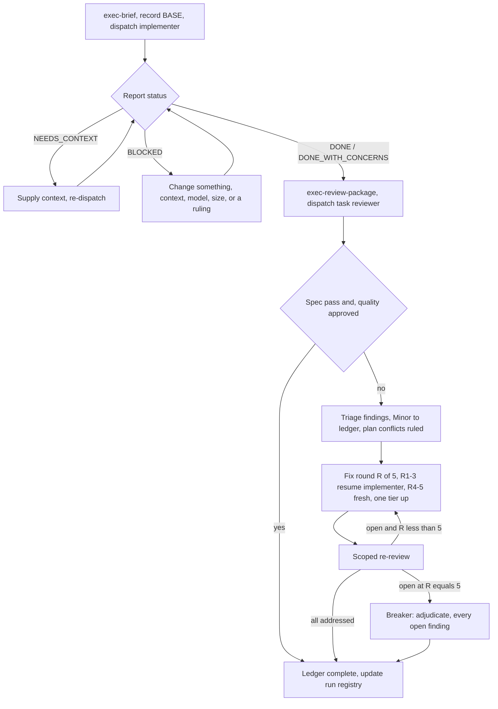

# Executor — Execution

Execute one plan by dispatching a fresh implementer subagent per task, a
task review after each, and a whole-branch review at the end. You are the
**controller**: you coordinate, you rule, you never implement.

**Why subagents.** You delegate each task to an agent with isolated context
whose instructions you craft exactly. It never inherits your session's
history, so it cannot be distracted by another task's decisions, and your own
context stays free for coordination — which is the only thing you cannot
delegate.

**Core loop:** fresh implementer per task + task review (spec + quality) +
capped fix loop + broad final review.

**Narration:** between tool calls, at most one short line. The ledger, the
reports, and the verdict files carry the record.

## Prerequisites

| Requirement | Why |
|---|---|
| A plan at `docs/executor/INIT-NNNN-*/plans/INIT-NNNN-Pnn-*.md` | Everything resolves from its `id:` frontmatter |
| Every task heading carries its ID: `### Task 3: <name> — \`INIT-0004-P01-T03\`` | `exec-brief` errors out without it, because a brief with no ID cannot be filed, reviewed, or resumed |
| The planning gate passed and the human picked `execution_mode: subagent` | Execution runs without check-ins, so the approval must already exist |
| A reachable spec (`spec:` in plan frontmatter) | The spec is the binding authority every conflict resolves against |

Scripts live in the sibling contract skill. Invoke them as
`../executor/scripts/<name>` from this skill's directory, or by absolute
path. Never hand-build a store path — the scripts own path resolution and
they are the only thing that keeps a renamed plan attached to its artifacts.

## Setup

**1. Isolated workspace.** Ensure the work happens in an isolated git
worktree — use the repository's native worktree tooling or verify the
existing one. **Never start implementation on a main/master branch without
the human's explicit consent**, because the four stop conditions include side
effects on shared branches and you would be committing to one every task.

**2. Resolve the execution workspace.**

```bash
../executor/scripts/exec-workspace docs/executor/INIT-0004-cloud-tenant-cells/plans/INIT-0004-P01-cell-router.md
# → /repo/.executor/INIT-0004/P01
```

This creates `briefs/ reports/ reviews/diffs/ reviews/verdicts/` and **seeds
`progress.md`, `rulings.md`, `preflight-scan.md`, and `dispatches.md` with
their headers**. You never hand-create those four files, and you never
invent a different shape for them. It also writes the self-ignoring
`.executor/.gitignore` and inserts this run's row into `.executor/INDEX.md`
with `Status: running` and `Tasks: 0/?`.

Resolution keys on the plan's `id:` frontmatter, not the filename — renaming
a plan does not orphan its workspace. A plan with no `id:` is pre-Executor
and falls back to `.executor/legacy/<basename>/`.

**3. Read the ledger before doing anything else.** Conversation memory does
not survive compaction. In real sessions, controllers that lost their place
have **re-dispatched entire completed task sequences — the single most
expensive failure observed.** The ledger, not your todos, is the recovery
map.

`progress.md` opens with its identity:

```text
# Executor ledger
plan: INIT-0004-P01
plan_file: docs/executor/INIT-0004-cloud-tenant-cells/plans/INIT-0004-P01-cell-router.md
spec: INIT-0004-SPEC-01
```

- A `plan:` line naming a different plan is not yours — leave it, resolve
  your own workspace.
- Tasks with a `complete` line are DONE. Do not re-dispatch them. Resume at
  the first task without one.
- A task whose last line is a fix round is mid-loop — resume the loop at the
  next round.
- **After compaction, trust the ledger and `git log` over your own
  recollection.** The commits the ledger names exist in git even when your
  context no longer remembers creating them.
- Check `dispatches.md` too: a task's last dispatch may still be a live
  agent you can resume instead of replacing, which preserves its context.
- `git clean -fdx` destroys the whole store, because `.executor/` is
  git-ignored. If that happens, rebuild the ledger from `git log` and the
  commits the reports named — the artifacts are gone, the commits are not.

**4. Read the plan once and the spec once.** Note the plan's context and
Global Constraints, and create one todo per task. The spec is the authority
the plan argues from — conflicts inside the plan resolve against it, by ID.
If the plan names no reachable spec, record a ledger line saying so: rulings
made without a spec are provisional.

**5. Run the preflight conflict scan** (below) before Task 1 dispatches.

## The Preflight Conflict Scan

Scan the plan once for conflicts, **writing down what you checked as you
check it**, into `preflight-scan.md` (already seeded with the table header):

```markdown
| Tasks | Shared surface | Produced vs consumed | Finding | Ruling |
|---|---|---|---|---|
| T02 ↔ T05 | `src/router/place.ts` | T02 exports `placeCell(tenant, cell)`, T05 calls `placeCell(cell, tenant)` | argument order contradicts | ruled: T02's order is the spec's (INIT-0004-IFCE-01) — T05's dispatch carries the correction |
| T03 (self) | own text | creates `scoring.ts`, later step edits `score.ts` | filename disagrees with itself | ruled: `scoring.ts`, the name the interface doc uses |
| T04 (self) | own text | tests assert on the code it specifies | consistent | — |
```

The scan's output is a **table, not a verdict**:

- **One row for every pair of tasks that share a file or an interface** —
  the two tasks, what one produces against what the other consumes, and what
  you found. The plan's dependency map is the input that tells you which
  pairs to check.
- **One row for every task** — whether its own text agrees with itself: the
  tests it specifies against the code it specifies, the files it creates
  against the files it later touches.
- One row for anything the plan mandates that the review rubric treats as a
  defect (a test that asserts nothing, verbatim duplication of a logic
  block), so the reviewer's finding is already adjudicated when it arrives.

**"The scan is clean" without those rows is not a scan you ran.**

**Rule on every finding before Task 1 dispatches** — each finding weighed
against the plan text that mandates it, with the spec as binding authority.
Record each with `exec-ruling` and put the one-line summary in the row's
Ruling cell:

```bash
../executor/scripts/exec-ruling "$PLAN" preflight \
  "T02's argument order stands, T05 adapts" \
  "INIT-0004-IFCE-01 fixes the signature and the plan is its argument" \
  "if wrong, T05 needs a one-line call-site fix"
```

If the scan is clean, proceed without comment. The review loop remains the
net for conflicts that only emerge from implementation.

## Continuous Execution

**Do not pause to check in between tasks.** Execute every task from the plan
without stopping. "Should I continue?" prompts and progress summaries waste
the human's time — they approved the plan and asked for it to be executed.
Approval happens at phase boundaries, not inside them.

### Rulings, not stalls

A running plan does not wait on a human. Conflicts, ambiguities, plan
defects, a cap you would have asked to exceed — decide them. The spec is the
binding authority, the plan is its argument, and your judgment settles what
neither answers.

**Record every ruling with `exec-ruling` the moment it is made**, not
collected at the end:

```bash
../executor/scripts/exec-ruling PLAN_FILE TASK_ID "<decision>" "<why>" "<cost if wrong>"
# TASK_ID may be a task ID, 'preflight', or 'final'
# appends to <workspace>/rulings.md AND writes .local/decisions/NNNN-<utc>-<slug>-ruling.md
# prints both paths
```

Then add a one-line ledger pointer so the resume scan sees it:
`INIT-0004-P01-T05: ruling recorded (rulings.md)`.

**Change from legacy:** rulings used to live only in a ledger that was
deleted when the plan finished, and reached the human once, in a final chat
message. A ruling that dies with its workspace was a decision made in
secret. `exec-ruling` writes it twice, at the moment of decision, and
nothing deletes either copy.

A wrong ruling costs rework the human can see and undo. A session parked on
a question costs their whole day and buys nothing.

### Four things stop you, and only these

1. An irreversible or destructive operation.
2. A security-sensitive action.
3. A side effect outside this worktree that norms say you ask about first —
   a merge, a push to a shared branch, a publish.
4. A defect so deep that every path forward is a guess.

For those, stop and ask. Nothing else.

## Model Selection

Use the **least powerful model that can handle each role**, to conserve cost
and increase speed.

| Role / shape | Tier |
|---|---|
| Mechanical implementation — isolated function, complete spec, 1-2 files | cheap |
| Plan text contains the complete code to write (transcription plus testing) | cheapest |
| Single-file mechanical fix | cheapest |
| Integration and judgment — multi-file coordination, pattern matching, debugging | standard |
| Architecture and design judgment, broad codebase understanding | most capable |
| The final whole-branch review | most capable — never the session default |
| Task review | scaled to the diff's size, complexity, and risk — a small mechanical diff does not need the top tier, a subtle concurrency change does |
| Scoped re-review of a small fix diff | cheap-to-mid |
| Fix rounds 4-5 | **at least one tier above the implementer that got stuck** |

**Task complexity signals (implementation tasks):**

- Touches 1-2 files with a complete spec → cheap model
- Touches multiple files with integration concerns → standard model
- Requires design judgment or broad codebase understanding → most capable

**Always specify the model explicitly when dispatching.** An omitted model
inherits your session's — often the most capable and most expensive — which
silently defeats this entire section.

**Turn count beats token price.** Wall-clock and context cost scale with how
many turns a subagent takes, and the cheapest models routinely take 2-3× the
turns on multi-step work, costing more overall. Use a mid-tier model as the
floor for reviewers and for implementers working from prose descriptions.

**Log every dispatch** in `dispatches.md` (seeded with its header) so the
selection is reviewable after the fact and a resumed controller can find a
live agent:

```markdown
| Task | Role | Model | Agent | Started | Outcome |
|---|---|---|---|---|---|
| INIT-0004-P01-T03 | implementer | cheap | impl-t03-a | 2026-09-01T14:20Z | DONE |
| INIT-0004-P01-T03 | reviewer R01 | standard | rev-t03-r1 | 2026-09-01T14:41Z | 2 findings |
| INIT-0004-P01-T03 | implementer fix R01 | cheap (resumed impl-t03-a) | impl-t03-a | 2026-09-01T14:52Z | DONE |
```

Two uses, both load-bearing: model-selection decisions become reviewable
after the fact, and a resumed controller finds a live agent to resume
instead of replacing it.

## Context Discipline

Everything you paste into a dispatch prompt — and everything a subagent
prints back — **stays resident in your context for the rest of the session
and is re-read on every later turn.** Hand artifacts over as file paths.

- Never make a subagent read the whole plan file. It gets its brief.
- Never paste accumulated prior-task history into a later dispatch. A real
  session's dispatch hit **42k characters of which 99% was pasted history**.
  A fresh subagent needs its task, the interfaces it touches, and the global
  constraints. Nothing else.
- Never transcribe a verdict into your own context. The reviewer writes
  `reviews/verdicts/<TASK-ID>-R<nn>-verdict.md` itself; you read the path
  and act on the findings.
- Review diffs never enter your context — `exec-review-package` writes the
  file, prints the path, and the reviewer reads it.

## Waiting Discipline

Never poll a wait interface with short timeouts, and never sit in one
silent, open-ended wait either.

- While you have local work — ledger updates, packaging the next review,
  reading a report — keep working. Child results arrive on their own.
- When genuinely idle, wait in **bounded stretches** (five to ten minutes,
  where the platform allows).
- Between stretches, post one line of status and reconcile live children:
  list them, and chase any that finished without reporting.

A bounded stretch keeps nearly all of a long wait's efficiency while
guaranteeing a stuck or lost child is noticed within minutes rather than at
the end of the session.

## The Task Loop



**Batch small same-shape work.** When the plan lists several tasks that are
each a small, independent edit of the same kind — the same one-line fix,
constant change, or field addition repeated across files — do **not**
dispatch one subagent per task. Compose ONE dispatch brief listing every
file and its change, send the whole batch to a single subagent, and review
its diff as one unit. Reserve one-dispatch-per-task for work that needs its
own judgment, its own tests, or its own review surface.

**Never dispatch multiple implementation subagents in parallel** — they
conflict in the same worktree.

### 1. Dispatch the implementer

**Record BASE first:** `git rev-parse HEAD`. The review package and every
fix-round diff need it. Never use `HEAD~1` later — it silently drops all but
the last commit of a multi-commit task.

**Generate the brief:**

```bash
../executor/scripts/exec-brief "$PLAN" 3
# → /repo/.executor/INIT-0004/P01/briefs/INIT-0004-P01-T03-brief.md
```

The brief carries an identity header — task ID, plan ID and path, spec ID —
followed by the task's verbatim text. It **errors out if the task heading
carries no task ID**, because an unidentified brief cannot be filed,
reviewed, or resumed. If that happens, the plan is defective: rule on it, add
the IDs to the plan's task headings per the frontmatter contract, record the
ruling, and continue.

**Compose the dispatch** from [implementer-prompt.md](implementer-prompt.md)
so the brief stays the single source of requirements. It contains exactly:

1. One line on where this task fits in the project.
2. The brief path, introduced as "read this first — it is your requirements,
   with the exact values to use verbatim."
3. Interfaces and decisions from earlier tasks that the brief cannot know.
4. Your resolution of any ambiguity you noticed in the brief.
5. The report-file path (`reports/<TASK-ID>-report.md`) and the report
   contract.
6. The no-secrets rule and the no-subagents contract (both in the template).

Exact values — numbers, magic strings, signatures, test cases — appear
**only in the brief**, so there is exactly one authority for them.

**The no-subagents contract.** The implementer never dispatches subagents —
not helpers, and never a reviewer. Review arrives from you, after the
report. In real sessions, **every reviewer a worker spawned duplicated the
task review the controller dispatched anyway — a full extra review seat per
task.**

**Carry forward parked findings.** If an earlier task parked a finding in
the area this task touches, put a pointer to that rulings entry in the
dispatch, so the implementer does not rediscover a decided question.

**Record the agent identity** from the dispatch result into `dispatches.md`
— fix-loop rounds 1-3 resume that agent.

**Ledger:** `INIT-0004-P01-T03: dispatched (model cheap, agent impl-t03-a, base a1b2c3d)`

If the implementer asks questions — before starting or mid-task — answer
clearly and completely, provide the context it needs, and do not rush it
into implementation.

### 2. Handle the report

Implementers report one of four statuses.

| Status | Handling |
|---|---|
| **DONE** | Generate the review package and dispatch the task reviewer. |
| **DONE_WITH_CONCERNS** | Read the concerns before proceeding. Correctness or scope concerns get addressed before review. Observations ("this file is getting large") get noted in the ledger and review proceeds. |
| **NEEDS_CONTEXT** | Supply the missing information and re-dispatch. |
| **BLOCKED** | Assess the blocker: (1) context problem → more context, same model; (2) needs more reasoning → more capable model; (3) task too large → break it into pieces; (4) the plan itself is wrong → rule on the correction with `exec-ruling` and re-dispatch carrying the ruling. |

**Never ignore an escalation, and never force the same model to retry
unchanged.** If the implementer said it is stuck, something has to change
before the next attempt — otherwise you are paying for the same failure
twice.

### 3. Review the task

Per-task reviews are task-scoped gates. The broad review happens once, at
the end. **Never skip the task review**, and never accept a verdict missing
either half — spec compliance AND task quality are both required.
Implementer self-review never replaces the task review.

**Build the package:**

```bash
../executor/scripts/exec-review-package "$PLAN" 3 "$BASE" HEAD 01
# → /repo/.executor/INIT-0004/P01/reviews/diffs/INIT-0004-P01-T03-R01-a1b2c3d..d4e5f6a.diff
```

`TASK` is the task number or the literal `final`; `ROUND` defaults to `01`.
The file holds the commit list, the stat summary, and `git diff -U10` — the
reviewer sees all three in one read, and none of it enters your context.
Use the BASE you recorded before dispatching. **Never dispatch a task
reviewer without a diff file.**

**Reviewer inputs** — four paths and one block:

- the brief file, the report file, the review package path
- the verdict path it must write:
  `reviews/verdicts/INIT-0004-P01-T03-R01-verdict.md`
- the global-constraints block that binds this task

**The global-constraints block is the reviewer's attention lens.** Copy the
binding requirements verbatim from the plan's Global Constraints or the spec
(`INIT-0004-SPEC-01`): exact values, exact formats, and the stated
relationships between components ("same layout as X", "matches Y"). The
reviewer's own template carries the process rules — YAGNI, test hygiene,
review method — so this block is only for what THIS spec demands.

**Do not:**

- add open-ended directives ("check all uses", "run race tests if useful")
  without a concrete, task-specific reason — they turn a scoped review into
  a wander;
- ask a reviewer to re-run tests the implementer already ran on the same
  code — the report carries the test evidence;
- **pre-judge findings.** Never instruct a reviewer to ignore or not flag an
  issue. If your prompt contains **"do not flag," "don't treat X as a
  defect," "at most Minor," or "the plan chose" — stop.** You are
  pre-judging, usually to spare yourself a review loop. Let the reviewer
  raise it and adjudicate it in the loop.

Templates and rubric belong to `executor-review` — dispatch the task review
with [`../executor-review/task-reviewer-prompt.md`](../executor-review/task-reviewer-prompt.md)
and every scoped re-review with
[`../executor-review/re-review-prompt.md`](../executor-review/re-review-prompt.md).

**"⚠️ Cannot verify from diff" items** — requirements living in unchanged
code or spanning tasks — do not block the rest of the review, but **you must
resolve each one yourself before marking the task complete**: you hold the
plan and cross-task context the reviewer lacks. A confirmed gap is a failed
spec review and enters the fix loop with the other findings.

### 4. The fix loop

The loop triggers on a spec ❌, any Critical or Important finding, or a ⚠️
item you confirmed as a real gap.

**Two routes leave the loop before it starts:**

- **Minor findings never enter the loop.** Record each in the ledger as
  `INIT-0004-P01-T03: minor (deferred): <one-liner>` and point the final
  whole-branch review at that list so it can triage which must be fixed
  before merge. A roll-up nobody reads is a silent discard.
- **A finding that conflicts with what the plan mandates is yours to rule
  on.** Weigh the finding against the plan text, decide with the spec as
  binding authority, and record the ruling with `exec-ruling` **before** you
  act on it. Do not dismiss the finding because the plan mandates it, and do
  not dispatch a fix that contradicts the plan without a recorded ruling.

Everything else enters the loop. A fix round is one fix dispatch plus one
scoped re-review. **Five rounds maximum per task.**

**Rounds 1-3 — resume the original implementer.** Send it the open findings
verbatim. Its context is intact: it knows the task, the code, and its own
choices. `dispatches.md` holds the agent identity. If your harness cannot
message a live subagent, dispatch a fresh one carrying the brief path, the
report-file path, and the findings — the report file is the persistent
memory either way.

**Rounds 4-5 — dispatch a fresh implementer one tier up** (per Model
Selection), with the brief path, the report-file path, the open findings,
and this framing:

> A prior implementer attempted this task [N] times; you own it now. Read
> the report file for what was tried.

A loop that survives three resumes usually means the implementer cannot see
its own problem — fresh eyes and a capability bump in one move.

**Every round, either way:** the implementer fixes, re-runs the tests
covering the amended code, appends its fix report to the **same** report
file, and returns the short contract. Name the covering test files in the
fix message — a one-line fix does not need the whole suite. Before
re-dispatching the reviewer, confirm the fix report contains the covering
tests, the command run, and the output; dispatch the re-review only once all
three are present.

**Every round ends with a scoped re-review:**

```bash
../executor/scripts/exec-review-package "$PLAN" 3 "$FIX_BASE" HEAD 02
```

where `FIX_BASE` is the head the previous review saw. The re-reviewer
verdicts each finding ADDRESSED or NOT ADDRESSED into
`reviews/verdicts/INIT-0004-P01-T03-R02-verdict.md` and flags new breakage
**in the fix diff only**. New Critical/Important breakage in the fix diff
joins the open findings list. Out-of-scope observations go to the ledger as
deferred minors — they never extend the loop.

**After each round, append to the ledger:**

```text
INIT-0004-P01-T03: fix round 1/5 (2 addressed, 0 open — magic number, missing progress report; commits d4e5f6a..b7c8d9e)
```

**Never fix findings yourself in the controller session.** Your context
stays clean for coordination, and controller fixes skip review entirely.

**The breaker.** When round 5's re-review still leaves findings open, stop
dispatching and adjudicate each open finding yourself — you hold the plan
and the cross-task context the reviewer lacks:

| Adjudication | Action |
|---|---|
| The reviewer is wrong, or the point is contestable | Park it with a ruling saying why the code stands. The final review sees both sides. |
| Real, but nothing downstream builds on it | Park it with a ruling saying it is real and deferred. |
| Real and load-bearing — a later task builds on it, or it reveals a plan defect | Rule on the **smallest change that unblocks the dependent work**, record it, and carry it into the next task's dispatch. Parking a structural failure silently lets every dependent task build on it. |

Stop only when the defect leaves every path forward a guess.

Every parked finding is an `exec-ruling` call plus a ledger line:
`INIT-0004-P01-T03: parked — <finding> — ruling recorded (rulings.md)`.

**Adjudicate only at the cap.** Adjudicating earlier to end a loop is
pre-judging with a different name. **A silent discard is forbidden.**

### 5. Complete the task

When the review comes back clean — or every open finding is parked with a
ruling at the cap — append the completion line:

```text
INIT-0004-P01-T03: complete (commits a1b2c3d..b7c8d9e, review clean)
INIT-0004-P01-T05: complete (commits b7c8d9e..e1f2a3b, 2 parked)
```

Update the run's `Tasks` cell in `.executor/INDEX.md` (`3/7`), mark the todo
complete, and move on in the same message — bookkeeping batched into one
turn keeps the loop cheap.

**Never move to the next task while the review has open Critical/Important
issues that are neither fixed nor parked-with-ruling at the cap.**

## Final Review

After the last task:

```bash
../executor/scripts/exec-review-package "$PLAN" final "$(git merge-base main HEAD)" HEAD
# → .../reviews/diffs/INIT-0004-P01-final-229e5e7..a91e502.diff
```

Dispatch the whole-branch review on the **most capable available model**
(see Model Selection) using
[`../executor-review/final-reviewer-prompt.md`](../executor-review/final-reviewer-prompt.md),
with:

- the final diff path,
- the verdict path it must write:
  `reviews/verdicts/INIT-0004-P01-final-verdict.md`,
- the spec ID and its global constraints,
- the ledger's deferred-minor and parked lines, so it can triage which must
  be fixed before merge.

If it returns findings, dispatch **ONE** fix subagent with the complete
findings list — **not one fixer per finding.** Per-finding fixers each
rebuild context and re-run suites; a real session's final-review fix wave
cost more than all its tasks combined. Then run exactly **one** scoped
re-review of the fix wave (`exec-review-package "$PLAN" final "$FIX_BASE"
HEAD 02`).

Adjudicate residuals exactly as the task-loop breaker does: park with
rulings, or rule on the load-bearing ones. Only the four stop conditions
stop you here. **There is no second fix wave** — residual load-bearing
findings surface to the human when `executor-handoff` presents the options.

## Finish

**1. Mark the run complete.** Edit this run's row in `.executor/INDEX.md`:
`Status: complete`, `Tasks: 7/7`, `Finished: <today>`.

**2. Scan for secrets before anything leaves the worktree:**

```bash
../executor/scripts/exec-scan-secrets
# prints "file:line: possible <kind>" — never the value. Exit 1 on findings.
```

Resolve every finding per the safety reference before handoff.

**3. Surface the rulings.** Read `rulings.md` and list every ruling in your
final message — preflight rulings, parked findings, breaker adjudications,
all of them — in the order made, each with what it costs if wrong. The list
is exhaustive: if `rulings.md` holds a ruling, the list holds it. Read them
from the file, do not reconstruct them from memory. That list is how the
decisions you took on the human's behalf reach them, so they can rework
whatever you got wrong.

**4. The workspace is never deleted.**

**Change from legacy:** the old skill ended with `rm -rf <workspace>` on the
theory that git history was the record. It is not. The reports and the
verdicts are the *reasoning* record — why a design was chosen, what a
reviewer objected to, what was tried three times and abandoned — and none of
that is recoverable from a diff. Under the Executor the run is marked
complete in `.executor/INDEX.md` and **every artifact stays in place.**
Pruning is a deliberate human decision, never a cleanup step.

**5. Route to `executor-verification`**, then `executor-handoff`.

## The Citation Rule

Every artifact you write lives inside `.executor/INIT-0004/` and **must not
cite an ID from another initiative.** Briefs, reports, verdicts, ledger
lines, and rulings reference `INIT-0004-*` IDs only. If a finding or a
ruling genuinely depends on another initiative, state the requirement in
your own words — the dependency belongs in the charter's `depends_on`, which
is the only place a cross-initiative ID may appear.

## Common Rationalizations

| Excuse | Reality |
|---|---|
| "Close enough on spec compliance" | Reviewer found spec gaps = not done. Fix, or hit the cap and adjudicate — those are the only exits. |
| "I'll fix it myself, dispatching is overhead" | Controller fixes pollute your context and skip review entirely. Resume the implementer. |
| "One more round will converge" | Past the cap, rounds don't converge — the failure is structural. Adjudicate and route. |
| "The reviewer will just find something new anyway" | Scoped re-reviews verify fixes, they cannot wander. New findings on untouched code go to the ledger, not the loop. |
| "This finding is obviously wrong, I'll drop it" | You adjudicate only at the cap, and every adjudication is a recorded ruling. Silent discards are forbidden. |
| "The fix was small, skip the re-review" | Unreviewed fixes are how regressions land. Every round ends with a scoped re-review. |
| "Reviews slow the loop down" | The loop without reviews is unverified churn. Reviews are its brakes and its steering. |
| "Ledger bookkeeping is overhead" | The ledger is what survives compaction. Controllers without one have re-dispatched entire completed task sequences. |
| "The implementer spawned its own reviewer — free extra assurance" | A duplicate seat reviewing the same diff at full cost, whose approval counts for nothing. It is a defect to flag, not rigor. |
| "I'll collect the rulings at the end" | The end is where rulings get forgotten and paraphrased. `exec-ruling` at the moment of decision, or it did not happen. |
| "The run is over, clean up the workspace" | The reports and verdicts ARE the reasoning record. Mark the run complete. Nothing is deleted. |
| "The model field is optional, the default is fine" | The default is your session's model — usually the most expensive. Omitting it silently defeats Model Selection. |
| "I'll summarize the verdict into the ledger" | The reviewer writes its own verdict file. Transcribing it burns your context and loses the reviewer's exact words. |
| "The task heading has no ID, I'll just call it Task 3" | `exec-brief` refuses, because an unidentified brief cannot be filed or resumed. Fix the plan's headings and record the ruling. |
| "This finding is really about INIT-0002's ADR, I'll cite it" | Cross-initiative citations make the initiative unarchivable. State the requirement in your own words. |
| "The plan says to do it, so the finding is invalid" | The spec is the binding authority; the plan is its argument. Rule on the conflict, don't dismiss the finding. |
| "I'll ask before starting Task 4, just to confirm" | They approved the plan. Continuous execution means the next check-in is the final report. |
| "The secret is only in a git-ignored diff" | `.executor/` is committable and a secret in a diff is also in git history. Scan, then tell the human. |

## Worked Example

```text
Controller: Executing INIT-0004-P01 with executor-execution.

[Worktree verified: ../wt/init-0004-cell-router, branch feature/cell-router]

$ ../executor/scripts/exec-workspace docs/executor/INIT-0004-cloud-tenant-cells/plans/INIT-0004-P01-cell-router.md
/repo/.executor/INIT-0004/P01

[progress.md is freshly seeded — plan: INIT-0004-P01, no task lines. Fresh start.]
[Read plan once. Read spec INIT-0004-SPEC-01 once. 7 todos created.]

--- Preflight scan ---
[T02↔T05 share src/router/place.ts: T02 exports placeCell(tenant, cell),
 T05 calls placeCell(cell, tenant). Conflict.]
[T03 self-check: creates scoring.ts, later step edits score.ts. Conflict.]
[T01, T04, T06, T07 self-consistent. Rows written for all seven.]

$ ../executor/scripts/exec-ruling "$PLAN" preflight \
    "placeCell(tenant, cell) stands; T05's dispatch carries the corrected call" \
    "INIT-0004-IFCE-01 fixes the signature and the spec binds over the plan" \
    "if wrong, one call-site edit in T05"
/repo/.executor/INIT-0004/P01/rulings.md
/repo/.local/decisions/0007-20260901T142031Z-preflight-ruling.md

[Second ruling recorded for the scoring.ts/score.ts conflict. Both rows filled.]

--- Task 1: cell registry loader — INIT-0004-P01-T01 ---
$ git rev-parse HEAD
a1b2c3d4...
$ ../executor/scripts/exec-brief "$PLAN" 1
/repo/.executor/INIT-0004/P01/briefs/INIT-0004-P01-T01-brief.md

[Dispatch implementer, model cheap (2 files, complete spec), report path
 reports/INIT-0004-P01-T01-report.md]
[dispatches.md row appended. Ledger: T01 dispatched.]

Implementer: "Should the registry load lazily or at startup?"
Controller: "At startup — INIT-0004-IFCE-01 requires placeCell to be
             synchronous. Stated in the brief's step 2."

Implementer: Status DONE. Commits a1b2c3d..d4e5f6a. 5/5 passing, output pristine.
             Report: reports/INIT-0004-P01-T01-report.md

$ ../executor/scripts/exec-review-package "$PLAN" 1 a1b2c3d HEAD
/repo/.executor/INIT-0004/P01/reviews/diffs/INIT-0004-P01-T01-R01-a1b2c3d..d4e5f6a.diff

[Dispatch task reviewer, model standard, with brief + report + diff paths,
 the spec's global constraints, and the verdict path
 reviews/verdicts/INIT-0004-P01-T01-R01-verdict.md]

Reviewer: Spec ✅, quality approved, no findings. Verdict written.

[Ledger: INIT-0004-P01-T01: complete (commits a1b2c3d..d4e5f6a, review clean)]
[.executor/INDEX.md Tasks cell → 1/7]

--- Task 2: recovery modes — INIT-0004-P01-T02 ---
[brief, dispatch, DONE, review package, reviewer]

Reviewer: Spec ❌ — missing progress reporting (spec: "report every 100 items").
          Important — magic number 100 inline.
          Verdict: reviews/verdicts/INIT-0004-P01-T02-R01-verdict.md

[Fix round 1: resume impl-t02-a (agent id from dispatches.md) with both
 findings verbatim and the covering test file name]

Implementer: Progress reporting added, PROGRESS_INTERVAL extracted.
             test/recovery.test.js — 10/10 passing. Fix report appended.

$ ../executor/scripts/exec-review-package "$PLAN" 2 d4e5f6a HEAD 02
/repo/.executor/INIT-0004/P01/reviews/diffs/INIT-0004-P01-T02-R02-d4e5f6a..b7c8d9e.diff

Re-reviewer: Missing progress reporting — ADDRESSED (src/recovery.js:41).
             Magic number — ADDRESSED (src/recovery.js:7). New breakage: none.

[Ledger: INIT-0004-P01-T02: fix round 1/5 (2 addressed, 0 open; commits d4e5f6a..b7c8d9e)]
[Ledger: INIT-0004-P01-T02: complete (commits d4e5f6a..b7c8d9e, review clean)]

... tasks 3-7 ...

--- Final review ---
$ ../executor/scripts/exec-review-package "$PLAN" final $(git merge-base main HEAD) HEAD
/repo/.executor/INIT-0004/P01/reviews/diffs/INIT-0004-P01-final-229e5e7..a91e502.diff

[Dispatch whole-branch reviewer, most capable model, pointed at the ledger's
 3 deferred minors and 1 parked finding]

Final reviewer: All spec requirements met. Deferred minors triaged: none block merge.
                Parked finding on T05 concurred with. Verdict written.

$ ../executor/scripts/exec-scan-secrets
(clean, exit 0)

[.executor/INDEX.md: Status → complete, Tasks → 7/7, Finished → 2026-09-01]
[Workspace left in place — the reports and verdicts are the record.]

Rulings I made (from rulings.md, in order):
  1. preflight — placeCell(tenant, cell) stands, T05 adapts. Cost if wrong:
     one call-site edit.
  2. preflight — scoring.ts is the filename. Cost if wrong: one rename.
  3. INIT-0004-P01-T05 — parked: reviewer's caching objection. Cost if wrong:
     a later perf pass.

Routing to executor-verification.
```
