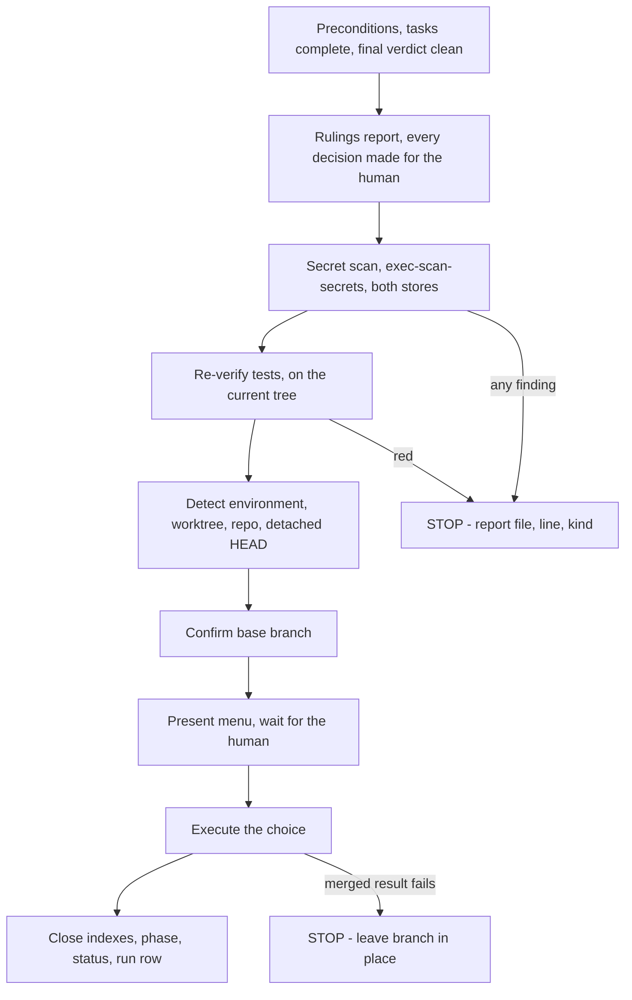

# Executor Handoff

Close-out is the phase where the human learns what you decided for them,
where a leaked credential is caught before it becomes permanent, and where
the record stops being a working file and becomes an archive. It is also
where a session that ran out of room hands the initiative to the next one.

Scripts referenced below live in `agent/skills/executor/scripts/` and are
written here as `exec-*`. Never hand-build a store path; resolve it.

**Nothing in either store is ever deleted by this skill.** See §8.

## The gate order

Each gate blocks the next. Do not reorder — the secret scan is worthless
after a push, and the menu is dishonest before a green run.



## Step 0 — Preconditions

Handoff starts only when all of these hold. If one does not, you are still
in an earlier phase; go back to its skill.

| Precondition | Where you check it |
|---|---|
| Every task in every plan is complete | each plan's `.executor/<INIT>/<Pnn>/progress.md` |
| Every task has a clean or accepted verdict | `reviews/verdicts/` |
| A final whole-branch review verdict exists and is clean | `reviews/verdicts/<PLAN-ID>-final-verdict.md` |
| Verification produced observed evidence, not expectation | `docs/executor/<INIT>-*/verification/` and the verification report |

Record entry into the phase before doing the work, so an interrupted
handoff is visible to the next session:

```bash
exec-initiative phase INIT-0004 handoff entered
```

## Step 1 — The rulings report

Every decision you took on the human's behalf reaches them here. This is
the whole point of being allowed to rule instead of stall: they get one
readable list, and they rework whatever you got wrong. A ruling they never
saw is a decision made in secret.

Under the Executor each ruling is already in two durable places — the
plan's `rulings.md` and a `.local/decisions/NNNN-*-ruling.md` record — so
the report is a **summary with pointers, not the sole record**. That does
not make it optional. Pointers are for six months from now; the report is
for the human sitting in front of you, who will not open a file they were
not told exists.

### Collect

1. For each plan in the initiative, read
   `.executor/<INIT>/<Pnn>/rulings.md` top to bottom. It is append-only, so
   file order is the order the rulings were made. Each entry carries
   `## <task-id> — <utc>`, **Decided**, **Why**, **Cost if wrong**.
2. Read `.executor/<INIT>/<Pnn>/preflight-scan.md`. Its `Ruling` column
   holds pre-dispatch adjudications. Anything there with no matching entry
   in `rulings.md` is a gap.
3. Read `reviews/verdicts/*`. Findings marked parked, deferred, or
   won't-fix, and any breaker adjudication that settled a
   reviewer/implementer disagreement, must each have a ruling.
4. **Close gaps before reporting, not after.** A plan file still exists, so
   `exec-ruling` still applies:

```bash
exec-ruling docs/executor/INIT-0004-.../plans/INIT-0004-P01-cell-router.md \
  INIT-0004-P01-T05 "<decision>" "<why>" "<cost if wrong>"
```

It appends to that plan's `rulings.md` and writes the `.local/decisions/`
record, printing both paths. Do not backfill a ruling into the report only.

### Report

In the final message, under a heading exactly `Rulings I made`, in the
order they were made, grouped by plan when the initiative has more than
one:

```markdown
## Rulings I made

1. **INIT-0004-P01-T03** — Kept the existing retry cap at 3 instead of the
   plan's 5. Why: task 7 asserts 3 in its acceptance test and the plan
   contradicted itself. Cost if wrong: one-line change plus a test edit.
2. **preflight** — Task 4 and task 6 both touch `router.ts`; ran them
   sequentially rather than splitting the file. Cost if wrong: a slower
   run, no correctness impact.

Full text: `.executor/INIT-0004/P01/rulings.md` ·
mirrored in `.local/decisions/`.
```

Do not compress a ruling into its decision alone. **Cost if wrong is the
field the human triages on** — without it they must reconstruct the stakes
of every line.

**Empty case.** Zero rulings is a legitimate outcome and is still reported:

```markdown
## Rulings I made

None. Every decision on this initiative was yours.
```

Before writing that, confirm it: an execution with review rounds, parked
findings, or preflight conflicts and an empty `rulings.md` means rulings
were made and never written. Reconstruct them from the verdicts and the
ledger, record them with `exec-ruling`, then report.

## Step 2 — The secret scan gate

```bash
exec-scan-secrets                      # both stores; the default
exec-scan-secrets .executor/INIT-0004  # narrower, when you need it
```

Exit 0 prints `clean: no credential-shaped content found in N store(s)` and
handoff proceeds. Exit 1 prints one `file:line: possible <kind>` per
finding and **blocks handoff**. The script never prints the matched value,
and neither do you — printing it copies the secret into the transcript,
which is the failure the scan exists to prevent.

**From inside a linked worktree, name the execution store explicitly.** The
script's default target list resolves both stores from the working-tree
root, but `.executor/` lives at the main repository root — so a default
scan run from a worktree skips the execution store and still exits 0.
Read the count in the clean line: `in 1 store(s)` when both stores exist
means the execution store went unscanned, and an unscanned store is not a
clean one.

```bash
MAIN_ROOT=$(git -C "$(git rev-parse --git-common-dir)/.." rev-parse --show-toplevel)
exec-scan-secrets docs/executor "$MAIN_ROOT/.executor"
```

On any finding, follow `agent/skills/executor/references/safety.md`:

| Situation | Action |
|---|---|
| Any finding at all | Tell the human immediately: which file, which line, what kind. Nothing else moves. |
| Only in `.executor/`, never committed | That file is the only copy. The human chooses redact-in-place or discard the artifact. |
| Reached git | This is credential rotation, not a file edit. The human rotates. |
| History rewriting | Never yours. Never unasked. Not even when it looks trivial. |
| After resolution | Record the incident as a ruling — kind of credential, which artifact, what was done. Never the value. |

A finding inside `reviews/diffs/` means the secret is in git history too,
because the diff captured a commit. Say so explicitly; it changes the
human's response from "edit a file" to "rotate a credential".

Re-run the scan after any redaction. A scan is evidence for the tree it ran
on, same as a test run.

## Step 3 — Verify before the menu

Run the project's full suite (`npm test` / `cargo test` / `pytest` /
`go test ./...` — whatever this repo uses) **on the current tree**, now.

A green run only proves the tree it ran on. The verification phase's
evidence was gathered before the last fix round, before the last review
finding landed, possibly before a rebase. It does not transfer.

If the suite is red: report the failures and stop. The menu comes after a
green suite — offering integration options on a red tree asks the human to
approve something you know is broken.

Record the command and its observed outcome; it becomes the evidence line
in the final message. Never write an expected result as an observed one.

## Step 4 — Detect environment

```bash
GIT_DIR=$(cd "$(git rev-parse --git-dir)" 2>/dev/null && pwd -P)
GIT_COMMON=$(cd "$(git rev-parse --git-common-dir)" 2>/dev/null && pwd -P)
# Capture now, while still inside the workspace — Step 7 changes directory
# before worktree handling needs this value
WORKTREE_PATH=$(git rev-parse --show-toplevel)
```

| State | Menu | Workspace |
|---|---|---|
| `GIT_DIR == GIT_COMMON` (normal repo) | Standard 3 options | No worktree to handle |
| `GIT_DIR != GIT_COMMON`, named branch | Standard 3 options | Provenance-based (§7) |
| `GIT_DIR != GIT_COMMON`, detached HEAD | Reduced 2 options (no merge) | Externally managed — leave in place |

**Executor-specific:** the two stores resolve from two different roots.
`docs/executor/` resolves from `exec_root` (the working-tree root), so
specs, plans, and ADRs commit on the branch that produced them and travel
with the merge. `.executor/` resolves from `exec_main_root` (the main
repository root, derived from `git rev-parse --git-common-dir`), so the
execution store is shared by every worktree and **removing a worktree
cannot destroy it**. Nothing needs relocating before cleanup.

## Step 5 — Determine base branch

The base branch is whatever this work forked from — usually named in the
charter, the plan, the conversation, or the branch's upstream. If it is not
already known, ask:

```
This branch split from <your best guess> — is that correct?
```

Confirm before merging. "The base branch is obviously main" is the classic
wrong merge, and merging into the wrong base is expensive to undo.

## Step 6 — Present options

**Normal repo and named-branch worktree — exactly these 3:**

```
Implementation complete. What would you like to do?

1. Merge back to <base-branch> locally
2. Push and create a Pull Request
3. Keep the branch as-is (I'll handle it later)

Which option?
```

**Detached HEAD — exactly these 2:**

```
Implementation complete. You're on a detached HEAD (externally managed workspace).

1. Push as new branch and create a Pull Request
2. Keep as-is (I'll handle it later)

Which option?
```

Present the menu as written. Do not add a discard option — discarding
happens only when the human asks for it in so many words (§7). Wait for the
answer; the integration decision is theirs, and a merge, a push, and a
publish are three of the four things that stop a running Executor.

## Step 7 — Execute the choice

### Git discipline (applies to every path below)

| Rule | Why |
|---|---|
| Never commit to a protected default branch | `main` stays deployable; branch first, always |
| Conventional Commits, imperative, ≤72 chars | `feat(router): add cell placement scoring` |
| Review `git diff --cached` before every commit | Last chance to catch a secret or a generated artifact |
| Never stage `.executor/` unless the human asked | It is ignored by design; committing it makes it public surface (see safety.md) |
| Squash a feature branch into clean history | A trail of `wip` commits is not a record; `rulings.md` is |
| Force-push only on explicit request | A rejected push means the remote moved — investigate first |

### Option 1: merge locally

```bash
MAIN_ROOT=$(git -C "$(git rev-parse --git-common-dir)/.." rev-parse --show-toplevel)
cd "$MAIN_ROOT"

git checkout <base-branch>
git pull
git merge <feature-branch>

<test command>          # verify on the merged result
```

**If tests fail on the merged result: stop everything.** Leave the branch
and the worktree in place and investigate. Nothing has been pushed, so the
merge is local and recoverable. A failing merged result is never flaky
until proven flaky.

Once green, delete the feature branch only after the worktree step below:

```bash
git branch -d <feature-branch>
```

### Worktree handling (Option 1 and confirmed discards only)

Options 2 and 3 always preserve the worktree — PR feedback gets fixed
there.

**The execution store survives this.** `.executor/` lives at the main
repository root, not in the worktree, so worktree removal cannot destroy an
execution record. Never copy the store anywhere — a second copy is two
divergent records where the contract guarantees one.

1. **If `GIT_DIR == GIT_COMMON`:** normal repo, nothing to do.
2. **Sanity-check the guarantee once, before removing** — cheap, and it
   catches a misconfigured worktree before the removal rather than after:

```bash
exec-workspace <plan-file>      # must print a path OUTSIDE "$WORKTREE_PATH"
```

   If it prints a path inside the worktree, stop and tell the human: the
   store is not where the contract says it is, and removal would lose it.
3. **If `WORKTREE_PATH` is under `.worktrees/` or `worktrees/`:** we own it.

```bash
git worktree remove "$WORKTREE_PATH"
git worktree prune
```

4. **If removal is refused** (`contains modified or untracked files`): those
   files exist nowhere else. Never `--force` on your own initiative. Show
   what is at stake and ask:

```bash
git -C "$WORKTREE_PATH" status --porcelain -uall
```

```
Worktree removal refused — these files were never committed:

<file list>

1. Commit them to <branch> before cleanup
2. Move them into <main repo root>
3. Delete them (unrecoverable)

Which?
```

5. **Otherwise:** the host environment owns this workspace. Leave it. Clean
   up only worktrees under `.worktrees/` or `worktrees/`.

### Option 2: push and create a PR

```bash
git push -u origin <feature-branch>
# From a detached HEAD, name the branch on the remote:
# git push origin HEAD:refs/heads/<new-branch>
```

Create the pull request against `<base-branch>` with the forge's tooling —
its CLI if available, or the creation URL most forges print on push —
following the repo's PR template if one exists. Report the URL.

The PR description links the initiative: its folder, the charter, the spec,
and the final verdict path. Keep the worktree.

### Option 3: keep as-is

Report: `Keeping branch <name>. Worktree preserved at <path>.` Then still
run Step 8 — indexes close out regardless of integration choice, because
the work is done even if it has not landed.

### If the human asks to discard the work

Only ever a response to an explicit request. Confirm first:

```
This will permanently delete:
- Branch <name>
- All commits: <commit-list>
- Worktree at <path>

Type 'discard' to confirm.
```

Wait for that exact word. "Yeah, get rid of it" is not it. On confirmation:
remove the worktree (the execution store is at the main root and stays —
the record of a discarded attempt is often the most valuable thing it
produced), then:

```bash
git branch -D <feature-branch>
```

Set the initiative status to `abandoned`, not `complete`, and say why in
the charter body.

### Quick reference

| Option | Merge | Push | Keep worktree | Delete branch |
|---|---|---|---|---|
| 1. Merge locally | yes | — | — | yes (`-d`) |
| 2. Create PR | — | yes | yes | — |
| 3. Keep as-is | — | — | yes | — |
| Discard (explicit request only) | — | — | — | yes (`-D`) |

## Step 8 — Index and lifecycle closure

Three records close, in this order.

**1. The run registry — `.executor/INDEX.md`.** Edit the plan's row in
place (no script writes it after `exec-workspace` created it): `Status` →
`complete`, `Tasks` → `N/N`, `Finished` → today's UTC date. One row per
plan; an initiative with three plans closes three rows. Rows are never
deleted.

**2. The phase gate.**

```bash
exec-initiative phase INIT-0004 handoff passed "merged to main, PR #482"
```

This stamps the gate-passed date in the initiative's phase log, updates the
`**Phase:**` header line, and updates the phase and updated cells in
`docs/executor/INDEX.md`.

**3. The lifecycle status.**

```bash
exec-initiative status INIT-0004 complete
```

Valid: `active`, `complete`, `superseded`, `abandoned`, `paused`. It
updates the initiative INDEX header and the registry row. Use `superseded`
only alongside a `supersedes_initiative` pointer in the replacing
initiative's charter.

### Nothing is deleted — deliberately

The legacy skill deleted the plan's workspace when the plan finished. **The
Executor reverses that on purpose.** The workspace holds the briefs, the
reports, the diffs, the verdicts, and the rulings — the only surviving
answer to "why is this code like this". Deleting it destroyed the reasoning
and kept the artifact, which is exactly backwards.

So: a complete plan's workspace stays. A complete initiative's folder
stays. Their index rows stay and read `complete`. Pruning either store is a
deliberate human decision, taken with intent, never a cleanup step at the
end of a task.

This is not in tension with workspace hygiene. Scratch files you created
outside the two stores — probe scripts, temp diffs, `/tmp` artifacts — are
still yours to remove. The stores are the deliverable.

## Step 9 — The final message

Structure, in this order:

1. **What shipped** — one paragraph, initiative ID and title.
2. **Rulings I made** — §1, mandatory, empty case included.
3. **Evidence** — the exact test command and its observed outcome; the
   secret-scan result; the final review verdict path.
4. **What changed in git** — branch, base, merge or PR URL, commit count.
5. **Where the record lives** — initiative folder, plan workspaces.
6. **What was not done** — deferred findings, accepted risks, follow-ups.
   Named here or they are lost.

Every claim traces to something you observed. An unrun check is reported as
unrun, not omitted.

## Partial handoff — pausing an initiative

An initiative usually outlives a session. Pausing is a first-class outcome,
not a failure, and it is **not** abandonment:

| Status | Meaning | Resumable |
|---|---|---|
| `paused` | Suspended deliberately; the work is still wanted | Yes — resume protocol below |
| `abandoned` | Stopped on purpose; the work is no longer wanted | No — charter body says why |
| `blocked` (run row) | Execution stopped on one of the four stop conditions | Yes, once the condition clears |
| `paused` (run row) | The run's initiative is paused; the plan is resumable as-is | Yes — resume protocol below |

Conflating them costs a future reader the only thing they need to know:
whether to pick this up or leave it.

### What to write before stopping

1. **Ledger** — `progress.md` reflects the true state of every task. A task
   half-done is recorded as in-progress with what remains, not as complete.
2. **Rulings** — every decision made this session is in `rulings.md` via
   `exec-ruling`. Write them now; a ruling reconstructed next session is a
   guess.
3. **Dispatches** — `dispatches.md` rows carry an outcome for every
   dispatch, so the next controller knows which agents finished and which
   were cut off.
4. **Phase** — `exec-initiative phase INIT-0004 <phase> entered` for
   wherever work actually stopped. Do not mark a gate passed that a human
   did not approve.
5. **Status** — `exec-initiative status INIT-0004 paused`.
6. **Run row** — set `.executor/INDEX.md` to `paused` for a run whose
   initiative is paused and whose plan can be picked up as-is; use
   `blocked` only when execution stopped on one of the four stop
   conditions. The distinction tells the next session whether anything
   must be cleared before work restarts.
7. **Secret scan** — run it anyway. A paused store is still a store, and
   the pause may last months.
8. **Session record** — a `.local/handoff/session/` record per
   `local-context-tracking`: numbered `NNNN-YYYYMMDDTHHMMSSZ-topic.md`,
   full frontmatter, plus branch, HEAD, `git status --short`, the
   continuation verdict, and the resume commands. It points at the
   initiative; it does not duplicate it.

Uncommitted work is committed on the feature branch before pausing, or
named explicitly in the session record as uncommitted. Work that exists
only in a dirty worktree is work that a machine reboot deletes.

## Cross-session resume protocol

Read in this order. Each step narrows the next; skipping ahead is how a
resumed session re-derives state it already had.

| # | Read | What it tells you |
|---|---|---|
| 1 | `docs/executor/INDEX.md` | Which initiatives exist, their status and phase |
| 2 | `docs/executor/INIT-NNNN-*/INDEX.md` | The phase log — **where work stopped**, and what is skipped vs never done |
| 3 | `.executor/INDEX.md` | Which plans ran, which are complete, where their workspaces are |
| 4 | `<workspace>/progress.md` | Which tasks are done, which are mid-flight |
| 5 | `<workspace>/rulings.md` | What was already decided — do not re-decide it |
| 6 | `<workspace>/preflight-scan.md` | Known cross-task conflicts and their adjudications |
| 7 | `<workspace>/dispatches.md` | Whether a live agent can be resumed instead of replaced |
| 8 | `.local/handoff/session/` (highest sequence, not superseded) | The previous session's continuation verdict |

Then verify the world, before planning or editing anything:

```bash
git branch --show-current
git rev-parse HEAD
git status --short
```

**Precedence, absolute:** current user instruction beats current repository
state beats stored records. If `progress.md` says task 5 is complete and
the code says otherwise, the code wins — and you write a correction record
rather than editing the old one, per `local-context-tracking`'s append-only
rule.

**A missing store is a verified absence, not permission to invent prior
context.** No `.executor/<INIT>/` means that plan never ran. No `.local/`
means no session record exists. Neither means "assume what probably
happened" — it means say what you found and start from repository truth.

Re-read every binding document the record names — charter, spec,
interfaces — before touching code. A summary of a spec is not a spec.

## Common rationalizations

| Excuse | Reality |
|---|---|
| "Tests passed earlier this session" | Run the suite on the tree you are about to integrate. A green run only proves the tree it ran on. |
| "The rulings are in `rulings.md`, that's the record" | It is the durable record. The report is how the human learns the decisions exist. Both, always. |
| "Only two small rulings, not worth a section" | Small rulings are the ones that ship wrong and nobody notices. Report all of them, with cost-if-wrong. |
| "No rulings, so no section" | Write the empty case explicitly. Silence reads as an omission, not as zero. |
| "No secrets in this one, skipping the scan" | The scan is seconds and the failure is unrecoverable once pushed. Run it. |
| "I'll show the human the matched line so they can find it" | File, line, and kind. Printing the value copies the secret into the transcript. |
| "The secret is only in a diff, not the source" | A diff captured a commit. It is in git history too. Say that — it changes rotation from optional to required. |
| "They obviously want it merged" | Integration is the human's decision. Present the menu and wait. |
| "The base branch is obviously main" | Confirm the fork point or ask. Merging into the wrong base is expensive to undo. |
| "They seem done with this — I'll offer to discard it" | The menu is complete as written. Discard happens only when they ask for it in so many words. |
| "'Yeah, get rid of it' counts as confirmation" | Only the typed word `discard` authorizes deletion. |
| "The merged-result failure is probably flaky" | A failing merged result stops everything. Branch and worktree stay put while you investigate. |
| "The push was rejected — force-push will fix it" | The remote moved. Investigate. Force-push only on explicit request. |
| "The PR is up, so the worktree is clutter now" | PR feedback gets fixed in that worktree. It stays until the work lands. |
| "This other worktree looks stale — I'll clean it too" | Only `.worktrees/` and `worktrees/`. Everything else belongs to the host. |
| "Removal refused — `--force` finishes the cleanup" | The refusal means files exist only there. Show the human and ask. |
| "The plan is done, so the workspace is scratch" | The workspace is the reasoning. Mark it complete; never delete it. |
| "I'll copy `.executor/` out before removing the worktree" | It already lives at the main root. A copy is two divergent records. Remove the worktree; the store stays. |
| "Paused and abandoned are close enough" | One says pick this up, the other says do not. That is the whole value of the field. |
| "The ledger says task 5 is done, so it is" | The checkout wins over any record. Verify, then write a correction. |
| "No `.local/` record, so I'll reconstruct what probably happened" | A missing record is a verified absence. Report it and start from repository truth. |