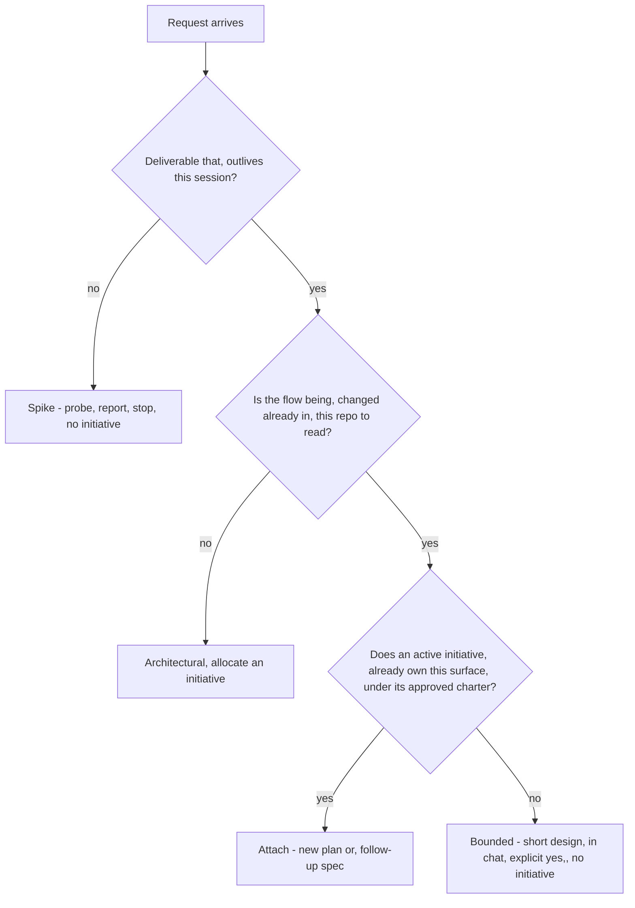

# Executor — Initiative Intake and Lifecycle

Read [the contract](../executor/SKILL.md) first: ID grammar, the citation
rule, the phase table, rulings policy. This skill is the only thing that
allocates initiative numbers, writes charters, and moves phase rows.

Scripts referenced below live in the contract skill. Invoke them as
`skill://executor/scripts/<name>` (the contract writes them relatively as
`scripts/<name>`); paths in their output are repo-absolute.

Two duties, in order:

1. **Decide whether an initiative should exist at all.** Most requests do not
   get one. Creating one for trivial work is this system's primary failure
   mode — the ceremony becomes the work.
2. **If it should exist, run its lifecycle** from allocation to closure,
   keeping both indexes true at every transition.

## 1. The Initiative Gate

**The one-line test:** name the deliverable that outlives this session. If
you cannot, there is no initiative — answer the question and stop.

Classify the request into one of three paths **before your first clarifying
question**, and say the classification out loud so the human can override it:

> "This looks bounded — the retry flow is already in `client/http.ts`, so
> I'll present a short design here rather than open an initiative."

| Path | Signal | Output | Initiative? |
|---|---|---|---|
| **Spike** | A feasibility question — "can we", "is it possible", "quick and dirty is fine" | An answer, not code you keep | **Never.** Present the question and probe in 2–3 sentences, get a nod, investigate as cheaply as correctness allows, report a recommendation. Anything built stays labeled throwaway. |
| **Bounded** | A well-scoped change to a flow **that already exists in this repo** — a flag, a small endpoint, a one-file fix | A commit | **Usually not.** Ask the questions that matter, present a short design in chat, stop for an explicit yes, implement. Attach to an existing initiative only if one already owns that surface (§4). |
| **Architectural** | New project, new subsystem, restructures how components fit, or alters an interface others depend on | A body of work spanning sessions | **Always.** Allocate, scaffold, charter, gate (§2, §3). |

**Bounded measures the repo, not your familiarity.** Understanding the kind
of app is not enough — bounded means the flow you are changing is here to
read. A new project has no existing flow, so it is architectural, so it gets
an initiative. This is the single most common misclassification.

**When in doubt between two paths, take the heavier one.** The doubt is the
signal.

**The ratchet is one-way.** Hidden complexity discovered mid-task upgrades
the path: stop, say so, and step up — a bounded change that turns out to
touch three components becomes architectural mid-flight, and the initiative
is opened *now*, with what already happened recorded in the charter's
Problem section. Nothing ever downgrades. An architectural task does not
become bounded because you are tired of it.

**Approval never scales.** Every path ends with the human approving your
intent before implementation. A spike's approval is a nod; an initiative's is
the charter gate. What scales with simplicity is the artifact, never the gate.



### Red flags

| Thought | Reality |
|---|---|
| "This is too simple to need an initiative" | Simple means a short design and a fast yes, not a skipped gate. If it produces a lasting deliverable it gets an initiative with three short documents. |
| "I'll call it bounded and skip the charter" | Reaching for a label to skip work IS the doubt. Take the heavier path. |
| "I understand this kind of app, so it's bounded" | Bounded measures the repo, not your familiarity. A new project has no existing flow — it is architectural. |
| "The design is obvious, I'll scaffold while they read the charter" | The gate is the approval, not the charter's length. Present, then stop until you hear yes. |
| "The spike works, so I'll keep the code" | A spike's output is an answer. Keeping the code is a new request — classify it from scratch. |
| "It grew, but I'm almost done — no need to re-classify" | Hidden complexity upgrades the path mid-task. Stop, say so, open the initiative, and record what already happened. |
| "They approved the spike, so the follow-up is approved" | Each request gets its own classification and its own approval. |
| "I'll open an initiative to be safe" | Nothing deletes an initiative. An initiative whose deliverable you cannot name is permanent ceremony. |
| "Two related asks, one initiative — saves ceremony" | One initiative, one problem statement, one set of success criteria. Two problems in one charter means no gate can ever be evaluated. |

## 2. Allocation and Scaffolding

Allocate only after the classification says architectural (or the human
explicitly asks for an initiative).

```bash
skill://executor/scripts/exec-initiative new "Cloud tenant cells"
# → INIT-0004<TAB>/repo/docs/executor/INIT-0004-cloud-tenant-cells
```

`new` does all of this in one call — never hand-build any of it:

| Created | Detail |
|---|---|
| Folder | `docs/executor/INIT-<NNNN>-<title-slug>` (slug lowercased, non-alphanumerics collapsed to `-`, truncated to 48 chars) |
| Subdirectories | `discovery/ architecture/ design/ specs/ risks/ verification/ plans/ brainstorm/sessions/` |
| `charter.md` | Full frontmatter (`id: <INIT>-CHTR-01`, `status: draft`, `phase: intake`, `skipped_phases: []`, `owner: TBD`) plus the empty section skeleton |
| `INDEX.md` | Header line, `## Dependencies` (`_None declared._`), Documents table with the charter row, Phase log with an `intake` row dated today |
| Registry row | Inserted at the top of `docs/executor/INDEX.md` (created with its header if absent) as `active` / `intake` |

Timestamps come from `date -u` inside the script, so they are real. Never
invent one when you edit these files afterwards — run
`date -u +%Y-%m-%dT%H:%M:%SZ` and use the output.

### The race rule (verified behaviour, respect it)

`new` computes the next number by listing existing folders. **It is not
concurrency-safe:** two simultaneous calls both produce the same `INIT-NNNN`
with different slugs, and the registry can lose one of the two rows to a
write race. `resolve` then returns whichever duplicate folder `find` hits
first — silently, arbitrarily. So:

1. **Never run two `new` calls at once**, and never background one.
2. **Immediately after `new`, verify:** exactly one folder matches the
   printed ID, and exactly one registry row names it. Verify by listing
   `docs/executor/` and reading `docs/executor/INDEX.md`.
3. **On a duplicate number, never overwrite and never delete.** The folder
   that has a registry row keeps the number — the registry is the record of
   what was allocated. The folder without a row renumbers: rename it to the
   next free `INIT-NNNN-<slug>`, then rewrite the ID in the four places it
   appears — charter `id:` and `initiative:`, the INDEX header line, the
   INDEX Documents row, and the registry row — and record the race in the
   renumbered initiative's `INDEX.md` directly under its header line:

   ```markdown
   **Allocation note:** raced with INIT-0004 on 2026-09-01 — renumbered from
   INIT-0004 to INIT-0005 before any document beyond the charter was written.
   ```

   If both duplicates have rows, the one with fewer documents renumbers.
4. **Renumbering is only safe while the initiative holds nothing but its
   scaffold.** Once any other document, plan, or workspace references the ID,
   stop and report the collision to the human — renumbering then rewrites
   every ID inside the initiative and every artifact keyed to them.
5. **A missing registry row is fixed by hand.** The script inserts a row only
   at creation; nothing re-adds it later.

### What you fill in after `new`

| Field / section | Rule |
|---|---|
| `owner:` | The human or team the human names. If they have not said, use the requesting human. Never guess a team name. |
| `status:` in the charter | Stays `draft` until the intake gate passes. Then `active`, and the INDEX Documents row's Status cell changes with it — same change. |
| `updated_at:` | Real UTC from an executed command, every time you touch the file. |
| `depends_on:` and the other three relationship fields (`supersedes_initiative`, `superseded_by_initiative`, `related`) | Other initiative IDs, **only** if the relationship is real. These four charter fields are the canonical home for every cross-initiative link; the INDEX Dependencies section mirrors them in prose. No other field in any document may carry another initiative's ID. |
| `skipped_phases:` | The list, plus a body section naming each reason (§5). |
| Charter body | Section by section, per §3. |

## 3. The Charter

The charter is the document the human approves to pass the intake gate. It
is not a summary of the request — it is the contract that every later phase
argues from, and the only place scope is bounded.

Fill the skeleton `new` wrote, in this order. Add the two sections it does
not seed (`Skipped phases`, and `Why abandoned` only if that day comes).

```markdown
# <Title>

## Problem

## Why now

## Goals

## Non-goals

## Success criteria

## Scope boundaries

## Constraints

## Stakeholders

## Skipped phases
```

| Section | What it must contain | Failure it prevents |
|---|---|---|
| **Problem** | What is wrong today, stated so someone outside the team recognises it, with the observed evidence (a measurement, an incident, a user report). Not a solution in disguise — "we need a queue" is not a problem. | An initiative that ships something nobody needed. |
| **Why now** | What changed to make this urgent, or what breaks if it waits. If nothing changed and nothing breaks, say so — that is a legitimate answer and it usually means the initiative can wait. | Work that displaces more urgent work because nobody asked when. |
| **Goals** | 2–5 outcomes, each one a change in the world, not an activity. "Tenants are placed in cells without manual assignment," not "write a placement service." | A goal list that a completed initiative can satisfy without helping anyone. |
| **Non-goals** | The things a reader would reasonably assume are included and are not — named explicitly. Every non-goal is a question you will otherwise answer three times during execution. | Scope creep arriving as "obviously this was in scope." |
| **Success criteria** | **Observable and measurable.** "Faster" is not a criterion; "p99 placement latency under 200ms at 10k tenants, measured by the existing load harness" is. Each criterion names the observation and how it gets observed, because `executor-verification` will be asked to produce exactly that evidence. | An initiative that can never be declared done, or is declared done on vibes. |
| **Scope boundaries** | Which components, directories, services, and data the work may touch — and which it may not. Name paths where you can. | Tasks that wander into unrelated subsystems and reviews that cannot tell whether that was intended. |
| **Constraints** | Hard limits that shape every later decision: compatibility guarantees, deadlines, budget, runtimes, languages, dependency policy, compliance requirements, teams whose approval is required. Redact secrets — write the shape and the source, never the value. | Architecture that is elegant and impossible. |
| **Stakeholders** | Who approves phase gates, who must be consulted, who is affected. One named approver minimum — "the team" cannot approve a charter. | A gate nobody can pass. |
| **Skipped phases** | One line per phase in `skipped_phases:`, each with its reason. Written at the moment the decision is made, not retroactively. | A reader unable to distinguish "we considered alternatives and picked one" from "nobody looked." |

**Success criteria are the highest-leverage section.** Write them so that a
stranger with repo access could run the observation and get a yes or no.
Every downstream skill inherits their precision, or their vagueness.

**Redaction applies here.** Problem statements love to quote error logs, and
error logs contain connection strings and bearer headers. Write the redacted
existence statement and the safe path instead — see
[safety.md](../executor/references/safety.md). `docs/executor/` is tracked
and therefore already public to anyone with the repo.

### The intake gate

Present the charter and **stop — your turn ends with the presentation**. Do
not write code, scaffold a project, allocate a spec, or start discovery
until the human has approved the problem statement and the success criteria
— those two are what they are actually approving; the rest is context.
Charter approval is the first and most load-bearing gate in the system:
everything downstream argues from it, so working past it unapproved poisons
the whole initiative.

Nothing here is a ruling. Rulings are an execution-time mechanism and
`exec-ruling` requires a plan file, because `rulings.md` is per-plan. A
decision taken during intake with the human in the loop is charter content;
a decision taken later during discovery or architecture is an ADR
(`INIT-NNNN-ADR-nn`), owned by `executor-architecture`. Never reach for
`exec-ruling` before a plan exists.

When the human approves, in one change:

```bash
skill://executor/scripts/exec-initiative phase INIT-0004 intake passed "charter approved"
```

then set the charter's `status: active` and `updated_at`, and change the
charter's Status cell in the initiative INDEX Documents table from `draft` to
`active`. Then enter the next phase (§5).

If the human rejects the charter, the initiative does not disappear —
nothing deletes it. Mark it `abandoned` (§6) with a `## Why abandoned`
section. That permanence is why the gate in §1 comes before allocation.

## 4. Attaching to an Existing Initiative

Prefer attaching over allocating. A second problem statement is a second
initiative — a second plan is not.

**Attach when all of these hold:**

- The existing charter's Problem still describes this work.
- The existing success criteria still govern it — no new criterion is needed.
- The initiative's status is `active` or `paused`.

**Allocate a new initiative when any of these hold:**

- The success criteria would have to change or grow.
- You would have to edit the approved charter's Goals, Non-goals, or Scope
  boundaries to make the work fit. **Widening an approved charter silently
  invalidates the approval it carries** — that is the whole reason the gate
  exists.
- The initiative is `complete`, `superseded`, or `abandoned`.

**How to attach:**

1. `exec-initiative resolve INIT-0004` — get the folder. Never hand-build it.
2. `exec-id INIT-0004 SPEC` or `exec-id INIT-0004 P` — the next free ID. It
   scans filenames **and file contents**, so a misfiled document still
   reserves its number.
3. Hand off the writing: a follow-up spec to `executor-spec`, a new plan to
   `executor-planning`. This skill does not write specs or plans.
4. Add the Documents row in the same change as the document (§7).
5. Move the phase if the attachment genuinely reopens one — a follow-up spec
   re-enters `specification`; a second plan for an already-specified
   initiative re-enters `planning`. If the initiative was `paused`, set it
   `active` first.

**A second plan while the first is executing:** leave the running plan's
workspace alone. `P02` gets its own workspace when `executor-execution`
calls `exec-workspace` on it. The phase stays `execution`; record the
addition in the phase log's Notes cell (`2 plans`). Two plans running
concurrently against one spec is a planning decision, not an intake one —
say so and route it.

## 5. Phase Transitions

The authoritative phase list, owning skill, and gate are in [the contract's
phase table](../executor/SKILL.md). Only these ten phase names are accepted
by the script: `intake discovery architecture design specification planning
execution review verification handoff`.

Every gate is a **human-approval stop**. The approver is the charter's named
approver. Two exceptions worth knowing cold:

- **Design** may be waived for a single-component initiative — that is a
  `skipped` row, not a silent omission.
- **Execution**, once the human approves the plan and picks a mode, runs to
  completion without check-ins. Approval happens at phase boundaries, never
  inside them.

### Recording a transition

```bash
exec-initiative phase INIT-0004 discovery entered "approach survey started"
exec-initiative phase INIT-0004 discovery passed  "approach B chosen"
exec-initiative phase INIT-0004 design   skipped  "single component, folded into spec"
```

| Event | Writes into the phase-log row | Also writes |
|---|---|---|
| `entered` | today's date in **Entered** | `**Phase:**` in the INDEX header; **Phase** + **Updated** in the registry row |
| `passed` | today's date in **Gate passed** | same |
| `skipped` | `—` in **Entered**, `**skipped**` in **Gate passed** | same |

A note argument, when given, replaces the row's **Notes** cell. The row is
created if the phase has none yet; otherwise it is edited in place. Prints
`INIT-0004: discovery entered`.

**Ordering gotcha (verified).** Every event — including `skipped` — sets the
header and registry Phase to the phase named in the command. Recording a
skip *after* entering the next phase rewinds both to the skipped phase.
**Record skips first, then enter the phase you are actually in**, and check
that the header's `**Phase:**` names where the initiative really stands
before you move on.

**Layout gotcha.** When a phase has no row yet, the row is appended to the
end of `INDEX.md`. Keep the phase log the **last** section of the initiative
INDEX — anything you add to that file goes above it, or the next appended
row lands outside the table.

**A skipped phase always carries a reason note.** The row with `**skipped**`
and no reason is indistinguishable from an oversight, which is exactly the
distinction the phase log exists to make. Add the phase to the charter's
`skipped_phases:` list and its reason to the charter's Skipped phases
section in the same change.

**Rework does not rewind the phase.** Review findings and verification gaps
send work back to execution; the phase stays where the initiative genuinely
is and the Notes cell records the loop (`round 2, 3 findings`). Rewriting
history in the phase log destroys the only record of how the work actually
went.

## 6. Lifecycle States

```bash
exec-initiative status INIT-0004 <active|complete|superseded|abandoned|paused>
```

The script rewrites `**Status:**` in the initiative INDEX header and the
**Status** + **Updated** cells of the registry row. Everything else in the
table below is yours to write, in the same change.

| State | Trigger | You also write | Notes |
|---|---|---|---|
| `active` | Created, or resumed from `paused` | Nothing extra on creation. On resume, a phase-log Notes line saying what unblocked it | The state `new` starts in, even while the charter is still `draft` |
| `paused` | The human suspends the work, or a declared `depends_on` initiative must land first | A phase-log Notes line naming the **resume condition** — the event that makes this active again | A pause with no resume condition is an abandonment in denial. Name the condition or mark it abandoned |
| `complete` | The handoff gate passed: merged, verified, secret scan clean | `phase handoff passed` in the same change | `executor-handoff` normally drives this; this skill does it when an initiative closes without a handoff phase |
| `abandoned` | Stopped deliberately — charter rejected at intake, the problem went away, the approach was invalidated | A `## Why abandoned` section in the charter body, and charter frontmatter `status: withdrawn` | The folder and every document stay. The reasoning is why anyone would ever read it |
| `superseded` | Another initiative replaces this one wholesale | See below | Never used for partial replacement — that is a new plan or a follow-up spec |

**Nothing is ever deleted.** Not a folder, not a document, not a row.
Pruning is a deliberate human decision, never a cleanup step.

### Superseding an initiative

Wholesale replacement, both sides written in one change:

**New initiative** (`INIT-0009`):

- charter frontmatter `supersedes_initiative: INIT-0002`
- INDEX Dependencies section mirrors it in prose:
  `supersedes_initiative: INIT-0002` — <why it was replaced>

**Old initiative** (`INIT-0002`):

- `exec-initiative status INIT-0002 superseded`
- INDEX Dependencies section gains the backpointer at initiative level:
  `related: [INIT-0009]` — supersedes this initiative
- Documents keep their bodies and their `active` status. **Do not withdraw
  them and do not edit them to point at the new initiative** — that would be
  a cross-initiative citation, which the citation rule forbids.

**Why the old initiative stays readable:** its research, options, and ADRs
are the reasons the replacement exists. An unreadable predecessor guarantees
the successor re-derives its predecessor's dead ends. And because nothing
inside `INIT-0002` ever cited another initiative's internals, nothing
breaks when it is filed away.

## 7. Index Maintenance Duty

This skill owns:

- **`docs/executor/INDEX.md`** — the initiative registry, every row, forever.
- **The initiative `INDEX.md` header line and phase log** — status, phase,
  owner, and the full transition history.

Other skills own their own **Documents** rows; `.executor/INDEX.md` belongs
to `executor-execution`. Formats are in
[indexes.md](../executor/references/indexes.md) — do not restate them, do
not drift from them.

| Rule | Why |
|---|---|
| **Same change, always.** A row is written in the same change as the transition it describes | An index updated later is an index that has already drifted |
| **Never hand-edit a cell the script owns** — registry Status, Phase, Updated, and the `**Status:**` / `**Phase:**` fields of the INDEX header line | Two writers on one cell produce a value neither intended. Run the command instead |
| **Hand-edit only what the script cannot:** the header's `**Owner:**`, the registry Title and Folder cells, the Documents table, and a phase-log Notes cell when no transition is happening (a resume note, an allocation note) | The script never sets these. When a transition *is* happening, pass the note as the command's fourth argument instead |
| **The document wins over the row.** If a row says `active` and the document says `superseded`, fix the row | The document is the artifact; the row is a pointer |
| **Rows are never deleted.** New documents append, status changes edit in place | A deleted row is how someone loses a completed run's reports |
| **Avoid renaming the folder slug.** Resolution keys on the ID prefix, so a rename is legal and pointless — and it silently invalidates the registry's Folder cell | Cosmetic gain, real drift |
| **Create on first use.** A missing index is created with its header row, never treated as a blocker | `exec-initiative new` already does this for the registry |
| **Verify by reading, not by assuming.** After a transition, read the two files you touched | The awk edits are position-sensitive on the pipe columns; a malformed row is silent |

## 8. Cold-Start Checklist

**A request arrives:**

1. Read enough of the repo to classify honestly — does the flow being
   changed exist here to read?
2. Classify: spike / bounded / architectural. **Say it out loud.**
3. Spike → probe, report, stop. Bounded → short design in chat, wait for an
   explicit yes, implement. Neither gets an initiative.
4. Architectural → does an active initiative already own this surface under
   its approved charter (§4)? If yes, attach.
5. `exec-initiative new "<title>"`. Verify the ID is unique in both the
   folder listing and the registry (§2).
6. Fill `owner:`, then the charter body section by section (§3).
7. Present the charter. **Stop.** Wait for approval of the problem statement
   and the success criteria.
8. On approval: `phase intake passed "charter approved"`, charter
   `status: active` + fresh `updated_at`, INDEX Documents row Status →
   `active`.
9. `phase <next> entered` and route to that phase's owning skill.

**A phase gate passes later:** `phase <phase> passed "<what the human
approved>"`, then `phase <next> entered`, then route. Skipping a phase:
record the `skipped` row with its reason **before** entering the next one,
add it to `skipped_phases:` and the charter's Skipped phases section.

## Common Rationalizations

| Excuse | Reality |
|---|---|
| "I'll open the initiative and figure out the charter as I go" | The charter is the gate. An initiative with an empty charter has approved nothing and bounds nothing. |
| "The success criteria are obvious — 'it should be faster'" | Not a criterion. `executor-verification` will be asked to produce evidence for exactly what you wrote. Write the number and the observation. |
| "Non-goals are padding, everyone knows what's out of scope" | Then write it down once instead of answering it three times mid-execution. |
| "I'll pick the number, the folder is obviously next" | `new` lists and allocates in one command. Invented numbers collide, and duplicate numbers resolve arbitrarily — so run the command, then verify the ID is unique (§2). |
| "Two agents allocated at once, I'll just delete the extra folder" | Nothing deletes. The folder without a registry row renumbers and records the race. |
| "This new ask is close enough — I'll widen the charter's goals" | Widening an approved charter invalidates its approval. Second problem statement, second initiative. |
| "Discovery was unnecessary, so I left it out of the log" | Then a reader cannot tell whether you considered alternatives or nobody looked. `skipped` plus a reason. |
| "The phase log looks messy with rework loops — I'll tidy it" | The mess is the history. Notes cell, not a rewrite. |
| "Nobody reads the registry, I'll update it at the end" | The registry is the entry point for "what work exists." Same change, or it drifts. |
| "The initiative is dead, I'll remove the folder" | Mark it `abandoned` and write why. The next person to have this idea needs to know it was already tried. |
| "The old initiative is superseded — I'll point its ADRs at the new one" | Cross-initiative citation, forbidden. The backpointer lives at initiative level in the INDEX Dependencies section. |
| "It's an intake decision made without the human, that's a ruling" | Rulings are execution-time and need a plan file. Intake decisions are charter content; later ones are ADRs. |

Worked classifications and a fully filled charter:
[references/intake-examples.md](references/intake-examples.md).
