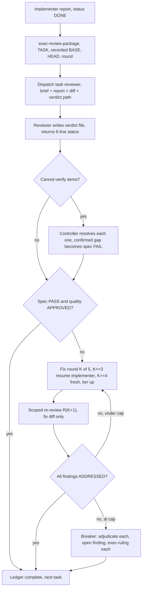

# Executor Review

A review is not a conversation. It is a **round**: an ID, a diff file, and a
verdict file. The round ID pairs the judgment with the exact diff it judged,
and the verdict outlives the session that produced it.

This skill is dispatch discipline plus three ready templates. It owns
reviewing; it does not own implementing, planning, or verification.

## The Two Verdicts (non-negotiable)

Every task review returns **two** verdicts:

1. **Spec compliance** — does the diff satisfy its requirements, nothing
   missing, nothing extra, nothing misunderstood?
2. **Code quality** — is it well-built, tested, maintainable?

A review missing either is not a review. The implementer's self-review never
replaces it — self-review is the implementer grading its own work, which is
the thing a reviewer exists to check.

## What Changed From Legacy (read this once)

| Legacy | Executor | Why |
|---|---|---|
| Verdict lived only in the subagent's response text | Verdict is a file the reviewer writes: `reviews/verdicts/<TASK-ID>-R<nn>-verdict.md` | A verdict summarized into one ledger line is lost; the judgment is the insight, the diff is only evidence |
| Controller transcribed findings into its own context | Controller reads a six-line status; fix dispatches carry the **verdict path** | Everything pasted into the controller stays resident and is re-read every turn |
| Reviews addressed as "Task 2 review, round 3" | Review rounds are IDs: `INIT-0004-P01-T03-R03` | Diff and verdict share the round ID, so no judgment floats free of its diff |
| Findings cited reviewer taste | Findings cite the spec requirement they violate: `INIT-0004-SPEC-01-R07` | A finding traces to the contract it breaks, not to an opinion |
| Workspace deleted after final review | Nothing in either store is ever deleted | The execution record is the point |

## Scripts

Scripts live in the contract skill at `agent/skills/executor/scripts/`.
Commands below are written bare (`exec-review-package …`); invoke them from
that path.

| Need | Command | Prints |
|---|---|---|
| The plan's workspace | `exec-workspace PLAN_FILE` | `.executor/<INIT>/<Pnn>/` |
| A review diff | `exec-review-package PLAN_FILE TASK BASE HEAD [ROUND]` | the diff file path |
| A ruling record | `exec-ruling PLAN_FILE TASK_ID "<decision>" "<why>" "<cost if wrong>"` | rulings.md path + `.local/decisions/` path |
| A secret scan | `exec-scan-secrets [PATH ...]` | `file:line: possible <kind>`, exit 1 on findings |

`TASK` is the task **number** (`3`), or the literal `final` for a
whole-branch package. `ROUND` defaults to `01` and is **ignored when TASK is
`final`** — final packages are distinguished by their commit range, so a
final verdict must record that range in its header.

The diff file contains a commit list, a `--stat` summary, and `git diff -U10`
for the range. That extended context is why a reviewer does not need to open
the changed files.

## Citable IDs

| Token | Names |
|---|---|
| `INIT-0004-P01-T03` | a task |
| `INIT-0004-P01-T03-R02` | review round 2 of that task |
| `INIT-0004-SPEC-01-R07` | requirement 7 of that spec |
| `INIT-0004-SPEC-01-C03` | global constraint 3 of that spec |

A requirement token hangs off `-SPEC-<nn>-`; a review round always carries a
`-T<nn>-` segment before its `-R<nn>`. Unambiguous, so a finding can cite
either without a reader guessing which it means.

**Citation rule:** every ID in a verdict belongs to this initiative. A verdict
never names an ID from another initiative — if the diff depends on other
work, describe the requirement in words.

## Round IDs and File Naming

Round `R01` is the first review of a task. Fix round *K*'s scoped re-review
is round `R<K+1>`. Five fix rounds maximum, so a task's rounds run `R01`
through `R06`.

| Artifact | Path (under the plan workspace) |
|---|---|
| Task diff | `reviews/diffs/<TASK-ID>-R<nn>-<base7>..<head7>.diff` |
| Task verdict | `reviews/verdicts/<TASK-ID>-R<nn>-verdict.md` |
| Final diff | `reviews/diffs/<PLAN-ID>-final-<base7>..<head7>.diff` |
| Final verdict | `reviews/verdicts/<PLAN-ID>-final-verdict.md` |
| Final fix-wave re-review verdict | `reviews/verdicts/<PLAN-ID>-final-R02-verdict.md` |

Findings are labelled inside their verdict as `C1`, `C2`, `I1`, `M1` —
severity letter plus ordinal. Referenced across rounds as
`INIT-0004-P01-T03-R01-I2`. Finding IDs are what a re-review verdicts and
what a fix dispatch names, so no finding can be silently dropped.

## The Review Loop



### 1. Package the diff

```bash
exec-review-package PLAN_FILE 3 "$BASE" "$(git rev-parse HEAD)" 01
```

- **BASE is the commit recorded before the implementer was dispatched.**
  Never `HEAD~1` — it silently truncates a multi-commit task to its last
  commit, and the review then passes code nobody read.
- **Never dispatch a task reviewer without a diff file.** A reviewer told to
  "run git diff" re-derives the range, gets it wrong, and burns turns.
- The diff never enters the controller's context. The script prints a path;
  the path is what you pass on. Reading the diff yourself defeats the whole
  arrangement — your context is for coordination.

### 2. Build the global-constraints block

The block you hand the reviewer is its **attention lens**. Copy the binding
requirements verbatim from the spec (or the plan's Global Constraints
section): exact values, exact formats, and the stated relationships between
components — "same layout as X", "matches Y". Those relational constraints
are the ones an implementer satisfies locally and breaks globally.

Tag each line with its citable ID (`INIT-0004-SPEC-01-C03: …`) so a finding
against it comes back citing the constraint rather than paraphrasing it.

The template already carries the process rules — YAGNI, test hygiene, review
method. The constraints block is only for what **this project's spec**
demands.

### 3. Dispatch

Template: [task-reviewer-prompt.md](task-reviewer-prompt.md). Fill every
placeholder. Specify the model explicitly — an omitted model inherits the
session's, usually the most expensive one. Choose it by diff risk per
`executor-execution`'s Model Selection section; that policy lives there and
is not restated here.

**Prompt hygiene — three rules that cost real sessions:**

| Rule | Why |
|---|---|
| **Never pre-judge.** No "do not flag", no "at most Minor", no "the plan chose", no "don't treat X as a defect". | Pre-judging is how a controller spares itself a review loop. If you think a finding would be a false positive, let the reviewer raise it and adjudicate it in the loop. If your draft prompt contains one of those phrases — stop and delete it. |
| **No open-ended directives** — "check all uses", "run race tests if useful" — without a concrete, task-specific reason. | Open scope turns a bounded review into a codebase crawl at review-model prices. |
| **Never ask a reviewer to re-run tests the implementer already ran on the same code.** | The report carries that evidence. Re-running it buys nothing and can take longer than the task. |

### 4. Read the status, not the verdict

The reviewer writes the verdict file and returns six lines:

```text
VERDICT: <verdict file path>
SPEC: PASS | FAIL
QUALITY: APPROVED | NEEDS_FIXES
FINDINGS: critical=<n> important=<n> minor=<n>
CANNOT_VERIFY: <n>
GATE: PASS | FAIL
```

…followed by one ≤100-character headline per Critical and Important finding,
each prefixed with its finding ID. That is everything the controller needs to
ledger the round and decide loop-or-park. The findings themselves stay in the
file, and the fixer reads them there.

Ledger the round in `progress.md`:

```text
INIT-0004-P01-T03: review R01 — spec FAIL, 0C/2I/1M — reviews/verdicts/INIT-0004-P01-T03-R01-verdict.md
```

### 5. Resolve cannot-verify items yourself

A reviewer reports "cannot verify from diff" for requirements living in
unchanged code or spanning tasks. These **do not block the review** — but you
resolve every one before the task completes, because you hold the cross-task
context the reviewer lacks. A confirmed gap becomes a **failed spec review**
and enters the fix loop with the other findings. An item resolved as
satisfied gets a ledger line saying so; silence here is how a spec gap ships.

### 6. The fix loop

Triggers on: spec FAIL, any Critical or Important finding, or a cannot-verify
item you confirmed as a real gap.

Two routes leave the loop before it starts:

- **Minor findings never enter the loop.** Ledger each one as
  `INIT-0004-P01-T03: minor (deferred): <one-liner> [R01-M1]`, and point the
  final review at that list for merge triage. A roll-up nobody reads is a
  silent discard.
- **A plan-mandated finding is yours to rule on.** Weigh the finding against
  the plan text with the **spec as binding authority**, record the decision
  with `exec-ruling`, then act. Do not dismiss a finding because the plan
  mandated it, and never dispatch a fix that contradicts the plan without a
  recorded ruling.

A fix round is one fix dispatch plus one scoped re-review. Five rounds
maximum per task.

- **Rounds 1-3 — resume the original implementer.** Its context is intact.
  Send it the verdict file path and the open finding IDs. If your harness
  cannot message a live subagent, dispatch a fresh one with the brief path,
  the report path, the verdict path, and the IDs — the files are the
  persistent memory either way.
- **Rounds 4-5 — fresh implementer, one tier up**, framed: "A prior
  implementer attempted this task N times; you own it now. Read the report
  file for what was tried." Three failed resumes means the implementer cannot
  see its own problem — fresh eyes and a capability bump in one move.
- **Every round:** the implementer fixes, re-runs the tests covering the
  amended code, appends its fix report to the same report file. Before
  re-dispatching the reviewer, confirm the fix report names the covering
  tests, the command run, and its output. All three present, then re-review.
- **Never fix findings yourself in the controller session.** Controller fixes
  pollute your context and skip review entirely.

**The re-review is scoped.** FIX_BASE is the head the previous round saw:

```bash
exec-review-package PLAN_FILE 3 "$FIX_BASE" "$(git rev-parse HEAD)" 02
```

Template: [re-review-prompt.md](re-review-prompt.md). It verdicts each prior
finding **ADDRESSED** or **NOT ADDRESSED** and flags new breakage **in the fix
diff only**. New Critical/Important breakage joins the open findings.
Out-of-scope observations go to the ledger as deferred minors — they never
extend the loop.

Ledger each round:

```text
INIT-0004-P01-T03: fix round 1/5 (2 addressed, 0 open — commits d4e5f6a..b7c8d9e) — reviews/verdicts/INIT-0004-P01-T03-R02-verdict.md
```

### 7. The breaker

When round 5's re-review still leaves findings open, stop dispatching and
adjudicate each open finding yourself. Every adjudication is an `exec-ruling`
call — a silent discard is forbidden.

| Situation | Action |
|---|---|
| Reviewer is wrong, or the point is contestable | Park with a ruling saying why the code stands. The final review sees both sides. |
| Real, but nothing downstream builds on it | Park with a ruling that says it is real and deferred. |
| Real and load-bearing — a later task builds on it, or it reveals a plan defect | Rule on the smallest change that unblocks the dependent work, record it, carry it into the next task's dispatch. Parking a structural failure lets every dependent task build on it. |

Adjudicate **only at the cap**. Adjudicating earlier to end a loop is
pre-judging with a different name. Stop and ask the human only when the
defect leaves every path forward a guess.

### 8. Complete the task

```text
INIT-0004-P01-T03: complete (commits a1b2c3d..b7c8d9e, review clean at R02)
INIT-0004-P01-T03: complete (commits a1b2c3d..b7c8d9e, 2 parked at R06)
```

Never move to the next task while a Critical or Important finding is neither
fixed nor parked-with-ruling at the cap.

## Severity Discipline

| Severity | Means | Route |
|---|---|---|
| **Critical** | Bug, security issue, data-loss risk, broken functionality, credential-shaped content in the diff | Fix loop, immediately |
| **Important** | This task cannot be trusted until fixed: missed requirement, incorrect or fragile behaviour, maintainability damage you would block a merge over — verbatim duplication of a logic block, swallowed errors, tests that assert nothing | Fix loop |
| **Minor** | Style, polish, "coverage could be broader", optimisation opportunities | Ledger as deferred; final review triages |

Not everything is Critical, and a stated rationale in the report never
downgrades a severity.

## Secret Hygiene in Review

A reviewer that spots credential-shaped content in a diff:

1. Flags it **Critical**.
2. Records **file:line and the kind of credential only**. It NEVER quotes,
   echoes, or paraphrases the value into the verdict file — the verdict is an
   artifact that may be committed, so quoting copies the secret into a second
   place.
3. Notes that a secret in a diff means the secret is **also in git history**,
   which is the larger problem: this is credential rotation, not a file edit.

The controller confirms with `exec-scan-secrets` over the plan's diffs
directory (the script prints `file:line: possible <kind>` and never the
value), then **stops and tells the human immediately** — a landed credential
is a security-sensitive condition, one of the four things that stop a running
Executor. History rewriting is the human's call, never yours. Record the
incident with `exec-ruling` as a redacted statement: what kind, which
artifact, what was done.

## Final Whole-Branch Review

One review event per plan, after every task is complete.

```bash
exec-review-package PLAN_FILE final "$(git merge-base main HEAD)" "$(git rev-parse HEAD)"
```

- Dispatch on the **most capable available model** — this is the last gate
  before handoff.
- Template: [final-reviewer-prompt.md](final-reviewer-prompt.md).
- Hand it the ledger's **deferred-minor and parked lines** so it can triage
  which must be fixed before merge. Those lines are why the ledger exists;
  a deferred minor nobody triages was discarded, not deferred.
- Verdict file: `reviews/verdicts/<PLAN-ID>-final-verdict.md`.

If it returns findings:

1. **ONE fix dispatch with the complete list** — never one fixer per
   finding. Per-finding fixers each rebuild context and re-run suites; a real
   session's final-review fix wave cost more than all its tasks combined.
2. **Exactly one scoped re-review** of the fix wave:
   `exec-review-package PLAN_FILE final "$FIX_BASE" "$(git rev-parse HEAD)"`,
   dispatched with `re-review-prompt.md`, verdict at
   `reviews/verdicts/<PLAN-ID>-final-R02-verdict.md`.
3. **Adjudicate residuals** as in the breaker: park with rulings, or rule on
   the load-bearing ones. **There is no second fix wave.** Residual
   load-bearing findings surface to the human at handoff.

Then update this plan's row in `.executor/INDEX.md` in the same change, and
hand off to `executor-verification`. Nothing is deleted: the workspace, the
diffs, and the verdicts stay where they are. Pruning is a human decision,
never a cleanup step.

## Common Rationalizations

| Excuse | Reality |
|---|---|
| "I'll read the diff myself, it's faster" | The diff is the largest artifact in the run. Reading it burns the context you need to keep driving, and it is re-read on every later turn. |
| "`HEAD~1` is close enough for BASE" | It truncates a multi-commit task to its last commit. The review then passes code nobody read. |
| "The reviewer's response text is the verdict" | It vanishes on the next summarization. The verdict file is the deliverable; the response is a receipt. |
| "I'll write the verdict file from the reviewer's answer" | Then the verdict passed through your context, which is exactly what the file exists to prevent. The reviewer writes it. |
| "Spec review passed, quality is obviously fine" | Two verdicts or it is not a review. |
| "This finding is obviously wrong, I'll drop it" | You adjudicate only at the cap, and every adjudication is an `exec-ruling`. Silent discards are forbidden. |
| "One more round will converge" | Past the cap, rounds do not converge — the failure is structural. Adjudicate and route. |
| "The fix was small, skip the re-review" | Unreviewed fixes are how regressions land. Every round ends with a scoped re-review. |
| "The minors are in the verdict files, that's enough" | The final review reads the ledger, not eleven verdict files. Unledgered minors are discarded minors. |
| "Cannot-verify items are the reviewer's problem" | The reviewer cannot see across tasks. Unresolved, they are spec gaps that ship. |
| "The implementer already reviewed itself" | Self-review is the author grading their own work. It is a useful signal and never a gate. |
| "Final review is clean, delete the workspace" | Nothing in either store is deleted by a skill. |
