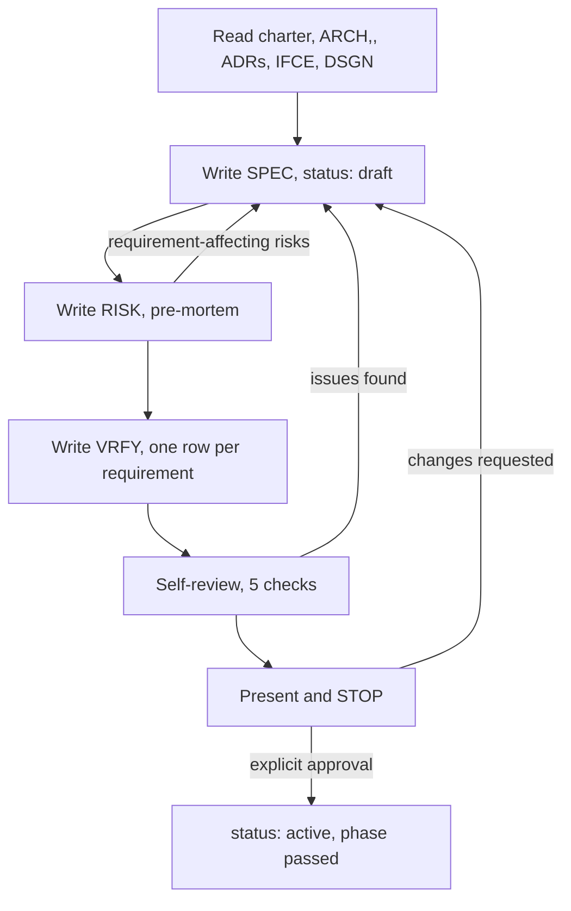

# Specification

This phase produces the document every later phase is measured against.

Three documents, in this order:

| Order | Kind | ID | Directory | Answers |
|---|---|---|---|---|
| 1 | Spec | `INIT-NNNN-SPEC-nn` | `specs/` | What must be true when this is done |
| 2 | Risk | `INIT-NNNN-RISK-nn` | `risks/` | How this ships and still fails |
| 3 | Verification | `INIT-NNNN-VRFY-nn` | `verification/` | What observed output proves each requirement |

Order is load-bearing. The pre-mortem changes requirements, so it runs
before the spec leaves `draft`. The verification strategy must cover the
final requirement set, so it is written last.

## The Spec Is the Authority

**The spec is the binding authority. Every plan argues from it; every
review measures against it.**

- `executor-planning` writes plans whose `spec:` frontmatter names this
  document. A plan is an argument that these tasks satisfy these
  requirements.
- `executor-execution` resolves a plan-versus-spec conflict against the
  spec: if a task's steps contradict a requirement, the requirement wins
  and the plan defect is recorded as a ruling.
- `executor-review` resolves a finding-versus-plan conflict against the
  spec. A reviewer's verdict cites requirement IDs, not opinions.
- `executor-verification` executes the VRFY document row by row.

Everything downstream inherits this document's precision. An ambiguous
requirement is not a documentation problem — it is a defect that ships as
two implementers building two different things and a reviewer unable to
say which is wrong.

**The acceptance bar for this phase:** two competent readers, working from
the spec alone and never speaking to each other, build the same thing.

## Requirement and Constraint Citation

The contract's ID grammar names documents. Requirements and constraints
live inside one, so this skill fixes their citation form:

```text
R07                            requirement 07, inside its own spec
C03                            global constraint 03, inside its own spec
V05                            verification criterion 05, inside its own VRFY
INIT-0004-SPEC-01-R07          single-token form, used from outside
INIT-0004-SPEC-01-C03          single-token form, used from outside
INIT-0004-VRFY-01-V05          single-token form, used from outside
```

Two digits, sequential from `01`, allocated in writing order and **never
renumbered** — a plan, a verdict, or a VRFY row that cites `R07` must
keep pointing at the same requirement forever. Inserting a requirement
later takes the next free number regardless of where it reads in the
body.

No collision with review rounds: a review-round ID always carries a
`-T<nn>-` segment before its `-R<nn>` (`INIT-0004-P01-T03-R02`). An `R`
directly after `-SPEC-<nn>` is a requirement.

## Preconditions

Do not start until all of these hold:

| Check | Command / source | If it fails |
|---|---|---|
| Architecture gate passed | Initiative `INDEX.md` phase log shows `architecture` gate passed, or a `skipped` row | Stop; that phase is `executor-architecture`'s |
| Design approved or waived | Phase log `design` row shows passed or `**skipped**` | Stop; same owner |
| Inputs readable | `charter.md`, every `ARCH`, `ADR`, `IFCE`, `DSGN` in the initiative | Read them; never spec against remembered architecture |

Read the whole input set before writing one requirement. The spec's job
is to make approved decisions executable, not to relitigate them. If
reading the inputs surfaces a decision nobody made, that gap is an ADR —
see [Decisions Here Are ADRs](#decisions-here-are-adrs).

If the initiative has no `ARCH` document at all, architecture was skipped
and the phase log says so. That is legitimate for a small initiative. It
does **not** license inventing structure inside the spec: structural
choices are still ADRs.

## Procedure



### 1. Open the phase

```bash
date -u +%Y-%m-%dT%H:%M:%SZ
scripts/exec-initiative phase INIT-0004 specification entered
```

`date -u` is the only source of `created_at` and `updated_at` in all three
documents — never an invented timestamp, never one copied from another
document. `exec-initiative phase` updates the phase-log row, the
initiative `INDEX.md` header, and the root registry row in one call, and
prints `INIT-0004: specification entered` as confirmation; it does not
print a timestamp.

### 2. Allocate the three IDs

```bash
scripts/exec-id INIT-0004 SPEC
scripts/exec-id INIT-0004 RISK
scripts/exec-id INIT-0004 VRFY
```

`exec-id` scans filenames **and** file contents, so a misfiled document
still reserves its number. Allocate immediately before writing; on a
collision take the next free number, keep both documents, and note the
race in the initiative `INDEX.md`.

### 3. Write the spec

Path: `<initiative>/specs/INIT-0004-SPEC-01-<topic-slug>.md`.
Frontmatter per the contract, `status: draft`:

```yaml
implements: [INIT-0004-ARCH-01, INIT-0004-DSGN-01]
decisions: [INIT-0004-ADR-01]
verification: INIT-0004-VRFY-01
plans: []
global_constraints: 7
```

`global_constraints` is a count and must equal the number of `C<nn>`
entries in the body. `verification` is filled in now even though the VRFY
document is written in step 5 — you allocated its ID in step 2.

Body sections, in order, from
[references/spec-template.md](references/spec-template.md):

| Section | Contains | Why |
|---|---|---|
| Scope | What this spec covers, in one paragraph | A reader must know in ten seconds whether their question is in here |
| Global constraints | `C01…Cnn`, exact values copied verbatim | Every requirement implicitly includes these; a paraphrased version floor is a different version floor |
| Requirements | `R01…Rnn`, one testable statement each | The unit a plan implements and a review cites |
| Interfaces | `IFCE` IDs and the symbols this spec relies on | The seam where two tasks build incompatible halves |
| Out of scope | Itemized, one line each | An unstated non-goal gets built by an implementer being helpful |
| Open questions | Question, owner, blocking or not | An unowned question is answered by whoever notices last |

**Verbatim means verbatim.** Copy `node >= 20.11.0`, not "recent Node".
Copy the exact string a copy rule requires, the exact package name and
version bound, the exact platform triple. A constraint an implementer has
to interpret is a constraint two implementers interpret differently.

**Interfaces are referenced by ID, never restated.** Write
`INIT-0004-IFCE-01 · placeCell`. Copying a signature into the spec
creates a second source of truth that drifts the first time the interface
changes. If the interface is wrong or missing a case, that is an
`executor-architecture` change, not a spec workaround.

**Out of scope is itemized, not gestured at.** "Multi-region is out of
scope" is one item. "Various advanced features are out of scope" is
nothing.

### 4. Write the risk document

[Risk Documents](#risk-documents-risk) below. Requirement-affecting risks
go back into the spec now, while it is still `draft` and no plan exists.

### 5. Write the verification strategy

[Verification Strategy](#verification-strategy-vrfy) below. One row per
requirement, minimum, plus a row per global constraint.

### 6. Self-review

[Spec Self-Review](#spec-self-review). Five checks, fix inline, re-run if
a fix touched requirement text.

### 7. Cross-link and index

1. Spec frontmatter `verification:` names the VRFY ID.
2. VRFY frontmatter `spec:` names the SPEC ID.
3. Risk frontmatter counts match its body rows.
4. Append three rows to the initiative `INDEX.md` document table, sorted
   by ID, in this same change.
5. Every ID in every field begins with this initiative's ID. A
   cross-initiative citation is forbidden — if this spec genuinely needs
   something from another initiative, state the requirement in your own
   words and put the dependency in the charter's `depends_on`.

### 8. Scan for secrets

```bash
scripts/exec-scan-secrets docs/executor/INIT-0004-<slug>
```

Exit 0 clean, exit 1 findings. It prints `file:line: possible <kind>` and
never the value. Specs attract real values — a connection string in a
constraint, a token in an example payload. Write the shape and the
variable name, not the value; `<placeholder>`, `REDACTED`, `YOUR_*`, and
`${VAR}` forms are ignored by the scan by design.

### 9. The human review gate

[The Human Review Gate](#the-human-review-gate). Present, stop, wait.

### 10. Pass the gate

Only after explicit approval:

```bash
scripts/exec-initiative phase INIT-0004 specification passed "3 docs, 14 reqs"
```

Set all three documents `status: active`, update their `updated_at`, fix
the three `INDEX.md` status cells, then route to `executor-planning`.

## Requirement Quality Rules

Every requirement satisfies all five. A requirement failing any one is
rewritten before the gate.

| Rule | Test | Why |
|---|---|---|
| **Observable** | Names something a person or a command can see from outside | An unobservable requirement cannot be verified, so it cannot be done |
| **Testable** | A VRFY row can name the procedure and the evidence | If you cannot say what proves it, you have written an intention |
| **Unambiguous** | Cannot be read two ways by a competent reader | Two readings become two implementations and an unresolvable review |
| **Atomic** | One requirement, one number | A reviewer must be able to reject exactly one thing; "and" in a requirement hides a second requirement that passes while the first fails |
| **Stated once** | Appears in exactly one `R<nn>` | Duplicated requirements drift, and then the spec contradicts itself |

Write in the present indicative of the finished system — "the router
rejects a placement request naming an unknown cell with HTTP 422" — not
in the imperative of the implementer. The spec describes the world after
the work, so a reviewer can hold the built thing against the sentence.

### No Placeholders

These are **spec failures that block the phase gate**, not style
preferences. Finding one is a defect, not a nitpick.

| Placeholder | Why it fails |
|---|---|
| "TBD", "TODO", "decide later", "fill in details" | The decision is still open; a plan built on it argues from nothing |
| "add appropriate error handling" | Appropriate to whom? Every implementer picks differently |
| "add validation" | Which fields, which rules, which failure response |
| "handle edge cases" | Naming the edge cases IS the requirement |
| "write tests for the above" | Test intent without observable behaviour is untestable by definition |
| "similar to X" / "same as the existing Y" | The implementer sees one brief, not X. State the behaviour |
| "reasonable", "sensible defaults", "performant", "robust", "user-friendly", "as needed" | Adjectives with no threshold. A number, or delete it |
| A type, function, endpoint, or field named nowhere in this spec or any referenced `IFCE`/`DSGN` | A dangling reference the implementer must invent |

**Why this is a failure and not a style note:** a placeholder is a
decision you refused to make and billed to someone with less context. The
implementer sees one task brief. The reviewer sees one diff. Neither has
the charter, the ADRs, or the conversation you had. The decision gets
made anyway — by whoever is furthest from the information needed to make
it well, under time pressure, invisibly.

An open question you genuinely cannot answer is not a placeholder. It
goes in **Open Questions** with a named owner and a blocking flag, where
the human sees it at the gate. The failure is hiding it inside a
requirement so it looks answered.

## Spec Self-Review

Run all five yourself after the three documents exist. This is a
checklist you execute, not a subagent dispatch. Fix inline.

**1. Placeholder scan.** Search all three documents for the ban list.
Grep case-insensitively for at least: `TBD`, `TODO`, `appropriate`,
`edge case`, `similar to`, `as needed`, `robust`, `performant`,
`sensible`, `reasonable`, `etc\.`, `and/or`. Every hit is either rewritten
or justified in one clause.

**2. Internal consistency.** Do two requirements contradict? Does a
requirement contradict a global constraint, an ADR's
`consequences_accepted`, or the charter's non-goals? Does the spec's scope
paragraph match the requirements actually present? On a contradiction with
an ADR, the ADR wins — the spec is downstream.

**3. Scope check.** Is this plannable? If the requirements split into two
groups sharing no interface and no requirement, write two specs — each
must be plannable into work that produces working software on its own. If
the split is bigger than that (independent subsystems with their own
success criteria), it is a decomposition question for the charter, not
something a spec absorbs.

**4. Ambiguity check.** Read each requirement adversarially, hunting for
a second reading. Ask of each: what would a hostile-but-competent
implementer be allowed to build here? If any requirement supports two
readings, **pick one and make it explicit** — do not add "either is
acceptable", which just moves the ambiguity into the review.

**5. Coverage against architecture and interfaces.** The check most often
skipped, and the only one that catches a requirement nobody wrote. Build
the table:

| Source | Item | Specified as | Or out of scope because |
|---|---|---|---|
| `INIT-0004-IFCE-01` | `placeCell` | R03, R04 | — |
| `INIT-0004-IFCE-01` | `evictCell` | — | OOS-02: automated eviction not built |
| `INIT-0004-ADR-02` | Tenant isolation boundary | R09 | — |

Every symbol in every referenced `IFCE` document's `provides:` list is
**either specified or explicitly out of scope**. Every ADR whose
`informs:` names this spec is reflected in a requirement or a constraint.
A blank cell in both columns is a hole in the contract: the interface
exists, nothing requires it to work, and nothing will verify it.

Keep the table in the spec body. It is how the human checks coverage at
the gate in one glance, and how a later reader sees that `evictCell` was
excluded on purpose rather than forgotten.

**Re-run the loop after any fix that changed requirement text**, not just
the section you touched. Splitting an "and" into two requirements, adding
a requirement, or tightening a threshold can break check 2 and check 5
elsewhere.

## Risk Documents (`RISK`)

A real pre-mortem, not a list of things that sound bad.

Frontmatter:

```yaml
method: pre-mortem
risks_identified: 9
mitigations_planned: 6
accepted_without_mitigation: 3
```

Template: [references/risk-template.md](references/risk-template.md).

### 1. Write the failure history backwards

Assume the initiative **shipped and failed**. Fix a date far enough out
that the failure has consequences. Write the history in past tense, three
to eight sentences, naming what users and operators actually saw:

> It is 2027-01. Cell placement shipped in September. By November,
> placement latency at 8k tenants had tripled and two tenants were
> co-located on a cell that then lost its disk. The on-call runbook had no
> entry for a split cell, so recovery took eleven hours. We rolled the
> feature back in December and the migration path back to shared storage
> did not exist.

Past tense is the technique, not decoration. "Latency might degrade" is a
worry you can wave away; "latency had tripled by November" forces you to
say how, and the how is the risk.

### 2. Enumerate causes that trace to the history

Every cause must be traceable to a sentence in the narrative, and every
sentence in the narrative must produce at least one cause. That coupling
is what stops a pre-mortem from decaying into a generic risk checklist
copied between projects.

Then invert as a second pass: how would you *guarantee* this fails?
Merge, dedupe, and drop anything that does not touch the narrative — an
unnarrated risk usually belongs to a different initiative.

### 3. Rate by probability and blast radius

| Field | Values | Meaning |
|---|---|---|
| Probability | high / medium / low | Say what makes it likely, in one clause. Not a percentage you cannot defend |
| Blast radius | contained / initiative / product / irreversible | What is destroyed if it happens: one component, this initiative's value, the product, or something unrecoverable such as leaked credentials or lost data |

Sort by blast radius first, probability second. A low-probability
irreversible risk outranks a likely contained one, because you can fix
contained things twice.

### 4. Every mitigation lands in a real later phase

A mitigation must name where it lands, by ID:

| Landing site | Form |
|---|---|
| This spec | A new or tightened `R<nn>` or `C<nn>` |
| Verification | A VRFY row that would catch it |
| Planning | A named task-shaped deliverable the plan must contain |
| Architecture | An ADR to revisit, named by ID |

**A mitigation with no landing site is not a mitigation — it is a wish.**
"Monitor placement latency" is a wish; "R11: the placement service emits
a `placement_latency_ms` histogram, proven by criterion V11" is a
mitigation. `mitigations_planned` counts landed mitigations only.

### 5. Feed requirements-affecting risks back into the spec

Do this before the gate, while the spec is `draft`. A risk whose
mitigation is a requirement changes the requirement set, which changes the
coverage table and the criteria count. Discovering this after a plan
exists costs a supersession.

### 6. Name what you accept

A risk accepted without mitigation is named, with two things:

1. **Why accepted** — the cost of mitigating exceeds the expected loss,
   or the mitigation belongs to a later initiative, or the trigger
   condition is outside the charter's scope.
2. **What would change the judgment** — the observation that reopens it.
   "If tenant count passes 12k" or "if a second team starts writing to
   these cells."

Without the second, "accepted" means "ignored, in writing". The falsifier
is what lets a future reader know whether the acceptance still holds.

**`accepted_without_mitigation` must equal the number of accepted risks
named in the body.** Same for `risks_identified` and
`mitigations_planned`. A count that disagrees with the body is how a risk
register becomes decorative — the human reads the frontmatter, the body
says something else, and nobody notices which is lying.

## Verification Strategy (`VRFY`)

Frontmatter:

```yaml
spec: INIT-0004-SPEC-01
criteria_count: 16
evidence_types: [unit, integration, manual, smoke]
```

`criteria_count` equals the number of criteria — table rows plus manual
criteria blocks. `evidence_types` lists only the methods actually used.

Template:
[references/verification-template.md](references/verification-template.md).

### One row per requirement, minimum

Every `R<nn>` gets at least one row. A requirement needing two methods —
a unit test for the calculation and a manual check of the rendered
result — gets two rows. **Every `C<nn>` global constraint gets a row
too**: a version floor nobody checks is a version floor nobody meets.

| Column | Contains |
|---|---|
| ID | `V<nn>`, sequential, never renumbered — plans and verdicts cite them |
| Criterion | The `R<nn>` or `C<nn>` being proven |
| Method | `unit` \| `integration` \| `manual` \| `smoke` |
| Procedure | The exact command, or numbered manual steps |
| Evidence | The observed output that counts as proof |
| Status | `pending` until `executor-verification` runs it |

### Evidence means observed output

`executor-verification` executes this document later and can only report
what this document told it to observe. **Vagueness here becomes an
unverifiable claim there** — an agent handed "tested thoroughly" either
invents a check or reports a pass nobody can audit.

Disqualified as evidence, always:

| Disqualified | Replace with |
|---|---|
| "tested thoroughly" | The command and its expected output |
| "works" / "behaves correctly" | The specific assertion that holds |
| "tests pass" | Which test file, which test name, how many assertions |
| "verified manually" | Numbered steps and the expected state after each |
| "no errors" | Exit code 0 plus the named absence you checked for |
| "looks right" | The named screen state, field value, or rendered string |

Acceptable evidence names something a second person could observe
independently:

- `pytest tests/placement/test_scoring.py -v` → `12 passed`, exit 0
- `curl -s -o /dev/null -w '%{http_code}' …/place -d '{"cell":"nope"}'`
  → `422`
- `node --version` → a version string `>= 20.11.0` (constraint `C02`)
- Manual: (1) open the cell list; (2) click **Evict** on `cell-3`; (3)
  the row shows `draining` within 2s; (4) the audit log gains one
  `cell.evict` entry naming `cell-3`

A manual row a stranger cannot perform cold is a vague row. Numbered
steps, one observation per step.

### Negative and boundary criteria

A requirement stating a rejection, a limit, or an error response needs a
row that proves the *failure* path, not only the happy one. "Rejects an
unknown cell with 422" is verified by sending an unknown cell and
observing 422 — not by observing that valid requests still work.

## The Human Review Gate

After the self-review loop passes, present the written spec and **STOP**.

Present:

> Specification written for `INIT-0004`:
> - `specs/INIT-0004-SPEC-01-cell-placement.md` — 14 requirements, 7 global constraints
> - `risks/INIT-0004-RISK-01-premortem.md` — 9 risks, 6 mitigated, 3 accepted
> - `verification/INIT-0004-VRFY-01-acceptance-strategy.md` — 24 criteria
>
> Open questions needing you: Q1 (blocking), Q2 (non-blocking).
> Risks accepted without mitigation: 3 — A01, A02, A03.
>
> Please review before I write the implementation plan.

Then wait.

| Rule | Why |
|---|---|
| Do not write a plan, scaffold a project, create a branch, or touch code | The gate is the approval, not the document's existence |
| Silence is not approval | Nothing acquires consent by aging |
| "Looks good" is approval; "looks good, but what about X" is a change request | The question is the change request |
| A change request re-runs the **full** self-review loop, all five checks | A one-line requirement change can break coverage three sections away |
| Only explicit approval passes the phase gate | `exec-initiative phase … passed` claims a human agreed; never claim it for them |

The artifact scales with the work — a small initiative's spec is six
requirements and two constraints. The approval never scales.

While waiting, do not fill the interval with probing. The three documents
are written, scanned, and cross-linked. Stop.

**The gate ends your turn.** The presentation above is the last thing in
your message — no pre-reading the planning skill, no drafting requirement
tables "in case they approve", no other work in the same message. A spec
gate crossed without approval poisons every plan that argues from it, and
unwinding that costs supersession of the spec and every plan downstream.
Silence is not approval; wait for the explicit yes.

## Supersession

**While `status: draft` and no plan exists**, edit in place and bump
`updated_at`. Nothing downstream depends on the document yet.

**Once any plan exists** — the spec's `plans:` list is non-empty, or any
plan's `spec:` names this spec — a material change is a **new spec
document**, never an in-place edit.

Why: a plan that argued from a spec that silently changed is built on
sand. The implementer read one requirement, the reviewer measures against
another, and the diff between them exists nowhere. Supersession makes that
diff a document.

### Material versus non-material

| Change | Material? |
|---|---|
| Requirement added, removed, or split | Yes |
| Requirement renumbered | Never — numbers are permanent once cited |
| Threshold, value, version floor, or exact string changed | Yes |
| Out-of-scope item moved in scope, or in-scope item moved out | Yes |
| Constraint added or relaxed | Yes |
| Typo, formatting, broken link | No |
| A sentence clarified so it reads the way it was always implemented | No |

**The test:** could a reviewer's verdict change, or could a task's
implementation change? Then it is material. When unsure, supersede — a
spurious supersession costs one document, a silent material edit costs a
review nobody can trust.

### Superseding, step by step

1. `scripts/exec-id INIT-0004 SPEC` → the new ID.
2. Write the new spec. `supersedes: INIT-0004-SPEC-01`. Requirement
   numbers that survive **keep their numbers**; every citation in every
   plan, verdict, and VRFY row depends on it. New requirements take the
   next free number. Removed requirements leave a one-line tombstone
   naming what replaced them, so a citation from an existing plan still
   resolves.
3. Old spec: `status: superseded`, `superseded_by: INIT-0004-SPEC-02`,
   `updated_at` bumped. **Body untouched** — a superseded document keeps
   its content or the supersession record is worthless.
4. **Re-link verification.** New VRFY ID via `exec-id`, `spec:` naming the
   new spec, old VRFY superseded the same way. If no requirement changed
   number or meaning, point the existing VRFY's `spec:` at the new ID and
   bump `updated_at` instead — but the VRFY must never name a superseded
   spec.
5. **Notify plan authors.** Every plan whose `spec:` names the old ID is
   either re-argued against the new spec or explicitly confirmed
   unaffected. Record which, per plan, in the new spec's **Impact on
   existing plans** section. A plan mid-execution needs its controller
   told now, not at review.
6. Update the initiative `INDEX.md`: new rows appended, old rows'
   status cells edited to `superseded`. Rows are never deleted.

## Decisions Here Are ADRs

A decision made during this phase is an **ADR**, not a ruling.

| Concept | When | Where | Requires |
|---|---|---|---|
| ADR | Discovery, architecture, design, specification | `architecture/INIT-NNNN-ADR-nn-*.md`, tracked, human in the loop | Nothing but the initiative |
| Ruling | Execution, controller deciding without the human mid-plan | Per-plan `rulings.md` plus `.local/decisions/` | A plan file |

**Never call `exec-ruling` in this phase.** It appends to a plan's
`rulings.md`, and in this phase there is no plan. A structural gap you
discover while specifying goes to `executor-architecture` as an ADR with
`informs: [INIT-0004-SPEC-01]`.

A question only the human can answer goes in **Open Questions** with an
owner, where the gate surfaces it. It does not become a ruling and it
does not get quietly decided.

## Common Rationalizations

| Excuse | Reality |
|---|---|
| "The requirement is obvious from the architecture" | The implementer reads one brief, not the architecture. If it is not a requirement, it is not required. |
| "I'll write 'appropriate validation' and the implementer will figure it out" | They will, differently from the reviewer. That is the failure, not a shortcut. |
| "TBD is fine, I'll fill it in during planning" | Planning argues from the spec. A TBD makes the plan argue from a blank. |
| "The pre-mortem is ceremony, the risks are obvious" | Obvious risks are the ones nobody assigns a mitigation to. Name the landing site or accept it in writing. |
| "'Tested thoroughly' is enough, the verifier will figure out how" | `executor-verification` can only observe what this document names. It becomes an unverifiable claim. |
| "One VRFY row per feature is enough" | A reviewer rejects one requirement, not one feature. Rows are per requirement. |
| "Small change, I'll just edit the spec" | A plan exists. Supersede, re-link the VRFY, tell the plan authors. |
| "I'll record this decision as a ruling" | Rulings are execution-time and need a plan file. This is an ADR. |
| "The user hasn't objected, so I can start planning" | Silence is not approval. |
| "Two specs is bureaucratic, I'll write one big one" | If the halves share no interface and no requirement, one document just hides that they are two. |

## References

- [references/spec-template.md](references/spec-template.md) — spec skeleton with worked examples
- [references/risk-template.md](references/risk-template.md) — pre-mortem skeleton and rating scales
- [references/verification-template.md](references/verification-template.md) — criteria table and evidence examples

Contract references — read before writing into either store:
[layout](../executor/references/layout.md) ·
[frontmatter](../executor/references/frontmatter.md) ·
[indexes](../executor/references/indexes.md) ·
[safety](../executor/references/safety.md)
