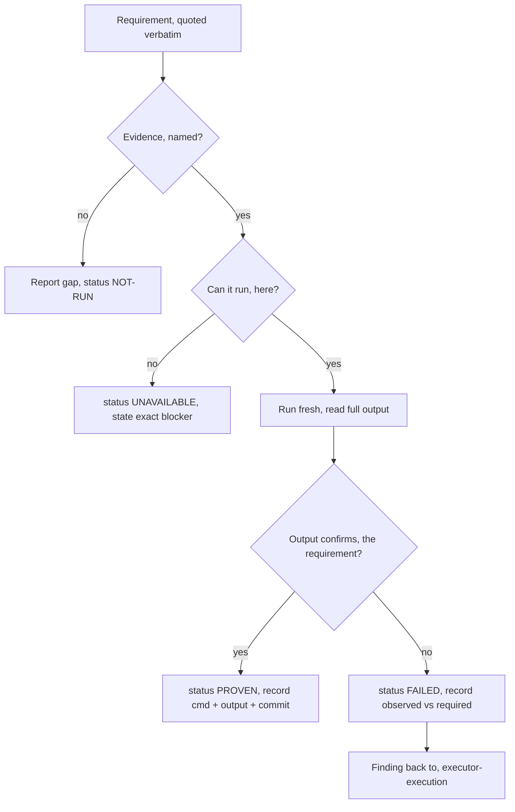

# Executor — Verification

The phase that converts claims into evidence. Everything before this produced
intent (charter, spec, plan) or activity (commits, reports, verdicts). None of
that is proof that the software works. This phase produces proof, or names
exactly what is unproven.

Read [`skill://executor`](../executor/SKILL.md) first for the ID grammar, the
citation rule, and the phase table. Scripts referenced below live in
`skill://executor/scripts/` and are written here as `exec-<name>`.

## The Iron Law

```text
NO COMPLETION CLAIM WITHOUT FRESH EVIDENCE FROM THE CURRENT STATE
```

If you have not run the check **in this session, against the code as it exists
now**, you cannot say it passes. Not "should pass", not "passes now", not
"verified earlier". Previous evidence is evidence about a previous commit.

**Violating the letter of this rule is violating the spirit of it.** The rule
covers exact phrases, paraphrases, synonyms, implications, and any wording that
would leave a reader believing the work is done.

## The Gate Function

Run this before any status statement, any expression of satisfaction, any
commit, any handoff, any move to the next task:

1. **IDENTIFY** — what exact command or observation proves this claim?
2. **RUN** — execute it fresh and in full. No partial runs, no `-k` filters
   chosen to make it green, no cached result.
3. **READ** — the whole output. Exit code. Failure count. Skip count.
4. **VERIFY** — does the output confirm the claim, or merely fail to
   contradict it? If NO: state the actual status with the evidence. If YES:
   state the claim *with* the evidence.
5. **RECORD** — command, observed output, and the commit it ran against, into
   the evidence ledger.
6. **ONLY THEN** — make the claim.

**Skipping a step is lying, not shortcutting.** There is no step in this list
that costs more than the retraction it prevents.

## Inputs

| Input | Where | Why it is needed |
|---|---|---|
| Verification strategy | `docs/executor/INIT-NNNN-<slug>/verification/INIT-NNNN-VRFY-nn-*.md` | The list of requirements and the evidence each one names |
| Spec | `docs/executor/INIT-NNNN-<slug>/specs/INIT-NNNN-SPEC-nn-*.md` | Requirement text is quoted verbatim from here |
| Final review verdict | `.executor/INIT-NNNN/Pnn/reviews/verdicts/INIT-NNNN-Pnn-final-verdict.md` | Tells you what review already found — it does not tell you the software works |
| Plan(s) and workspace | `docs/executor/INIT-NNNN-<slug>/plans/INIT-NNNN-Pnn-*.md`, `.executor/INIT-NNNN/Pnn/` | Where findings go back, and where rulings are recorded |
| The state under test | `git rev-parse HEAD`, `git status --short` | Every piece of evidence is stamped with it |

If the initiative has no VRFY document, verification cannot proceed as
specified: the acceptance criteria were never written down. Do not invent them
from the spec on the fly and call the result a strategy — report the missing
document, and if the human wants it now, `executor-spec` owns writing it
(`exec-id INIT-0004 VRFY` allocates the ID).

## Establish the state under test — first, always

```bash
git branch --show-current
git rev-parse HEAD
git status --short
```

Record the branch and the short HEAD. Every ledger row carries it.

**A dirty tree means the evidence is against an unrecorded state.** Say so in
the ledger explicitly (`a91e502 + uncommitted changes`) or commit first.
Evidence stamped with a commit that does not contain the code you tested is
worse than no evidence — it is a false record.

## Executing the strategy

Walk the VRFY document **requirement by requirement, in its order**. Never
batch, never sample, never skip ahead to the interesting ones.



Per requirement:

1. **Restate it verbatim.** Copy the requirement text from the spec or VRFY
   document into the ledger unedited. Paraphrasing is how a requirement
   quietly narrows to whatever you happened to test.
2. **Identify the evidence it names.** The VRFY document says which evidence
   type and which command. Use that one. If you substitute a different check,
   that substitution is a decision — record it as a ruling
   (`exec-ruling PLAN_FILE final "..."`), not as a silent swap.
3. **Run it fresh.** Full command, current state, complete output read.
4. **Record** the exact command, the observed output (trimmed to the lines
   that carry the verdict — exit code, counts, the assertion that mattered),
   and the commit.
5. **Mark the status.**

### The four statuses

| Status | Means | Rule |
|---|---|---|
| `PROVEN` | The named evidence ran fresh against the current state and its output confirms the requirement | Requires a recorded command and recorded output. Nothing else earns this word. |
| `FAILED` | The evidence ran and contradicted the requirement | Record observed vs required. Becomes a finding. |
| `NOT-RUN` | The evidence was never gathered — no time, no command written, forgotten, or the requirement names no evidence at all | **Never upgraded to PROVEN by inference.** A requirement nobody checked is unproven regardless of how obviously it "must" work. |
| `UNAVAILABLE` | The evidence cannot be gathered in this environment | State the exact missing condition (no staging credentials, no physical device, no production traffic). `UNAVAILABLE` is not a pass — it is a documented hole the human must accept at the gate. |

### NOT-RUN is the status that prevents fabricated completion

Most false completion claims are not lies about a failing check. They are
requirements that were never checked, absorbed into a summary sentence about
the ones that were. Therefore:

- Every requirement starts at `NOT-RUN` and is only moved by an executed
  command whose output you read.
- `NOT-RUN` appears in the ledger summary line, in the report to the human,
  and in the phase-gate note. It is never omitted for tidiness.
- A single `NOT-RUN` blocks the word "complete". The correct sentence is
  "11 of 12 requirements proven, 1 NOT-RUN: <which one, and why>".
- Never write `PROVEN` because a *neighbouring* requirement passed, because
  the implementer said so, or because the code obviously does it. Obviousness
  has no exit code.

## Evidence types — what each proves and what it does not

| Type | Proves | Does NOT prove |
|---|---|---|
| Unit | One unit honours the contract its assertions state | That the unit is wired in, that callers use it correctly, that the feature works |
| Integration | One seam between components behaves as specified | Anything about the seams it does not cross, or the whole path end to end |
| Smoke | The thing starts and performs its main job for real | Edge cases, error paths, load behaviour, correctness beyond what you observed |
| Manual | A human observed a specific behaviour at a specific time | Repeatability, regression safety, anything the human did not look at |
| Static | The code parses, types check, lints clean, schema validates | That it compiles/builds, runs, or is correct. Ever. |

### The mismatch rule

**Evidence proves what it exercises, not what it is near.**

- A green unit suite is not evidence the feature works end to end.
- A green linter is not evidence the build succeeds.
- A successful build is not evidence the program runs.
- A running program is not evidence it does the right thing.
- A passing test is not evidence the test would fail if the code broke —
  that requires the red-green check below.

When the VRFY document names integration evidence and you only have unit
evidence, the requirement is `NOT-RUN`, not "mostly proven".

### Regression tests: red-green or it proves nothing

A test written to lock in a fix is only evidence if it has been seen to fail
without the fix:

1. Write the test, run it — it passes.
2. Revert the fix, run it again — it **must** fail. Read that failure.
3. Restore the fix, run it — it passes again.

A test that has only ever been green may be asserting nothing. Record both
observed outcomes, or mark the requirement `NOT-RUN`.

## Smoke-test discipline

**Run the actual thing, not the test file.** Launch it, exercise the changed
path, observe the result with your own tool output.

| Surface | What counts as smoke evidence |
|---|---|
| Web UI | Driven in a real browser: navigate, interact with the changed path, observe rendered state. A screenshot or the assertion you read from the page. |
| TUI | Launched for real in a terminal, keys sent, output observed. |
| CLI | The binary invoked with real arguments, stdout/stderr and exit code read. |
| Service / daemon | Started, readiness observed (not assumed from process creation), a real request issued, the response read. |
| Library | A caller written or an existing caller exercised — the public entry point, not an internal function. |

Rules:

- Process creation is not readiness. Observe the readiness signal (log line,
  port accepting, prompt).
- Exercise the **changed** path. Starting the app and seeing the home page
  proves the app starts, nothing about your change.
- **If visual verification is genuinely impossible, say so explicitly** —
  "could not verify visually: no display/browser available in this
  environment" — and mark the requirement `UNAVAILABLE`. Never let a reader
  infer you looked at something you did not.
- Clean up what you started (processes, tabs, temp files) after the evidence
  is recorded, and only what you started.

## The evidence ledger

The ledger is an **outcomes section appended to the initiative's VRFY
document** — tracked, beside the strategy it answers, readable by anyone who
clones the repo.

Append; never rewrite the strategy section, never edit a previous round. Bump
the document's `updated_at` to the real UTC of the run. Do not add frontmatter
fields the contract does not define.

**Criterion references:** use the VRFY document's own existing numbering,
verbatim (`INIT-0004-VRFY-01 #3`). The ID grammar has no criterion segment —
never mint one, and never renumber the criteria to suit the ledger.

**Citation rule:** every ID written in the ledger begins with this
initiative's ID. If the evidence depends on another initiative's work, state
the dependency in your own words — the initiative's `INDEX.md` `depends_on` is
the only place another initiative's ID appears.

**Every criterion gets a table row and a detail block.** The row is the index
a reader scans, the block carries the observed output that makes the status
real. A `PROVEN` row with no recorded output is an assertion, not a record; a
`NOT-RUN` block records why the evidence was never gathered.

````markdown
## Outcomes — round 01

**State under test:** branch `feature/cell-router` at `a91e502`, clean tree
**Run at:** 2026-09-01T18:04:11Z
**Result:** 10 PROVEN · 1 FAILED · 1 NOT-RUN · 0 UNAVAILABLE

| Criterion | Evidence | Status | Command | State |
|---|---|---|---|---|
| INIT-0004-VRFY-01 #1 | unit | PROVEN | `bun test test/placement.test.ts` | a91e502 |
| INIT-0004-VRFY-01 #2 | integration | FAILED | `bun test test/router.int.ts` | a91e502 |
| INIT-0004-VRFY-01 #3 | smoke | PROVEN | `bun run start` + POST `/place` | a91e502 |
| INIT-0004-VRFY-01 #4 | manual | NOT-RUN | — | — |

<!-- rows #5–#12 omitted in this example -->

### INIT-0004-VRFY-01 #1 — PROVEN

**Requirement (verbatim):** "Placement scores every candidate cell and selects
the lowest-loaded cell that has capacity."

**Command:** `bun test test/placement.test.ts`
**State:** `a91e502`
**Observed:**

```text
9 pass, 0 fail, 0 skip  (exit 0)
```

**Verdict:** output confirms the requirement — the assertions cover tie-break
order and exclusion of at-capacity cells.

### INIT-0004-VRFY-01 #2 — FAILED

**Requirement (verbatim):** "Placement rejects a tenant whose cell is at
capacity with HTTP 409 and no partial write."

**Command:** `bun test test/router.int.ts`
**State:** `a91e502`
**Observed:**

```text
1 fail, 14 pass
router.int.ts:88 expected 409, received 500
```

**Required:** 409 with no partial write.
**Gap:** capacity check runs after the insert, so the write is partial.
**Finding raised:** yes — finding 1 of this round.
````

### Per-state evidence

Evidence belongs to a commit, not to a session.

- Evidence recorded against the current, unchanged state is **not re-run**.
  Re-running a green check to feel better is wasted work, not rigour.
- **Any change to the code under test invalidates every piece of evidence
  that exercised it.** After a fix lands, the affected requirements return to
  `NOT-RUN` and a new outcomes round is appended with the new commit.
- A new round never edits an old one. `round 02` records what changed and why
  it was re-run.

### Redaction

Observed output is pasted into a tracked document. Command output can contain
tokens, `Authorization:` headers, credentialed URLs, or `.env` echoes. Trim to
the verdict lines and redact shapes (`Bearer <redacted>`), then scan what you
wrote:

```bash
exec-scan-secrets docs/executor/INIT-0004-<slug>/verification
```

Exit 0 is clean; exit 1 lists `file:line: possible <kind>` and never prints
the value. On a finding: do not echo the value, tell the human which file,
which line, what kind. The store-wide scan before handoff belongs to
`executor-handoff`; this one covers the artifact you just wrote.

## Findings back to execution

A `FAILED` requirement, or a confirmed gap behind a `NOT-RUN`, is a finding
that returns to `executor-execution`. Verification does not fix it.

**The verifier does not patch the code.** Fixing it yourself destroys the
independence that made your evidence worth having, and silently rebases every
other row onto a commit you did not test. Hand it back.

A finding carries exactly this, appended in the outcomes round:

```markdown
### Finding 1 — INIT-0004-VRFY-01 #2

**Requirement:** <verbatim>
**Observed:** <the output line that contradicted it>
**State:** a91e502
**Severity:** blocking            <!-- blocking | non-blocking -->
**Where it appears to live:** `src/router/place.ts` — capacity check after insert
**Re-verification:** re-run `bun test test/router.int.ts` and the #3 smoke path
```

Then: the controller dispatches the fix through `executor-execution` against
the relevant plan (a fix round on the owning task if one exists, or a new task
in a new plan if the gap is genuinely new work — `executor-planning` owns
that). When the fix lands, append a new outcomes round at the new commit.

Verification-time decisions taken without the human — reclassifying a
requirement as `UNAVAILABLE`, substituting one check for another, accepting a
narrower observation as sufficient — are rulings, recorded the moment they are
made:

```bash
exec-ruling docs/executor/INIT-0004-<slug>/plans/INIT-0004-P01-cell-router.md \
  final "Accepted CLI smoke instead of browser smoke for #7" \
  "No display in this environment; the changed path is CLI-reachable" \
  "If the rendering layer regressed, this run would not catch it"
```

Plans exist by the time verification runs, so `exec-ruling` is available. It
requires a plan file because `rulings.md` is per-plan.

## The completion gate

The gate passes when **every requirement in the VRFY document has one of the
four statuses, each backed by a record**, and the human accepts the
`FAILED` / `NOT-RUN` / `UNAVAILABLE` set.

- Never convert an expected result into an observed one. "The command would
  print 0 failures" is not a record.
- Never let the summary line contradict the table. If the table has one
  `NOT-RUN`, the summary says so.
- Report the shape honestly: `N PROVEN · N FAILED · N NOT-RUN · N UNAVAILABLE`,
  then the named exceptions with their exact conditions.

**The completion gate is a human stop.** Present the outcomes round — the
summary line, the exceptions, and where the evidence ledger lives — and end
your turn. The human accepts the `FAILED` / `NOT-RUN` / `UNAVAILABLE` set or
sends work back; you do not declare the initiative complete on your own
authority, and you do not start handoff in the same message. An acceptance
that never happened is the exact fabrication this phase exists to prevent.

Record the phase transition:

```bash
exec-initiative phase INIT-0004 verification entered "12 criteria, VRFY-01"
exec-initiative phase INIT-0004 verification passed  "12/12 proven at a91e502"
```

`passed` is written only after the gate actually passes. A run with unproven
requirements stays `entered` and is reported — an `entered` phase with an
honest note is recoverable; a false `passed` is a lie in a tracked index.

**Verification is the phase that must not be skipped**, because skipping it
means the initiative asserts nothing. If the human explicitly waives it (a
docs-only initiative with no executable surface), record it as a stated
decision — `exec-initiative phase INIT-0004 verification skipped "<reason>"` —
never as an omission. The `skipped` row is what distinguishes a decision from
nobody looking.

## Pre-claim checklist

Before any sentence that implies the work is done:

- [ ] Every VRFY requirement has a status, and every status has a record?
- [ ] Every `PROVEN` backed by a command I ran in this session, whose output
      I read, against the current commit?
- [ ] The state under test recorded, and the tree's dirtiness stated?
- [ ] Evidence type matches what the requirement needs (mismatch rule)?
- [ ] Smoke evidence from the actual thing, not from a test file?
- [ ] Regression tests red-green verified?
- [ ] Reports from implementers and reviewers verified against `git diff`, not
      taken at face value?
- [ ] `NOT-RUN` / `FAILED` / `UNAVAILABLE` counts stated in the summary?
- [ ] Findings raised for every failure and gap?
- [ ] Outcomes round appended to the VRFY document with `updated_at` bumped?
- [ ] Secret scan run on what I wrote, exit code read?
- [ ] Phase row recorded with the truthful event?

An unchecked box means the claim is not ready. State the actual status instead.

## Common failures

| Claim | Requires | Not sufficient |
|---|---|---|
| Tests pass | Test command output: 0 failures, and the skip count read | A previous run, "should pass", a filtered subset |
| Linter clean | Linter output: 0 errors | Partial path, extrapolation from one file |
| Build succeeds | Build command: exit 0 | Linter passing, "logs look fine" |
| Types check | Type checker: exit 0 | Editor showing no squiggles |
| Bug fixed | The original symptom reproduced, then re-run and gone | Code changed and reasoning about it |
| Regression test works | Red-green cycle observed | The test passing once |
| Feature works | Smoke evidence from the real surface | A green unit suite |
| Subagent completed | `git diff` inspected, files read | The agent's report saying success |
| Review clean | The verdict file read from `reviews/verdicts/` | A summary of it in someone's message |
| Requirements met | VRFY walked requirement by requirement | "All tests pass, so we're done" |
| Initiative complete | Every requirement PROVEN or explicitly excepted | Review verdict clean |

## Red flags — stop

- "should", "probably", "seems to", "looks right", "must be fine"
- Expressing satisfaction before verification — "Great!", "Perfect!", "Done!"
- About to commit, push, open a PR, or hand off without the ledger written
- Trusting an implementer or reviewer success report
- Partial verification standing in for the whole requirement
- Thinking "just this once" or "it's obviously fine"
- Tired and wanting the work over
- Writing a summary sentence that covers requirements you did not check
- Upgrading a `NOT-RUN` while writing the summary
- Any wording that implies success without a command behind it

## Rationalizations

| Excuse | Reality |
|---|---|
| "The tests passed so it works" | The tests prove what they assert. Run the thing. |
| "The implementer reported it working" | A report is an input, never evidence. Verify independently. |
| "The reviewer approved it" | Review checks the diff against the spec. It does not run the software. |
| "Should work now" | Run the verification. |
| "I'm confident" | Confidence is not evidence. |
| "Just this once" | No exceptions. The exception is the failure mode. |
| "The linter passed" | A linter is not a compiler, and a compiler is not a runtime. |
| "I ran it earlier" | Earlier was a different commit. Evidence is per-state. |
| "It's obviously covered by criterion 3" | Then criterion 4 names its own evidence for a reason. Run it or mark it NOT-RUN. |
| "I'm tired" | Exhaustion is not an excuse, it is a reason to stop and report honestly. |
| "Partial check is enough" | Partial proves the part. The requirement is the whole. |
| "No display, so I'll assume the UI renders" | Mark it UNAVAILABLE and say so. Assumption recorded as evidence is fabrication. |
| "I'll note the NOT-RUN in chat, not the ledger" | Chat is lost. The ledger is the record. |
| "Different words, so the rule doesn't apply" | Spirit over letter. The rule covers implications. |
| "I'll just fix the failure while I'm here" | Then you tested a commit that no longer exists and lost your independence. Hand it back. |
| "Re-running everything is more rigorous" | Evidence for an unchanged state is still valid. Rigour is running what changed, not everything twice. |

## When this applies

Always, before: any variation of a success or completion claim; any expression
of satisfaction; any positive statement about work state; committing, pushing,
opening a PR; marking a task or phase complete; handing off to
`executor-handoff`; delegating to a subagent whose result you will report.

The rule binds exact phrases, paraphrases, synonyms, implications, and any
communication that would leave a reader believing the work is done.
