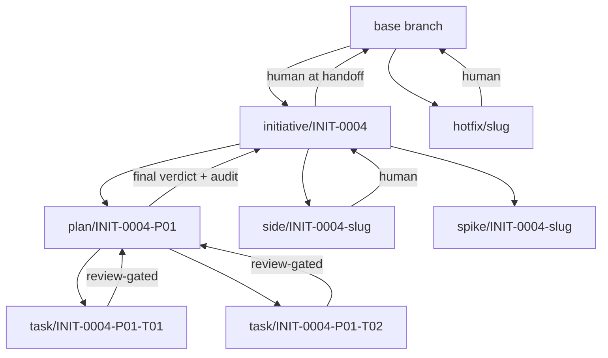

# The branch model

Normative, alongside `layout.md`. Scripts and skills resolve branch names,
fork points, and merge gates from this document. A branch whose name does
not parse here is not part of the model.

## Purpose

The workflow's git discipline answers four questions:

1. **Which branches exist** — one per artifact level, named after the
   artifact's ID.
2. **What each forks from** — so a task never inherits a sibling's
   half-finished work.
3. **What gates each merge** — so nothing reaches a longer-lived branch
   without the review its level requires.
4. **How the awkward cases resolve** — unrelated work, urgent fixes,
   experiments, cross-plan dependencies, abandoned tasks.

The invariant the whole model protects: **a longer-lived branch contains
only work that passed the review its level requires.** The initiative
branch holds reviewed plans; the base branch holds what the human accepted.

## Naming grammar

```text
initiative/INIT-NNNN
plan/INIT-NNNN-Pnn
task/INIT-NNNN-Pnn-Tnn
side/INIT-NNNN-<slug>
spike/INIT-NNNN-<slug>
hotfix/<slug>
```

- The suffix is the artifact ID exactly as the thinking store spells it —
  one grammar across documents, tasks, branches, and scripts. `exec-id`
  allocates the ID; the branch name is derived, never invented.
- `<slug>` is `[a-z0-9]+(-[a-z0-9]+)*`, at most 40 characters, no slashes.
- No other prefixes exist. `feature/`, `fix/`, `docs/`, and `release/` are
  the *contribution* conventions for changing The Executor itself (see
  `CONTRIBUTING.md`), not part of a user's initiative.

**Why not embed the task in the plan branch** (`plan/INIT-0004-P01-T03`):
a plan branch is per-plan. Embedding a task ID makes it per-task and
deletes the level the task merges into. The hierarchy needs three names,
not one compound name.

## Topology



## Fork rules

| Branch | Forks from | Fork point recorded in |
|---|---|---|
| `initiative/INIT-NNNN` | the human's current branch at intake | charter `**Branch:**` line + fork commit |
| `plan/INIT-NNNN-Pnn` | the initiative branch tip at plan start | plan ledger (`plan_file`, base commit) |
| `task/INIT-NNNN-Pnn-Tnn` | **the plan branch tip at dispatch** | dispatches row (branch + base commit) |
| `side/INIT-NNNN-<slug>` | the initiative branch tip | initiative ruling |
| `spike/INIT-NNNN-<slug>` | the initiative branch tip | initiative ruling |
| `hotfix/<slug>` | the base branch tip | outside the workflow |

**The task rule is load-bearing.** Forking each task from the plan branch
tip *at dispatch time* — not from a snapshot taken when the plan started —
is what makes sequential tasks conflict-free: task N+1 already contains
task N's merged work. Forking all tasks up front reintroduces exactly the
conflicts the hierarchy exists to avoid.

## Merge gates

| Merge | Gate | Enforced by |
|---|---|---|
| task → plan | the task's latest R-verdict is clean (`spec_verdict: PASS` or `null`, `quality: APPROVED`) | `exec-branch task merge` |
| plan → initiative | the plan's final verdict is clean **and** `exec-run audit` passes | `exec-branch merge` |
| side → initiative | human decision, recorded as an initiative ruling — a side branch is not a task and has no verdict | `exec-branch side merge` |
| initiative → base | human decision at handoff | `executor-handoff` |
| hotfix → base | human decision + tests | outside the workflow |
| spike → never | deleted, never merged | `exec-branch abandon` |

A gate is checked **before** any checkout or merge begins, so a refused
merge leaves the working tree exactly where it was.

## The sequential escape hatch

A plan may declare `sequential: true` in its frontmatter. Then tasks commit
directly to the plan branch and no task branches are created — the
two-level model.

The escape hatch exists because a strictly sequential plan gains nothing
from task branches: no parallelism to isolate, no sibling to conflict with,
and the plan branch's history is already a linear record of the work. What
it loses is per-task revert handles and a reviewed-only plan history; the
plan's final verdict still gates the merge to the initiative branch, so the
invariant above holds either way.

`exec-plan-lint` enforces the justification: `sequential: true` requires
every task after the first to declare `**Depends on:**` the immediately
preceding task. A plan that claims to be sequential while its tasks fan out
is refused — the flag is a statement about the dependency map, not a
convenience switch.

## Worktrees: what makes parallel waves safe

Branches alone do not isolate parallel work — two agents cannot share one
working tree. A parallel wave gives each task its own worktree:

```bash
git worktree add .executor/worktrees/INIT-0004-P01-T03 task/INIT-0004-P01-T03
```

Store resolution already accounts for this (`_exec-lib.sh`):

- `exec_root()` — the **worktree** root. The tracked thinking store
  (`docs/executor/`) resolves here, so a spec or plan edit commits on the
  branch that owns it.
- `exec_main_root()` — the **main** repository root. The untracked
  execution store (`.executor/`) resolves here, so every worktree shares
  one ledger, one registry, and one set of verdicts, and tearing a worktree
  down cannot destroy the run's record.

Lifecycle: the worktree is created at dispatch, and removed by
`exec-branch task merge` (after the merge) or `exec-branch task abandon`.
A worktree left behind is an orphan `exec-branch status` reports.

## Edge cases

| Situation | Resolution |
|---|---|
| **Unrelated work appears mid-run** | Never commit it on a task or plan branch — the branch's ID names its scope. In-scope but neither plan nor task → `side/INIT-NNNN-<slug>`. Urgent and out-of-scope → `hotfix/<slug>` from the base branch. Throwaway → `spike/INIT-NNNN-<slug>`. |
| Base branch moves while the initiative is in flight | The initiative merges base at a human-decided moment — it can invalidate reviews, so it is never automatic. Plans merge the initiative to pick the change up. |
| A task needs a sibling plan's output | Merge the sibling plan into the initiative first, then merge the initiative into the dependent plan. Never cherry-pick across plans: the sibling's work must arrive with its review history. |
| Two parallel tasks touch one file | Planning's file-map check forbids it. If it slips through, the later task merges the plan branch and resolves on its own branch — the conflict never lands on the plan branch. |
| Task abandoned mid-flight | `exec-branch task abandon`. The plan branch never saw the work; the task is parked with a ruling naming why. |
| Fix round (R02+) | Same task branch, new commits. A round is a review artifact, not a branch. |
| Task turns out to be a no-op | Abandon the branch, park the task with a ruling. |
| Task branch diverges badly | Abandon it, record an in-fix ledger line, re-dispatch from the current plan tip. |
| Doc-only change to the initiative | Commit directly on the initiative branch — documents are not review-gated — or via `side/` when it deserves its own history. |
| Revert a merged task | `git revert -m 1 <merge-commit>` on the plan branch. The ledger records the merge commit at merge time, so the handle exists. |
| Reviewer needs the task diff | `exec-review-package PLAN TASK BASE HEAD`, where BASE is the fork point recorded at dispatch. |
| Emergency: the initiative branch is broken | `hotfix/` from base, then merge base into the initiative. |
| Multiple initiatives in flight | Separate initiative branches. Cross-initiative dependencies are forbidden by the ID namespace — an initiative never reads another's artifacts. |
| The execution store is committed | `.executor/` is gitignored by default. If a project commits it, bookkeeping commits belong on the initiative branch, never on a task branch — the store is shared by every worktree. |

## Enforcement

| Mechanism | Checks |
|---|---|
| `exec-branch task start\|merge\|abandon` | fork from the plan tip; gate the merge on the R-verdict; remove the worktree |
| `exec-branch side\|spike` | fork from the initiative; `side` merges on a human ruling, `spike` never merges |
| `exec-branch status` | prints the whole stack (initiative → plan → task) and flags orphan worktrees |
| `exec-run check` | topology audit: the current branch matches the dispatched task; every completed task's recorded merge commit exists on the plan branch; no task branch holds unmerged commits when the plan's final verdict is clean; orphan worktrees and non-worktree debris are reported |
| `exec-plan-lint` | `sequential: true` requires the dependency chain to justify it |
| Ledger / dispatches | a `Branch` column plus the fork commit per task, so a resumed controller can find the work |

## Migration

- **New plans** get task branches by default.
- **In-flight plans** keep the two-level model by recording
  `sequential: true` (a one-line plan amendment, logged as a ruling) — or
  adopt task branches for their remaining tasks.
- **Completed runs** are untouched: their branches are already merged or
  abandoned, and the ledger's existing commit ranges remain valid.

## Costs

- One merge commit per task — a 15-task plan adds 15 merges to the plan
  branch.
- A worktree per parallel task: disk, and a cleanup obligation the scripts
  own.
- More state: the branch and fork commit per task must be recorded, or a
  resumed controller cannot find the work.

## Alternatives considered

| Model | Buys | Costs | Verdict |
|---|---|---|---|
| No task branches; tag each task's final commit | Revert handles, zero merge churn | No parallelism, plan history still unreviewed | Rejected — tags are handles, not isolation |
| Task branches only for parallel waves | Cheapest that still parallelizes | Two modes to reason about | Kept as the escape hatch, inverted: sequential is the declared exception |
| Worktrees without task branches | Parallelism with the least machinery | No per-task isolation or revert handle | Rejected — parallel agents on one branch race on the same commits |
