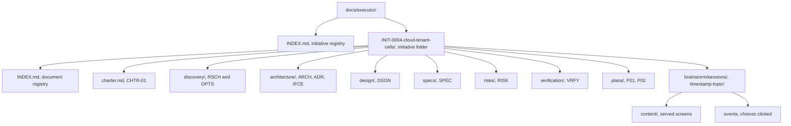

# Directory Layout

The exact structure of both Executor stores. Scripts and skills resolve
paths from this document; nothing invents a location.

## Thinking store — `docs/executor/` (git-tracked)



**Folder name:** `INIT-<NNNN>-<topic-slug>`. The slug is human-readable and
never load-bearing — every resolution goes through the ID.

**Brainstorm sessions live here, not in the execution store.** A
brainstorming session is thinking: the mockups, the options shown, the
choices clicked. It belongs beside the research it produced. Sessions are
timestamped rather than ID-numbered because most produce no document of
their own; one that does records the session path in that document's
frontmatter.

A session directory holds only the **record**: `content/` (the screens shown)
and `events` (the choices clicked). The visual companion's operational state —
`server-info`, the log, the pid, and the persisted session key — is written to
a runtime directory outside the repository, never here. This store is public
(see [safety](safety.md)) and the session key is an access token.

**Document types and their directories:**

| Type | ID segment | Directory | Purpose |
|---|---|---|---|
| Charter | `CHTR` | initiative root (`charter.md`) | Problem, goals, non-goals, success criteria, scope |
| Research | `RSCH` | `discovery/` | Prior art, measurements, external sources |
| Options | `OPTS` | `discovery/` | Approaches compared, with a recommendation |
| Architecture | `ARCH` | `architecture/` | System structure, components, boundaries, data flow |
| Decision | `ADR` | `architecture/` | One decision: context, options, choice, consequences |
| Interface | `IFCE` | `architecture/` | Contracts between components — signatures, schemas, protocols |
| Design | `DSGN` | `design/` | One component's internals |
| Spec | `SPEC` | `specs/` | The requirements contract a plan argues from |
| Risk | `RISK` | `risks/` | Risk register, pre-mortem output |
| Verification | `VRFY` | `verification/` | Acceptance criteria and how they get proven |
| Plan | `P` | `plans/` | Tasks with steps, files, interfaces |

## Execution store — `.executor/` (git-ignored by default, committable)

### Where each store's root resolves

The two stores anchor to different roots, and the difference matters the
moment a worktree is involved:

| Store | Root | Why |
|---|---|---|
| `docs/executor/` | **working-tree root** (`git rev-parse --show-toplevel`) | Tracked. Specs and plans must commit on the branch that produced them. |
| `.executor/` | **main repository root** (parent of `git rev-parse --git-common-dir`) | Untracked. Removing a worktree deletes everything inside it — anchoring the execution store to the worktree would let branch cleanup destroy the reports, verdicts, and rulings the Executor exists to keep. |

Outside a worktree the two roots are identical, so this is invisible in the
common case. Inside one, every worktree of the same repository shares a
single execution store. That is intended: plan IDs are unique repository-wide,
so two worktrees cannot collide, and a run started in a worktree stays
readable after that worktree is gone.

`exec-workspace` resolves this for you. Never build the path yourself.

```text
.executor/
├── .gitignore                                `*` — self-ignoring, written once
├── INDEX.md                                  every plan run: id, status, dates
└── INIT-0004/
    ├── P01/
    │   ├── progress.md                       ledger: per-task status, fast resume scan
    │   ├── preflight-scan.md                 pre-dispatch conflict table + rulings
    │   ├── rulings.md                        append-only decision log, task-tagged
    │   ├── dispatches.md                     agent identity, model, phase, timing
    │   ├── briefs/
    │   │   ├── INIT-0004-P01-T01-brief.md
    │   │   └── INIT-0004-P01-T03-brief.md
    │   ├── reports/
    │   │   ├── INIT-0004-P01-T01-report.md
    │   │   └── INIT-0004-P01-T03-report.md
    │   ├── reviews/
    │   │   ├── diffs/
    │   │   │   ├── INIT-0004-P01-T03-R01-a1b2c3d..d4e5f6a.diff
    │   │   │   ├── INIT-0004-P01-T03-R02-d4e5f6a..b7c8d9e.diff
    │   │   │   └── INIT-0004-P01-final-229e5e7..a91e502.diff
    │   │   └── verdicts/
    │   │       ├── INIT-0004-P01-T03-R01-verdict.md
    │   │       └── INIT-0004-P01-T03-R02-verdict.md
    │   └── verification/
    │       └── evidence/
    │           └── round-01/
    │               ├── state.txt
    │               └── INIT-0004-VRFY-01-V01-unit.txt
    │           ├── INIT-0004-P01-T03-R02-verdict.md
    │           └── INIT-0004-P01-final-verdict.md
    └── P02/
        └── ...
```

### Why each file exists

**`progress.md`** — the resume scan. It opens with YAML frontmatter
(`kind: ledger`, plan, plan_file, spec, created_at, updated_at), followed
by a **Task status table** — one row per task, state
(`pending | dispatched | in-fix | complete | parked`), commits, review,
notes — and a `## State changes` section holding one line per state change.
The resume scan reads the table first: a task with no row has never been
dispatched. A ledger whose `plan:` line names a different plan is not
yours. State-change lines append under `## State changes`, never between
table rows.

**`preflight-scan.md`** — the cross-task conflict table produced before Task
1 dispatches, with a ruling recorded beside every finding. The seed carries
a `## Scan` table (Tasks, Shared surface, Produced vs consumed, Finding,
Severity, Ruling) and a `## Method` block stating what was walked, so the
scan's scope is visible. A finding with no ruling is unresolved — do not
dispatch until every finding is ruled. Separated from the ledger because it
is written once and read whenever a task surprises you.

**`rulings.md`** — append-only, every decision made on the human's behalf,
with what it costs if wrong. Mirrored into `.local/decisions/` as each one
is written. This is the file that answers "why is it like this" a year
later.

**`dispatches.md`** — one line per subagent dispatch: task ID, role, model,
agent identity, start time, outcome, and the **Context** column naming the
brief and context files each agent received. Makes model-selection
decisions reviewable, lets a resumed controller find a live agent it can
resume rather than replacing, and answers "bad context or bad model?" with
one line when a run goes sideways.

**`briefs/`** — extracted task text, the single source of requirements for
one implementer. Never pasted through the controller's context.

**`reports/`** — implementer narrative. One file per task, appended to on
each fix round, so the file is the task's complete implementation history.

**`reviews/diffs/`** — the code artifact a reviewer reads. Named per review
round and commit range so a re-review never overwrites the diff its
predecessor saw.

**`verification/evidence/round-NN/`** — raw observed output backing each
outcomes round in the VRFY document. Written by `exec-evidence`:
`state.txt` records the branch, commit, and tree dirtiness of the state
under test; one `INIT-NNNN-VRFY-nn-V<nn>-<method>.txt` file per criterion
holds the command and its observed output. The VRFY outcomes table cites
these files instead of pasting the output a second time — the tracked
ledger keeps the verdict, the untracked store keeps the full record.

**`reviews/verdicts/`** — the reviewer's written judgment: spec verdict,
findings by severity, per-finding ADDRESSED / NOT ADDRESSED on re-reviews.
Persisted because the judgment is the insight; the diff is just evidence.
A verdict that lives only in a subagent's response text is lost the moment
the controller summarizes it.

### The placement rule — hard

**Every artifact a run produces lives under `.executor/`.** Briefs, context
files, reports, diffs, verdicts, ledger, rulings, preflight, dispatches —
all of it. **Nothing a run produces is ever written under `docs/executor/`**
except by the phase skills that own thinking documents (charter, research,
architecture, spec, plan, VRFY strategy).

The two stores are not interchangeable, and the reason is the worktree
survival contract: `docs/executor/` is tracked and commits on the branch
that produced it; `.executor/` is untracked and anchored to the main
repository root so removing a worktree cannot destroy the execution record.

A verdict, report, or evidence block that lands in `docs/executor/` is a
**contract violation**, not a style choice — it pollutes the tracked
thinking record with execution noise, and it silently moves the record to a
place where branch cleanup can lose it. If you catch yourself about to
write an execution artifact under `docs/executor/`, stop: the correct path
is under `.executor/`, resolved by the scripts, never hand-built.

**Verification outcomes are the one deliberate exception.** The evidence
ledger is appended to the initiative's VRFY document in `docs/executor/`
because it is the *thinking* record of what was proven — the strategy and
its outcomes belong together for anyone who clones the repo. That exception
is named here so it is a decision, not a leak.

## Path resolution

Never hand-build a path. Use the scripts:

| Need | Script |
|---|---|
| Initiative folder from an ID | `scripts/exec-initiative resolve INIT-0004` |
| Next free ID of a type | `scripts/exec-id INIT-0004 ADR` |
| Plan's execution workspace | `scripts/exec-workspace PLAN_FILE` |
| Task brief file | `scripts/exec-brief PLAN_FILE N` |
| Task context file | `scripts/exec-context PLAN_FILE N` |
| Run lifecycle in the registry | `scripts/exec-run PLAN_FILE start\|task\|complete\|check\|pause\|blocked` |
| Evidence file for a criterion | `scripts/exec-evidence PLAN_FILE ROUND CRITERION METHOD` (reads observed output from stdin) |
| Review diff for a task or the branch | `scripts/exec-review-package PLAN_FILE TASK BASE HEAD [ROUND]` (TASK = task number, or the literal `final`; ROUND defaults to `01`) |
| Secret scan before handoff | `scripts/exec-scan-secrets [PATH]` |

Scripts resolve the plan's `id:` frontmatter field, not its filename, so
renaming a plan never orphans its workspace. A plan with no `id:` field is
pre-Executor: the workspace falls back to the file's basename.

## Markdown rendering rules

Every seeded and generated markdown file must render correctly in any
common renderer. Three rules keep that true:

1. **HTML comments never sit between a table's header and its rows, or
   between two rows.** A comment after the separator row splits the table
   in most renderers once rows are appended. Comments go above the table
   they describe; appended rows go below the last row.
2. **Appends never land inside a table.** Log-style lines (ledger state
   changes, dispatch entries) append either as table rows directly under
   the last row, or as list lines in their own section — never after a
   trailing comment or a blank section end.
3. **Generated files open with YAML frontmatter** (see the frontmatter
   contract's execution-artifact section), so an agent reading one file
   cold can identify it without opening anything else.

## What is never deleted

Nothing in either store is deleted by a skill. When a plan finishes, its
workspace is marked complete in `.executor/INDEX.md` and left in place. When
an initiative finishes, its folder is marked complete in
`docs/executor/INDEX.md` and left in place.

Pruning is a human decision, taken deliberately, never a cleanup step.
