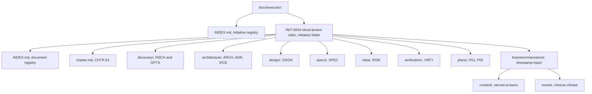

# Directory Layout

The exact structure of both Executor stores. Scripts and skills resolve
paths from this document; nothing invents a location.

## Thinking store — `docs/executor/` (git-tracked)



**Folder name:** `INIT-<NNNN>-<topic-slug>`. The slug is human-readable and
never load-bearing — every resolution goes through the ID.

**Brainstorm sessions live here, not in the execution store.** A
brainstorming session is thinking: the mockups, the options shown, the
choices clicked. It belongs beside the research it produced. Sessions are
timestamped rather than ID-numbered because most produce no document of
their own; one that does records the session path in that document's
frontmatter.

A session directory holds only the **record**: `content/` (the screens shown)
and `events` (the choices clicked). The visual companion's operational state —
`server-info`, the log, the pid, and the persisted session key — is written to
a runtime directory outside the repository, never here. This store is public
(see [safety](safety.md)) and the session key is an access token.

**Document types and their directories:**

| Type | ID segment | Directory | Purpose |
|---|---|---|---|
| Charter | `CHTR` | initiative root (`charter.md`) | Problem, goals, non-goals, success criteria, scope |
| Research | `RSCH` | `discovery/` | Prior art, measurements, external sources |
| Options | `OPTS` | `discovery/` | Approaches compared, with a recommendation |
| Architecture | `ARCH` | `architecture/` | System structure, components, boundaries, data flow |
| Decision | `ADR` | `architecture/` | One decision: context, options, choice, consequences |
| Interface | `IFCE` | `architecture/` | Contracts between components — signatures, schemas, protocols |
| Design | `DSGN` | `design/` | One component's internals |
| Spec | `SPEC` | `specs/` | The requirements contract a plan argues from |
| Risk | `RISK` | `risks/` | Risk register, pre-mortem output |
| Verification | `VRFY` | `verification/` | Acceptance criteria and how they get proven |
| Plan | `P` | `plans/` | Tasks with steps, files, interfaces |

## Execution store — `.executor/` (git-ignored by default, committable)

### Where each store's root resolves

The two stores anchor to different roots, and the difference matters the
moment a worktree is involved:

| Store | Root | Why |
|---|---|---|
| `docs/executor/` | **working-tree root** (`git rev-parse --show-toplevel`) | Tracked. Specs and plans must commit on the branch that produced them. |
| `.executor/` | **main repository root** (parent of `git rev-parse --git-common-dir`) | Untracked. Removing a worktree deletes everything inside it — anchoring the execution store to the worktree would let branch cleanup destroy the reports, verdicts, and rulings the Executor exists to keep. |

Outside a worktree the two roots are identical, so this is invisible in the
common case. Inside one, every worktree of the same repository shares a
single execution store. That is intended: plan IDs are unique repository-wide,
so two worktrees cannot collide, and a run started in a worktree stays
readable after that worktree is gone.

`exec-workspace` resolves this for you. Never build the path yourself.

```text
.executor/
├── .gitignore                                `*` — self-ignoring, written once
├── INDEX.md                                  every plan run: id, status, dates
└── INIT-0004/
    ├── P01/
    │   ├── progress.md                       ledger: per-task status, fast resume scan
    │   ├── preflight-scan.md                 pre-dispatch conflict table + rulings
    │   ├── rulings.md                        append-only decision log, task-tagged
    │   ├── dispatches.md                     agent identity, model, phase, timing
    │   ├── briefs/
    │   │   ├── INIT-0004-P01-T01-brief.md
    │   │   └── INIT-0004-P01-T03-brief.md
    │   ├── reports/
    │   │   ├── INIT-0004-P01-T01-report.md
    │   │   └── INIT-0004-P01-T03-report.md
    │   └── reviews/
    │       ├── diffs/
    │       │   ├── INIT-0004-P01-T03-R01-a1b2c3d..d4e5f6a.diff
    │       │   ├── INIT-0004-P01-T03-R02-d4e5f6a..b7c8d9e.diff
    │       │   └── INIT-0004-P01-final-229e5e7..a91e502.diff
    │       └── verdicts/
    │           ├── INIT-0004-P01-T03-R01-verdict.md
    │           ├── INIT-0004-P01-T03-R02-verdict.md
    │           └── INIT-0004-P01-final-verdict.md
    └── P02/
        └── ...
```

### Why each file exists

**`progress.md`** — the resume scan. One line per task state change, terse
enough to read in one glance after a context loss. Its first two lines are
the plan ID and plan file path; a ledger whose identity line names a
different plan is not yours.

**`preflight-scan.md`** — the cross-task conflict table produced before Task
1 dispatches, with a ruling recorded beside every finding. Separated from
the ledger because it is written once and read whenever a task surprises
you.

**`rulings.md`** — append-only, every decision made on the human's behalf,
with what it costs if wrong. Mirrored into `.local/decisions/` as each one
is written. This is the file that answers "why is it like this" a year
later.

**`dispatches.md`** — one line per subagent dispatch: task ID, role, model,
agent identity, start time, outcome. Makes model-selection decisions
reviewable and lets a resumed controller find a live agent it can resume
rather than replacing.

**`briefs/`** — extracted task text, the single source of requirements for
one implementer. Never pasted through the controller's context.

**`reports/`** — implementer narrative. One file per task, appended to on
each fix round, so the file is the task's complete implementation history.

**`reviews/diffs/`** — the code artifact a reviewer reads. Named per review
round and commit range so a re-review never overwrites the diff its
predecessor saw.

**`reviews/verdicts/`** — the reviewer's written judgment: spec verdict,
findings by severity, per-finding ADDRESSED / NOT ADDRESSED on re-reviews.
Persisted because the judgment is the insight; the diff is just evidence.
A verdict that lives only in a subagent's response text is lost the moment
the controller summarizes it.

## Path resolution

Never hand-build a path. Use the scripts:

| Need | Script |
|---|---|
| Initiative folder from an ID | `scripts/exec-initiative resolve INIT-0004` |
| Next free ID of a type | `scripts/exec-id INIT-0004 ADR` |
| Plan's execution workspace | `scripts/exec-workspace PLAN_FILE` |
| Task brief file | `scripts/exec-brief PLAN_FILE N` |
| Review diff for a task or the branch | `scripts/exec-review-package PLAN_FILE TASK BASE HEAD [ROUND]` (TASK = task number, or the literal `final`; ROUND defaults to `01`) |
| Secret scan before handoff | `scripts/exec-scan-secrets [PATH]` |

Scripts resolve the plan's `id:` frontmatter field, not its filename, so
renaming a plan never orphans its workspace. A plan with no `id:` field is
pre-Executor: the workspace falls back to the file's basename.

## What is never deleted

Nothing in either store is deleted by a skill. When a plan finishes, its
workspace is marked complete in `.executor/INDEX.md` and left in place. When
an initiative finishes, its folder is marked complete in
`docs/executor/INDEX.md` and left in place.

Pruning is a human decision, taken deliberately, never a cleanup step.
